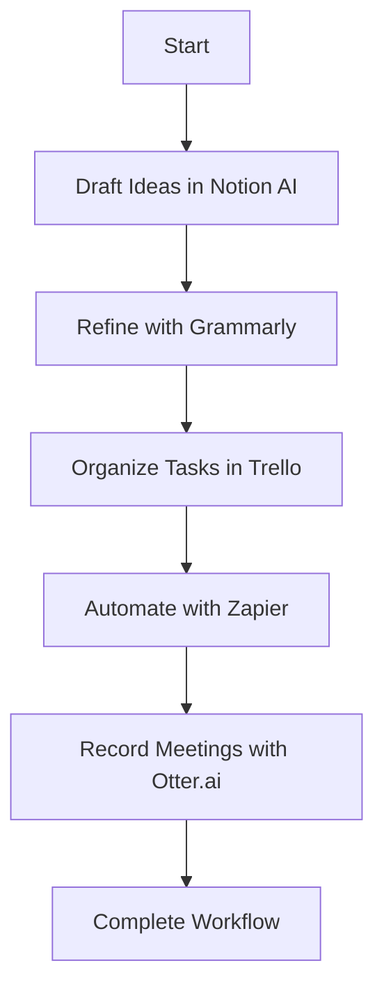

---

## 5 Must-Have AI Tools to Streamline Your Workflow in 2026

In today's fast-paced digital world, the right AI tools can be game-changers, especially when it comes to productivity. As we look ahead to 2026, several innovative AI tools are poised to redefine how we approach our daily tasks. Whether you're a freelancer, a small business owner, or part of a large corporation, these tools can help you enhance your efficiency and focus on what truly matters.

### Why AI Tools Are Essential for Productivity

AI tools for productivity are designed to automate repetitive tasks, analyze data, and offer insights that can lead to better decision-making. They allow us to focus on high-value activities rather than getting bogged down by mundane chores. In this blog post, we'll explore five must-have AI tools that can streamline your workflow in 2026.

### 1. Notion AI

#### Overview

Notion has always been a popular tool for note-taking and project management, but with the integration of AI, it has become even more powerful. [Notion AI](https://www.notion.so/product/ai?ref=AFFILIATE_ID) helps you write faster, organize your thoughts, and automate mundane tasks.

#### Use Cases

- **Content Creation:** Generate drafts for blogs or marketing materials.
- **Project Management:** Automate reminders and updates based on project milestones.

#### Pros and Cons

| Pros                          | Cons                               |
|-------------------------------|------------------------------------|
| Intuitive user interface      | Learning curve for new users       |
| Integrates well with other apps| AI suggestions can sometimes miss the mark |

### 2. Grammarly

#### Overview

[Grammarly](https://www.grammarly.com/?ref=AFFILIATE_ID) is a writing assistant that uses AI to help you communicate effectively. By checking for grammar, style, and tone, it ensures your writing is polished and professional.

#### Use Cases

- **Professional Emails:** Draft error-free communications.
- **Content Marketing:** Perfect articles and social media posts for clarity and engagement.

#### Pros and Cons

| Pros                          | Cons                               |
|-------------------------------|------------------------------------|
| Real-time writing suggestions  | Premium features can be expensive  |
| Integrates with various platforms | Can be overly cautious with suggestions |

### 3. Trello with Butler Automation

#### Overview

Trello is an established project management tool that benefits from AI automation through its Butler feature. Butler allows you to automate repetitive tasks, streamline workflows, and ensure that your team stays on track.

#### Use Cases

- **Task Assignments:** Automatically assign tasks based on project deadlines.
- **Notifications:** Set up alerts for upcoming deadlines without manual input.

#### Pros and Cons

| Pros                          | Cons                               |
|-------------------------------|------------------------------------|
| Highly customizable            | Can become complex with too many automations |
| Visual task management         | Limited advanced features in free version |

### 4. Zapier

#### Overview

Zapier is an automation tool that connects your favorite apps, allowing them to work together seamlessly. With Zapier, you can automate workflows between different platforms, saving you time and effort.

#### Use Cases

- **Data Transfer:** Automatically move data from your email to your CRM.
- **Social Media Posting:** Schedule and post content across various platforms simultaneously.

#### Pros and Cons

| Pros                          | Cons                               |
|-------------------------------|------------------------------------|
| Supports thousands of apps    | Can be complex for beginners       |
| Saves significant time        | Some integrations require premium plans |

### 5. Otter.ai

#### Overview

[Otter.ai](https://otter.ai/?ref=AFFILIATE_ID) is an AI-powered transcription service that can turn spoken words into written text. This tool is incredibly useful for meetings, interviews, and lectures, helping you capture important information effortlessly.

#### Use Cases

- **Meeting Notes:** Automatically transcribe and summarize meetings.
- **Interviews:** Record and transcribe discussions for future reference.

#### Pros and Cons

| Pros                          | Cons                               |
|-------------------------------|------------------------------------|
| Highly accurate transcriptions | Limited editing features           |
| Integrates with Zoom          | Requires internet for best results |

### Comparing AI Tools for Productivity

To help you decide which AI tools are best for your workflow, here’s a quick comparison table summarizing the key features of each tool:

<table>
  <tr>
    <th>Tool</th>
    <th>Key Features</th>
    <th>Best For</th>
  </tr>
  <tr>
    <td>[Notion AI](https://www.notion.so/product/ai?ref=AFFILIATE_ID)</td>
    <td>Content generation, project management</td>
    <td>Writers, project managers</td>
  </tr>
  <tr>
    <td>[Grammarly](https://www.grammarly.com/?ref=AFFILIATE_ID)</td>
    <td>Grammar check, tone adjustment</td>
    <td>Content creators, professionals</td>
  </tr>
  <tr>
    <td>Trello with Butler</td>
    <td>Task automation, visual management</td>
    <td>Teams, project managers</td>
  </tr>
  <tr>
    <td>Zapier</td>
    <td>App integration, workflow automation</td>
    <td>Businesses, marketers</td>
  </tr>
  <tr>
    <td>[Otter.ai](https://otter.ai/?ref=AFFILIATE_ID)</td>
    <td>Transcription, meeting summaries</td>
    <td>Students, professionals</td>
  </tr>
</table>

### Workflow Integration Example

To give you a clearer picture of how these tools can work together, consider this workflow:

1. **Notion AI** helps you draft project outlines.
2. Use **Grammarly** to refine your written content.
3. Organize tasks in **Trello**, using **Butler** to automate updates.
4. Use **Zapier** to push tasks and deadlines to your favorite calendar app.
5. Record and summarize meetings using **Otter.ai**.

This integrated approach can save you hours every week and improve your overall productivity.

### Final Thoughts

As we embrace the future, leveraging AI tools for productivity will become increasingly vital. These five tools—Notion AI, Grammarly, Trello with Butler, Zapier, and Otter.ai—are designed to streamline your workflow, ultimately allowing you to focus on what truly matters. 

Are you ready to transform your productivity in 2026? Don’t wait! Start experimenting with these tools today and watch your efficiency soar.

For more tips and insights on AI tools and productivity, subscribe to our blog and stay updated with the latest trends!

## 関連記事

- [AI Agents vs. Traditional Productivity Tools: An Honest Comparison](/posts/ai-agents-vs-traditional-tools-which-enhances-productivity/)
- [AI Agents as Productivity Partners: A Practical Introduction](/posts/ai-agents-your-new-productivity-partners-in-2026/)
- [The Complete Guide to AI Agent Productivity Tools in 2026](/posts/boost-productivity-with-ai-agents-in-2026-a-guide/)
