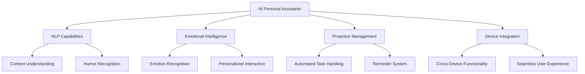

---

## AI Agents: The Future of Personal Assistants in 2026

In the ever-evolving landscape of technology, AI personal assistants are set to redefine our interactions with devices and systems by 2026. Imagine having a seamless blend of productivity, organization, and personal touch, all at your fingertips. In this article, we will explore the future of AI agents, their potential capabilities, and how they will enhance our daily lives.

### The Evolution of AI Personal Assistants

AI personal assistants, like Siri, Google Assistant, and Alexa, have already transformed how we manage our daily tasks. They help us with simple commands, reminders, and queries. However, the advancements in artificial intelligence are poised to take these assistants to the next level.

By 2026, we can expect AI personal assistants to not only respond to commands but also anticipate our needs, learn from our habits, and interact with us in more human-like ways. Imagine an AI that understands your schedule, preferences, and even your emotions.

### Key Features of Future AI Personal Assistants

#### 1. Natural Language Processing (NLP)

The future of AI personal assistants will rely heavily on advanced Natural Language Processing (NLP). This means they will be able to understand context, nuances, and even humor in conversations. For example, instead of just setting a reminder for a meeting, an AI assistant could summarize the agenda, suggest optimal preparation tasks, and even follow up with contacts.

#### 2. Emotional Intelligence

AI personal assistants will develop emotional intelligence capabilities, enabling them to recognize and respond to our feelings. This could mean that if you’re stressed, your assistant might suggest taking a break or playing soothing music. A study by MIT suggests that AI could analyze voice tone and facial expressions to gauge emotions, leading to more personalized interactions.

#### 3. Proactive Task Management

Gone will be the days of waiting for commands. Future AI personal assistants will proactively manage tasks based on learned behavior. For instance, if you consistently run out of coffee on Fridays, your AI might remind you to restock or even place an order for you. 

#### 4. Integration Across Devices

By 2026, expect AI personal assistants to integrate seamlessly across all your devices—from smartphones to smart home systems to wearables. This interconnectedness will allow for a cohesive experience. Imagine telling your assistant to dim the lights at home, and it also adjusts your calendar in preparation for the meeting you're about to attend.

### Use Cases: AI Personal Assistants in Action

Let’s explore some practical use cases for AI personal assistants in 2026:

#### Scenario 1: The Busy Professional

Imagine Sarah, a marketing manager juggling multiple projects. With her AI personal assistant, she no longer struggles with scheduling conflicts. Her assistant can analyze her calendar, prioritize tasks, and remind her of important deadlines. If a meeting runs over, the AI reschedules her next appointment automatically, notifying everyone involved.

#### Scenario 2: The Health-Conscious Individual

For health enthusiasts, AI personal assistants could track fitness goals, suggest meal plans, and remind users to stay hydrated. For example, John, who is trying to lose weight, receives daily meal suggestions based on his dietary restrictions and exercise schedule, making it easier for him to stay on track.

#### Scenario 3: The Family Coordinator

In a busy household, an AI personal assistant becomes the go-to resource for managing family schedules. It can create shared calendars, set reminders for school events, and even suggest family activities based on everyone’s availability. Think of it as a personal concierge for family life.

### Pros and Cons of AI Personal Assistants

| Pros                             | Cons                             |
|----------------------------------|----------------------------------|
| Increased productivity            | Potential privacy concerns       |
| Enhanced personalization          | Dependency on technology         |
| Seamless integration with devices | Misinterpretation of commands    |
| Proactive task management         | Emotional responses may vary     |

### The Future of AI Personal Assistants: A Decision Tree

To visualize the potential pathways and capabilities of AI personal assistants, let's consider a decision tree that highlights the major features and their implications.

### The Road Ahead: Ethical Considerations

As we embrace the future of AI personal assistants, we must also confront ethical considerations. Issues such as data privacy, consent, and algorithmic bias will be paramount. Users must feel confident that their personal information is secure and that AI assistants operate fairly and transparently.

### Conclusion: The Future is Bright for AI Personal Assistants

By 2026, AI personal assistants will not only be smarter but also more intuitive, capable of enhancing our productivity and enriching our lives. With advancements in NLP, emotional intelligence, and proactive management, these AI agents will serve as invaluable tools in both personal and professional realms.

As we prepare for this exciting future, it’s crucial to stay informed about the latest developments in AI technology. Are you ready to embrace the next generation of AI personal assistants? Join the conversation and share your thoughts on how you envision these tools shaping your life!

### Call to Action

Interested in learning more about AI tools and how they can revolutionize your productivity? Subscribe to our blog, follow us on social media, and stay updated on the latest trends in AI technology!