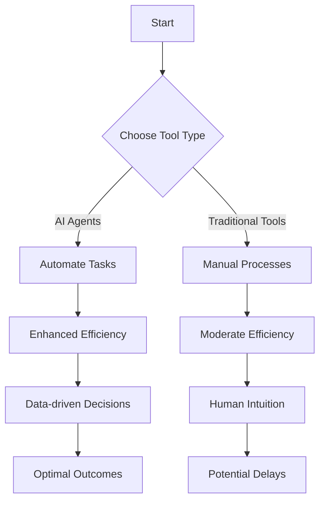

---

# AI Agents vs. Traditional Tools: Which Enhances Productivity?

In today's fast-paced world, where efficiency is the name of the game, the debate between AI agents and traditional tools has never been more relevant. While traditional tools have served us well for decades, the advent of AI technology promises to redefine productivity paradigms. But how do these two approaches stack up against each other? In this article, we will dive deep into the advantages and disadvantages of AI agents versus traditional tools, providing you with a comprehensive overview to help you make informed decisions for your workflow.

## Understanding AI Agents and Traditional Tools

Before we delve into the comparison, let's clarify what we mean by AI agents and traditional tools.

### What are AI Agents?

AI agents are software applications that leverage artificial intelligence to perform tasks that typically require human intelligence. They can analyze data, learn from it, and make autonomous decisions. Examples include virtual assistants like Siri, chatbots, and specialized AI tools for project management and data analysis.

### What are Traditional Tools?

Traditional tools, on the other hand, refer to software and applications that have been around for a while and rely on set programming without self-learning capabilities. This includes standard productivity tools like Microsoft Office, basic project management software, and even physical tools like calculators and whiteboards.

## The Productivity Debate: AI Agents vs. Traditional Tools

When it comes to enhancing productivity, both AI agents and traditional tools have their unique strengths and weaknesses. Let’s break it down into several key areas:

### 1. Efficiency

**AI Agents:**
- **Pros:** AI agents can automate repetitive tasks, analyze vast amounts of data in real-time, and learn from user behavior, thereby streamlining workflows. For instance, an AI-powered CRM can suggest the best time to contact a client based on their previous interactions.
- **Cons:** Implementation can be complex and may require a learning curve. Moreover, over-reliance on AI could lead to a lack of human oversight.

**Traditional Tools:**
- **Pros:** Familiarity is a key advantage. Most users are already comfortable using traditional tools, which can lead to immediate productivity without extensive training.
- **Cons:** They often lack advanced features for automation and data analysis, which can hinder efficiency in more complex tasks.

### 2. Collaboration

**AI Agents:**
- **Pros:** AI tools can facilitate better collaboration through features like shared dashboards and predictive analytics. For example, tools like Slack integrated with AI can summarize discussions for team members who may have missed meetings.
- **Cons:** If team members are not on board with using AI, it can lead to fragmentation and misunderstandings.

**Traditional Tools:**
- **Pros:** Tools like Google Docs allow for real-time collaboration and are easily accessible. They have been tried and tested over time for effective teamwork.
- **Cons:** Collaboration can become cumbersome without automation features, especially in larger teams working on complex projects.

### 3. Decision Making

**AI Agents:**
- **Pros:** AI agents can provide data-driven insights that help in making informed decisions. For example, AI analytics can predict market trends, allowing businesses to pivot strategies quickly.
- **Cons:** AI might make decisions based on algorithms that do not consider human nuances, leading to potential misjudgments.

**Traditional Tools:**
- **Pros:** Human intuition can play a significant role in decision-making when using traditional tools. These tools often provide a framework that allows for nuanced thinking.
- **Cons:** Reliance on manual analysis can slow down the decision-making process and lead to missed opportunities.

### 4. Cost

**AI Agents:**
- **Pros:** While the initial investment may be high, AI agents can lead to long-term savings by automating tasks and increasing productivity.
- **Cons:** Maintenance costs and the need for ongoing updates can add up, potentially offsetting initial savings.

**Traditional Tools:**
- **Pros:** Many traditional tools are low-cost or even free, making them accessible for small businesses and startups.
- **Cons:** The cost of inefficiency may be more significant in the long run, as these tools may not scale effectively with business growth.

## A Quick Comparison of AI Agents and Traditional Tools

To help you visualize the differences, here’s a quick overview in table format:

<table>
  <tr>
    <th>Feature</th>
    <th>AI Agents</th>
    <th>Traditional Tools</th>
  </tr>
  <tr>
    <td>Efficiency</td>
    <td>High, with automation capabilities</td>
    <td>Moderate, requires manual input</td>
  </tr>
  <tr>
    <td>Collaboration</td>
    <td>Enhanced with real-time analytics</td>
    <td>Good, but lacks advanced features</td>
  </tr>
  <tr>
    <td>Decision Making</td>
    <td>Data-driven insights</td>
    <td>Human intuition</td>
  </tr>
  <tr>
    <td>Cost</td>
    <td>Higher initial investment</td>
    <td>Low cost, but potential inefficiencies</td>
  </tr>
</table>

## Use Cases: When to Use AI Agents vs. Traditional Tools

### When to Choose AI Agents

1. **Complex Data Analysis:** If your work involves analyzing large datasets, AI agents like Tableau or Microsoft Power BI can help visualize data trends that traditional tools may miss.
2. **Customer Interaction:** For businesses with high volumes of customer queries, AI chatbots can provide instant responses, improving customer satisfaction and freeing up human agents for more complex issues.
3. **Project Management:** Tools like Asana or Monday.com with AI features can offer predictive insights into project timelines, helping teams adjust their workflows proactively.

### When to Choose Traditional Tools

1. **Simple Document Preparation:** For straightforward tasks like word processing or spreadsheet calculations, traditional tools like Microsoft Word or Excel are often enough.
2. **Team Collaboration on Basic Projects:** If your team is small and the projects are uncomplicated, traditional tools like Google Docs or Trello may suffice.
3. **Budget Constraints:** When resources are limited, starting with traditional tools can allow for immediate productivity without significant financial investment.

## The Future of Productivity: A Blend of Both

As technology continues to evolve, we can expect a growing integration of AI agents into traditional tools. This hybrid approach can combine the best of both worlds—leveraging AI's efficiency and data analysis capabilities while maintaining the user-friendliness and familiarity of traditional software.

For instance, imagine a project management tool that uses AI to predict project delays while still allowing team members to collaborate via familiar interfaces. Such a blend will not only enhance productivity but also make the transition to AI smoother for teams hesitant to fully embrace new technology.

## Conclusion: Which is Right for You?

In the showdown of AI agents vs. traditional tools, the best choice ultimately depends on your specific needs, the nature of your tasks, and your team's readiness for change. While AI agents provide unparalleled efficiency and data handling, traditional tools remain valuable for their simplicity and accessibility.

**Call to Action:** Ready to enhance your productivity? Explore the world of AI tools and see how they can fit into your unique workflow. Whether you choose AI agents or traditional tools, the key is to find the right balance that works for you. Share your thoughts in the comments below—what tools are you using, and how have they impacted your productivity?