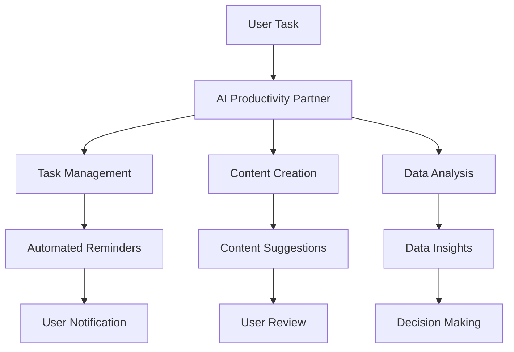

---

## AI Agents: Your New Productivity Partners in 2026

As we approach 2026, the landscape of work is evolving rapidly, thanks to advancements in artificial intelligence. With AI productivity partners becoming integral to our daily routines, the way we approach tasks, manage our time, and enhance our creativity is undergoing a significant transformation. In this article, we will explore how AI agents are set to become your most valuable productivity partners, the benefits they bring, and some practical examples of how they can be utilized in various domains.

### What Are AI Productivity Partners?

AI productivity partners refer to intelligent systems that assist individuals or teams in optimizing their workflows. These agents leverage machine learning, natural language processing, and automation to provide support in a variety of tasks, from scheduling meetings to generating creative content. As they become more sophisticated, these tools are designed to understand user preferences, predict needs, and help streamline processes, ultimately enhancing productivity.

### Why You Need an AI Productivity Partner

In today’s fast-paced world, juggling multiple tasks can easily lead to burnout and inefficiency. Here are a few reasons why integrating an AI productivity partner into your workflow can be a game-changer:

1. **Time Management**: AI tools can analyze your schedule, prioritize tasks, and even suggest optimal times for deep work and breaks.
  
2. **Enhanced Collaboration**: With AI agents facilitating communication and project management, teams can work together more effectively, regardless of location.

3. **Automation of Routine Tasks**: Repetitive tasks can be automated, allowing you to focus on more strategic initiatives that require human creativity and insight.

4. **Data-Driven Insights**: AI can provide valuable analytics that help in decision-making, ensuring you are always one step ahead.

### Practical Use Cases of AI Productivity Partners

Let’s delve into some practical use cases that illustrate how AI productivity partners can be utilized across different domains.

#### 1. Task Management and Scheduling

Imagine an AI agent that can manage your calendar, remind you of deadlines, and even reschedule meetings when conflicts arise. Tools like **Clockwise** and **x.ai** are already paving the way for this type of assistance. By analyzing your preferences and work habits, these tools can suggest the best times for meetings and help you allocate time for focused work.

#### 2. Content Creation

AI-driven writing assistants such as **Jasper** and **Copy.ai** can help marketers and content creators generate high-quality content in a fraction of the time. Whether you need blog posts, social media updates, or email newsletters, these tools can provide drafts, suggest improvements, and even optimize your content for SEO.

#### 3. Customer Support

In the realm of customer service, AI chatbots like **Zendesk AI** and **Intercom** act as productivity partners by handling routine inquiries, thus freeing up human agents to tackle more complex issues. This not only improves response times but also enhances customer satisfaction.

#### 4. Data Analysis

AI tools such as **Tableau** and **Power BI** can analyze vast amounts of data and present it in a digestible format. They can help businesses uncover trends, make data-driven decisions, and ultimately improve operational efficiency.

### Pros and Cons of AI Productivity Partners

While the benefits are compelling, it's essential to consider the potential downsides as well.

| Pros                                 | Cons                                  |
|--------------------------------------|---------------------------------------|
| Increases efficiency and productivity | May require a learning curve          |
| Reduces manual errors                | Potential for over-reliance           |
| Offers personalized recommendations   | Privacy concerns with data handling   |
| Enhances collaboration                | Can be costly depending on the tool   |

### The Future of AI Productivity Partners: A Workflow Diagram

To visualize how AI productivity partners will fit into your workflow, consider the following diagram that outlines the potential interactions and integrations:

### Choosing the Right AI Productivity Partner

With the plethora of AI tools available, how do you choose the right one for your needs? Here’s a quick comparison of some popular AI productivity partners:

<table>
  <tr>
    <th>Tool</th>
    <th>Best For</th>
    <th>Key Features</th>
    <th>Pricing</th>
  </tr>
  <tr>
    <td>Clockwise</td>
    <td>Time Management</td>
    <td>Smart scheduling, calendar optimization</td>
    <td>Free; paid plans available</td>
  </tr>
  <tr>
    <td>Jasper</td>
    <td>Content Creation</td>
    <td>AI writing assistant, SEO optimization</td>
    <td>Starts at $29/month</td>
  </tr>
  <tr>
    <td>Zendesk AI</td>
    <td>Customer Support</td>
    <td>AI chatbots, analytics tools</td>
    <td>Custom pricing</td>
  </tr>
  <tr>
    <td>Tableau</td>
    <td>Data Analysis</td>
    <td>Visualization, data modeling</td>
    <td>Starts at $70/user/month</td>
  </tr>
</table>

### Conclusion: Embrace Your AI Productivity Partner

As we move toward 2026, the integration of AI productivity partners will redefine how we work. These intelligent systems are not just tools; they are companions that can help you navigate the complexities of modern work life with ease and efficiency. By embracing these technologies, you can enhance your productivity and focus on what truly matters—your creativity and strategic thinking.

Are you ready to transform your workflow with AI productivity partners? Explore the tools mentioned in this article, and see how they can make a significant impact on your daily tasks. Share your thoughts or experiences with these tools in the comments below! Let's step into the future of productivity together.