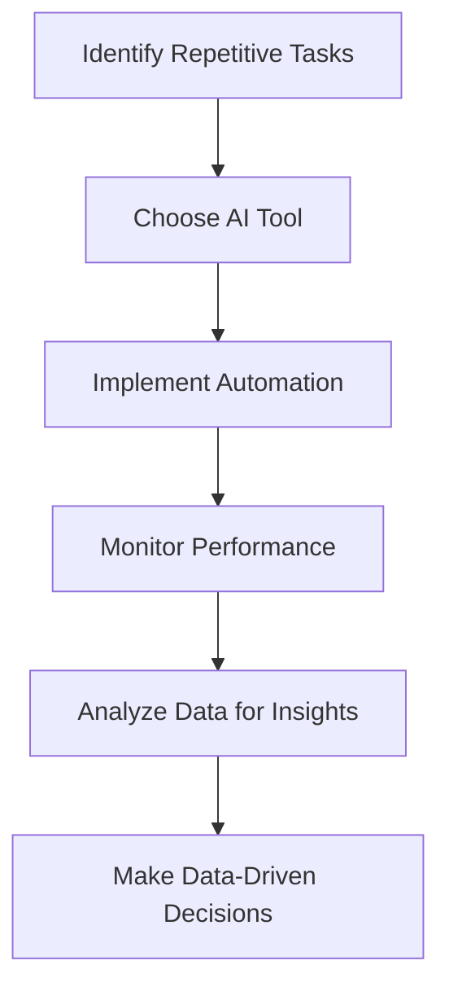

---

# AI Automation: Revolutionizing Business Operations in 2026

As we step into 2026, the landscape of business operations is undergoing a substantial transformation, largely propelled by advancements in AI automation. Companies are increasingly adopting AI technologies to streamline processes, improve decision-making, and enhance overall productivity. In this blog post, we will explore how AI automation is reshaping the way businesses operate, providing practical examples, use cases, and a closer look at the tools driving this revolution.

## Understanding AI Automation

AI automation refers to the use of artificial intelligence technologies to perform tasks that traditionally require human intervention. From automating repetitive tasks to analyzing massive datasets for actionable insights, AI automation helps businesses operate more efficiently. This shift not only reduces human error but also allows employees to focus on more strategic and creative endeavors.

### Key Components of AI Automation

1. **Machine Learning**: Algorithms that allow systems to improve automatically through experience.
2. **Natural Language Processing (NLP)**: Enables machines to understand and interpret human language, facilitating smoother interactions.
3. **Robotic Process Automation (RPA)**: Traditional automation techniques that can mimic repetitive human tasks.
4. **Predictive Analytics**: Utilizing historical data to forecast future trends and behaviors.

## How AI Automation is Impacting Business Operations

### Enhanced Efficiency and Cost Savings

AI automation can significantly reduce operational costs. For example, a logistics company utilizing AI-driven route optimization can decrease fuel costs and improve delivery times. By analyzing traffic patterns, weather conditions, and delivery routes, AI algorithms can suggest the most efficient paths, leading to substantial savings.

### Improved Decision-Making

AI tools provide businesses with valuable insights that aid in strategic decision-making. Companies like Amazon utilize AI to analyze customer behavior, helping them stock the right products and personalize marketing efforts. This data-driven approach not only enhances customer satisfaction but also boosts sales.

### Use Case: Customer Support Automation

One of the most prevalent applications of AI automation is in customer support. Chatbots equipped with NLP capabilities can handle basic inquiries, allowing human agents to focus on more complex issues. A retail company employing an AI chatbot saw a 30% reduction in response time and a 20% increase in customer satisfaction. 

## AI Automation Tools to Consider in 2026

With numerous tools available in the market, selecting the right AI automation solution is crucial for maximizing efficiency. Below, we compare some popular AI automation tools and their key features.

<table>
  <tr>
    <th>Tool</th>
    <th>Key Features</th>
    <th>Pros</th>
    <th>Cons</th>
  </tr>
  <tr>
    <td>Zapier</td>
    <td>Integrates with various apps, automates workflows</td>
    <td>Easy to use, no coding required</td>
    <td>Limited advanced features</td>
  </tr>
  <tr>
    <td>UiPath</td>
    <td>Robotic process automation, enterprise-grade solutions</td>
    <td>Highly customizable, scalable</td>
    <td>Steeper learning curve</td>
  </tr>
  <tr>
    <td>Automation Anywhere</td>
    <td>Cloud-native RPA, AI-driven insights</td>
    <td>Excellent for large enterprises</td>
    <td>Costly for small businesses</td>
  </tr>
  <tr>
    <td>Chatbot.com</td>
    <td>Customizable chatbots, NLP capabilities</td>
    <td>User-friendly, boosts customer engagement</td>
    <td>Limited integration options</td>
  </tr>
</table>

## The Future of AI Automation in Business

### Predictions for 2026

As we look ahead, several trends are set to dominate the AI automation landscape in business operations:

1. **Increased Integration**: Businesses will increasingly integrate AI tools into their existing systems, allowing for seamless workflows.
2. **Focus on Cybersecurity**: With the rise of AI, the importance of cybersecurity will grow, as businesses must protect sensitive data from potential threats.
3. **Ethical AI**: Companies will prioritize ethical considerations in AI deployment, ensuring transparency and fairness in automated decisions.

### Workflow of AI Automation in Business

To visualize how AI automation integrates into business operations, here’s a simple workflow diagram:

## Conclusion: Embracing AI Automation for Business Success

As we move further into 2026, the integration of AI automation into business operations is not just a trend; it’s a necessity for success. Companies that embrace these technologies will not only enhance their operational efficiency but also stay competitive in an ever-evolving marketplace. 

Are you ready to transform your business operations with AI automation? Start exploring the right tools today and join the revolution that’s redefining the future of work!

### Call to Action

Interested in implementing AI automation in your business? Contact us for personalized consultations on selecting the right tools that fit your needs! Let’s make 2026 the year of innovation and efficiency in your organization.

## 関連記事

- [Automating Business Processes with AI in 2026](/posts/automating-business-processes-with-ai-in-2026/)
- [Harnessing AI Automation for Business Growth in 2026](/posts/harnessing-ai-automation-for-business-growth-in-2026/)
- [How AI Automation is Transforming Business Operations](/posts/how-ai-automation-is-transforming-business-operations/)
