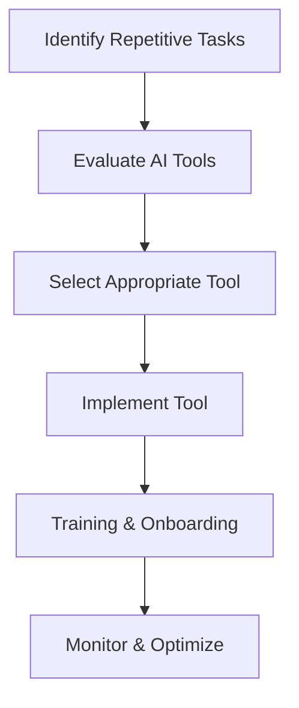

---

# AI Automation: The Key to Enhanced Business Efficiency

In today's fast-paced business landscape, organizations are constantly on the lookout for ways to streamline operations, reduce costs, and enhance productivity. Enter AI automation—a powerful tool that not only simplifies complex processes but also enhances overall business efficiency. In this article, we’ll explore the ins and outs of AI automation, practical applications, and how it can transform your business.

## What is AI Automation?

AI automation refers to the use of artificial intelligence technologies to automate repetitive and time-consuming tasks. From data entry to customer service, AI automation can handle a variety of functions, enabling human workers to focus on more strategic endeavors. 

### Why is AI Automation Important?

The importance of AI automation cannot be overstated. In an era where every second counts, businesses that successfully leverage this technology will find themselves at a significant advantage. Here are a few reasons why AI automation is essential:

- **Increased Efficiency**: Automating routine tasks speeds up processes and reduces the likelihood of human error.
- **Cost Savings**: By minimizing labor costs through automation, companies can allocate resources more effectively.
- **Enhanced Decision Making**: AI can analyze large datasets far quicker than humans, providing insights that help in strategic decision-making.
- **Improved Customer Experience**: AI chatbots can provide immediate assistance, ensuring customer queries are resolved swiftly.

## Practical Applications of AI Automation in Business

### 1. Customer Service Automation

One of the most popular applications of AI automation is in customer service. Chatbots powered by natural language processing (NLP) can handle inquiries, complaints, and requests 24/7. For instance, companies like Zendesk and Intercom provide AI-driven customer support solutions that can manage FAQs, ticketing systems, and even personalized recommendations.

#### Use Case: Chatbots in E-commerce

Imagine an online clothing store. Customers often have questions about sizing, availability, and shipping. By deploying a chatbot, the store can automate responses to these common queries, reducing wait times and improving customer satisfaction.

### 2. Marketing Automation

AI can also streamline marketing efforts. Tools like HubSpot and Marketo utilize AI to analyze consumer behavior, segment audiences, and automate email campaigns. This means that businesses can target the right audience at the right time with minimal manual effort.

#### Use Case: Personalized Email Campaigns

Suppose you run a travel agency. With AI automation, you can analyze past client trips and send personalized email offers based on their preferences. This not only increases the chances of conversion but also enhances customer loyalty.

### 3. Workflow Automation

AI can help automate workflows by integrating various business applications. Tools like Zapier or Microsoft Power Automate allow businesses to create workflows that connect different apps and automate tasks across platforms, ensuring that data flows seamlessly without manual intervention.

#### Use Case: Invoice Processing

A company can use AI to automate invoice processing by setting up a workflow that pulls data from emails, enters it into accounting software, and sends notifications to the finance team—all without human input.

## Pros and Cons of AI Automation

### Pros

- **Time-Saving**: Automates repetitive tasks, freeing up employee time for higher-value work.
- **Scalability**: Easily scales up processes to handle increased workloads without a proportional increase in cost.
- **Consistency**: Provides uniform output quality, reducing errors that can occur with human intervention.
- **Data-Driven Insights**: Generates valuable insights that can drive strategic decisions.

### Cons

- **Initial Investment**: Implementing AI solutions can require significant upfront investment.
- **Job Displacement**: Automation may lead to job losses in certain sectors, causing concerns among the workforce.
- **Complexity**: Some AI systems may be complex to implement and require ongoing maintenance.
- **Dependence on Data**: AI systems are only as good as the data they are trained on; poor data can lead to inaccurate outputs.

## Comparing AI Automation Tools

When it comes to selecting the right AI automation tools for your business, it’s essential to evaluate your specific needs. Here’s a comparison table of some popular AI automation tools:

<table>
  <tr>
    <th>Tool</th>
    <th>Best For</th>
    <th>Key Features</th>
    <th>Pricing</th>
  </tr>
  <tr>
    <td>Zapier</td>
    <td>Workflow Automation</td>
    <td>Integrates with over 2000 apps, easy-to-use interface</td>
    <td>Starts at $19.99/month</td>
  </tr>
  <tr>
    <td>HubSpot</td>
    <td>Marketing Automation</td>
    <td>Email campaigns, lead tracking, analytics</td>
    <td>Free tier available; paid plans start at $50/month</td>
  </tr>
  <tr>
    <td>Intercom</td>
    <td>Customer Service</td>
    <td>Chatbots, customer engagement tools, analytics</td>
    <td>Starts at $39/month</td>
  </tr>
  <tr>
    <td>UiPath</td>
    <td>Robotic Process Automation</td>
    <td>Drag-and-drop interface, extensive automation capabilities</td>
    <td>Pricing upon request</td>
  </tr>
</table>

## Workflow of AI Automation Implementation

To successfully integrate AI automation into your business, it's crucial to follow a structured workflow. Below is a simple diagram illustrating the steps involved:

## How to Get Started with AI Automation

1. **Identify Opportunities**: Analyze your current business processes to pinpoint tasks that are repetitive and time-consuming.
2. **Research Tools**: Explore various AI automation tools that align with your identified needs.
3. **Pilot Program**: Start with a small-scale pilot program to test the effectiveness of the chosen tool.
4. **Educate Your Team**: Ensure that your team is trained and comfortable with the new technology.
5. **Evaluate & Optimize**: Continuously monitor the performance of the automation and make necessary adjustments.

## Conclusion

AI automation efficiency is not just a buzzword; it’s a transformational force that can redefine how businesses operate. By automating routine tasks, organizations can improve productivity, reduce costs, and focus on what truly matters—innovation and customer satisfaction.

Are you ready to harness the power of AI automation for your business? Start exploring the tools available today, and take the first step towards enhancing your operational efficiency!

---

### Call to Action

Don’t let your business fall behind in the digital age. Explore our comprehensive guides and reviews on AI automation tools at AI Tools Lab, and take your productivity to the next level!

## 関連記事

- [AI Agents: The Future of Personal Assistants in 2026](/posts/ai-agents-the-future-of-personal-assistants-in-2026/)
- [AI Automation: A Game Changer for Small Businesses](/posts/ai-automation-a-game-changer-for-small-businesses/)
- [AI Coding Tools: Boost Your Development Skills Today](/posts/ai-coding-tools-boost-your-development-skills-today/)
