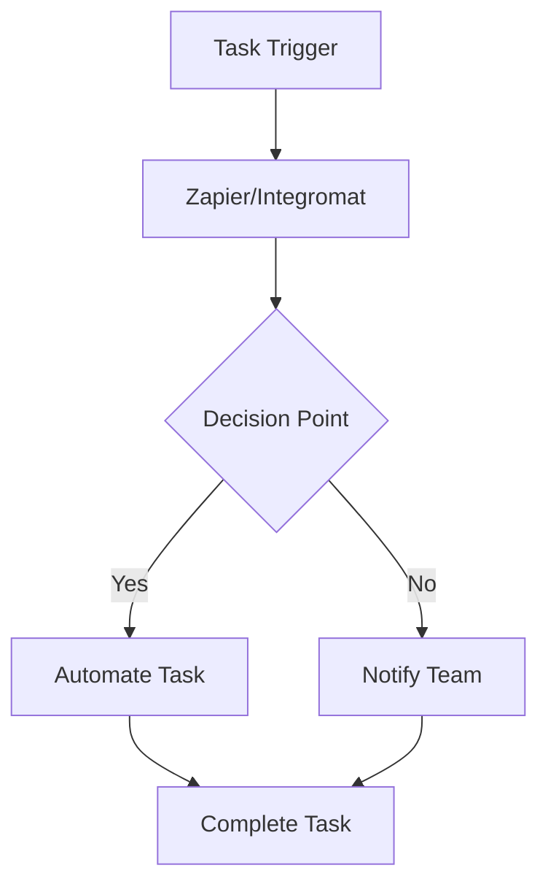

---

# AI Automation: Top Tools for Enhancing Team Productivity

In today's fast-paced business environment, every second counts. Teams are under constant pressure to deliver results, often leading to burnout and inefficiencies. Enter AI automation tools—game-changers that can transform how teams operate, allowing them to focus on what truly matters. In this article, we’ll explore some of the top AI automation tools available today and how they can enhance your team's productivity.

## What Are AI Automation Tools?

AI automation tools leverage artificial intelligence to automate routine tasks, streamline processes, and enhance decision-making. These tools can handle everything from scheduling meetings to analyzing data, freeing up time for team members to engage in more strategic work. By integrating AI automation into your workflow, you can boost efficiency, reduce errors, and increase overall productivity.

## Why Use AI Automation Tools?

There are several compelling reasons to incorporate AI automation tools into your team's workflow:

1. **Time Savings**: Automating repetitive tasks allows team members to focus on higher-value activities.
2. **Increased Accuracy**: AI reduces human error, leading to more reliable outcomes.
3. **Data Insights**: AI tools can analyze vast amounts of data quickly, providing valuable insights for better decision-making.
4. **Scalability**: Automation helps teams scale their operations without necessarily adding more personnel.

## Top AI Automation Tools to Consider

Let’s delve into some of the most effective AI automation tools currently available, highlighting their features, pros, and cons.

### 1. Zapier

#### Overview

Zapier is a popular automation tool that connects different apps and services to automate workflows without requiring coding skills.

#### Features

- Connects over 3,000 apps
- Customizable workflows (Zaps)
- Automation triggers based on events

#### Pros and Cons

| Pros                       | Cons                       |
|----------------------------|----------------------------|
| Easy to use                | Limited customization options |
| Extensive app integrations  | Can become expensive for larger teams |
| Excellent customer support   | Complex workflows may require a learning curve |

### 2. Integromat (Make)

#### Overview

Integromat, now rebranded as Make, is a powerful automation platform that allows users to visually design workflows.

#### Features

- Drag-and-drop interface for creating scenarios
- Real-time data transfer between apps
- Extensive library of pre-built templates

#### Pros and Cons

| Pros                       | Cons                       |
|----------------------------|----------------------------|
| Highly customizable         | Initial setup can be time-consuming |
| Supports complex scenarios  | May overwhelm beginners with options |
| Affordable pricing plans    | Limited customer support options |

### 3. UiPath

#### Overview

UiPath is one of the leaders in Robotic Process Automation (RPA), focusing on automating repetitive tasks across various applications.

#### Features

- Visual workflow designer
- AI integration for decision-making
- Excellent scalability options

#### Pros and Cons

| Pros                       | Cons                       |
|----------------------------|----------------------------|
| Robust feature set         | Steeper learning curve for new users |
| Suitable for enterprise-level automation | High cost for advanced features |
| Strong community support    | Requires IT involvement for setup |

### 4. Microsoft Power Automate

#### Overview

Microsoft Power Automate (formerly Microsoft Flow) is an automation tool that integrates seamlessly with Microsoft 365 applications.

#### Features

- Pre-built templates for common tasks
- Integration with Microsoft and third-party apps
- AI Builder for implementing AI capabilities

#### Pros and Cons

| Pros                       | Cons                       |
|----------------------------|----------------------------|
| User-friendly interface      | Limited functionality outside Microsoft ecosystem |
| Strong integration with Office apps | Can be costly for larger teams |
| Good for basic automation   | Some advanced features require technical knowledge |

### Comparison of AI Automation Tools

To help you decide which tool best fits your team's needs, here’s a quick comparison based on features, pricing, and target users.

<table>
  <tr>
    <th>Tool</th>
    <th>Ease of Use</th>
    <th>Pricing</th>
    <th>Best For</th>
  </tr>
  <tr>
    <td>Zapier</td>
    <td>Easy</td>
    <td>Free tier; paid plans start at $19.99/month</td>
    <td>Small to medium-sized businesses</td>
  </tr>
  <tr>
    <td>Integromat (Make)</td>
    <td>Moderate</td>
    <td>Free tier; paid plans start at $9/month</td>
    <td>Teams requiring custom workflows</td>
  </tr>
  <tr>
    <td>UiPath</td>
    <td>Complex</td>
    <td>Contact for pricing</td>
    <td>Enterprise-level automation</td>
  </tr>
  <tr>
    <td>Microsoft Power Automate</td>
    <td>Easy</td>
    <td>Free tier; paid plans start at $15/month</td>
    <td>Microsoft ecosystem users</td>
  </tr>
</table>

### Workflow Automation Example with Mermaid Diagram

To visualize how these tools can fit into your team’s workflow, here's a simple diagram illustrating a potential automation process using AI tools:

## How to Choose the Right AI Automation Tool

Selecting the right AI automation tool for your team doesn’t have to be overwhelming. Here’s a simple approach to guide your decision:

1. **Identify Your Needs**: Determine which tasks you want to automate and the tools currently used in your workflow.
2. **Evaluate Features**: Look for tools that offer the features that align with your automation goals, such as integrations and user-friendliness.
3. **Consider Budget**: Factor in your budget not just for initial costs but also for long-term use.
4. **Test Drive**: Leverage free trials to test the tools in action before making a commitment.

## Conclusion

AI automation tools have the potential to revolutionize how your team operates, enhancing productivity, efficiency, and accuracy. Whether you’re a small business or a large enterprise, there's a tool that can help streamline your workflows. 

Are you ready to elevate your team's productivity with AI automation? Start exploring these tools today and see the difference they can make in your daily operations!

### Call to Action

If you're interested in diving deeper into AI tools and discovering more about how they can enhance your productivity, subscribe to our newsletter for the latest updates and expert insights!