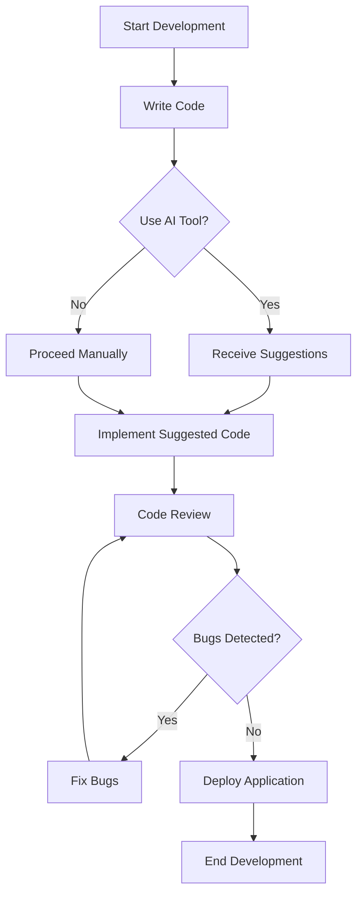

---

# AI Coding Tools: Revolutionizing Software Development

In today's fast-paced tech landscape, the integration of artificial intelligence (AI) in software development has become a game-changer. By automating mundane tasks, enhancing collaboration, and providing invaluable insights, AI tools are revolutionizing how developers approach coding. In this blog post, we’ll delve into the various AI tools available, their benefits, practical use cases, and how they are shaping the future of software development.

## Understanding AI in Software Development

AI in software development refers to the application of machine learning, natural language processing, and other AI technologies to improve coding practices and streamline the development process. These tools assist developers by offering code suggestions, automating testing, identifying bugs, and even generating entire code snippets based on user input.

### Benefits of Using AI Coding Tools

1. **Increased Productivity**: AI tools can automate repetitive tasks, allowing developers to focus on more complex problems.
2. **Enhanced Code Quality**: By using AI to analyze code, developers can significantly reduce bugs and improve overall code quality.
3. **Faster Development Cycles**: With AI handling routine tasks, projects can move from conception to deployment more swiftly.
4. **Better Collaboration**: AI tools often include features that facilitate communication and collaboration among team members, reducing the likelihood of miscommunication.
5. **Continuous Learning**: Many AI tools learn from user behavior, enabling them to offer increasingly sophisticated suggestions over time.

## Popular AI Coding Tools

Let’s explore some of the most popular AI coding tools currently available and how they can benefit software development.

### 1. GitHub Copilot

[GitHub Copilot](https://github.com/features/copilot?ref=AFFILIATE_ID) is an AI-powered code completion tool developed by GitHub and OpenAI. It suggests whole lines or blocks of code based on the context of what the developer is writing.

#### Pros:
- Provides real-time suggestions as you code.
- Supports multiple programming languages.
- Learns from a vast dataset of publicly available code.

#### Cons:
- Can occasionally suggest insecure code patterns.
- Requires an internet connection for optimal performance.

### 2. Tabnine

[Tabnine](https://www.tabnine.com/?ref=AFFILIATE_ID) is another AI-driven tool that enhances code completion and predictive coding. It uses deep learning models to understand a developer's coding style and offers context-aware suggestions.

#### Pros:
- Customizable AI model based on your codebase.
- Works with many popular IDEs.
- Offers offline support.

#### Cons:
- May not be as effective for less common programming languages.
- Advanced features are locked behind a paywall.

### 3. DeepCode

DeepCode is an AI coding assistant that reviews code for bugs and security vulnerabilities. It analyzes the codebase and offers suggestions for improvement.

#### Pros:
- Offers real-time feedback on code vulnerabilities.
- Integrates seamlessly with version control systems.
- Provides suggestions based on best practices.

#### Cons:
- May require a learning curve for new users.
- Can produce false positives in certain cases.

### 4. CodeGuru

Amazon CodeGuru is a cloud-based tool that provides automated code reviews and performance recommendations for applications hosted on AWS.

#### Pros:
- Integrates well with other AWS services.
- Provides actionable insights to improve performance and reduce costs.
- Uses machine learning to learn from previous code reviews.

#### Cons:
- Limited to applications running on AWS.
- Can be pricey for small teams.

### Comparison of AI Coding Tools

To help you make an informed decision, here’s a side-by-side comparison of the tools mentioned above:

<table>
    <tr>
        <th>Tool</th>
        <th>Real-Time Suggestions</th>
        <th>Languages Supported</th>
        <th>Customizable</th>
        <th>Pricing</th>
    </tr>
    <tr>
        <td>GitHub [Copilot](https://github.com/features/copilot?ref=AFFILIATE_ID)</td>
        <td>Yes</td>
        <td>Multiple</td>
        <td>No</td>
        <td>Subscription-based</td>
    </tr>
    <tr>
        <td>Tabnine</td>
        <td>Yes</td>
        <td>Multiple</td>
        <td>Yes</td>
        <td>Free/Premium</td>
    </tr>
    <tr>
        <td>DeepCode</td>
        <td>Yes</td>
        <td>Multiple</td>
        <td>No</td>
        <td>Free/Premium</td>
    </tr>
    <tr>
        <td>CodeGuru</td>
        <td>No</td>
        <td>Java</td>
        <td>No</td>
        <td>Pay-as-you-go</td>
    </tr>
</table>

## Practical Use Cases for AI Coding Tools

To truly appreciate the value of AI tools in software development, let’s consider some practical use cases:

### 1. Code Completion

Imagine a developer working on a large-scale application. With GitHub Copilot, they can receive code suggestions as they type, significantly speeding up the coding process. For example, if they start writing a function, Copilot can predict the rest of the function based on context, allowing the developer to complete tasks faster.

### 2. Bug Detection

Using DeepCode, a developer can run a code review before merging their changes. The tool analyzes the entire codebase and flags potential bugs or security vulnerabilities. This proactive approach not only saves time in the debugging phase but also enhances the overall security of the application.

### 3. Performance Optimization

With Amazon CodeGuru, developers can automatically receive recommendations on how to optimize their code for better performance. This is particularly useful for applications hosted on AWS, where the tool can suggest changes that could lead to significant cost savings and improved efficiency.

## The Future of AI in Software Development

As AI technology continues to evolve, we can expect even more sophisticated tools that will further enhance software development processes. The integration of AI with other emerging technologies, such as blockchain and the Internet of Things (IoT), will likely create new opportunities for innovation.

### Workflow of AI Integration in Software Development

To visualize how AI tools are integrated into the software development workflow, consider the following diagram:

## Conclusion

AI coding tools are not just a trend; they are reshaping the entire software development landscape. By automating routine tasks, enhancing collaboration, and providing intelligent insights, these tools enable developers to focus on what they do best: creating innovative solutions. 

As you explore the integration of AI in your software development process, consider trying out some of the tools mentioned in this post. Whether you’re a seasoned developer or just starting, leveraging AI can significantly enhance your productivity and code quality.

**Ready to revolutionize your coding experience? Start exploring AI coding tools today and unlock your full potential in software development!**

## 関連記事

- [Shipping Faster: AI Tools That Cut Development Time in Half](/posts/ai-coding-tools-the-key-to-faster-development-cycles/)
- [AI Coding Tools for Beginners: Where to Start in 2026](/posts/how-ai-coding-tools-are-revolutionizing-software-development/)
- [Best Free AI Coding Tools for Budget-Conscious Developers](/posts/the-best-ai-coding-tools-to-boost-developer-efficiency/)
