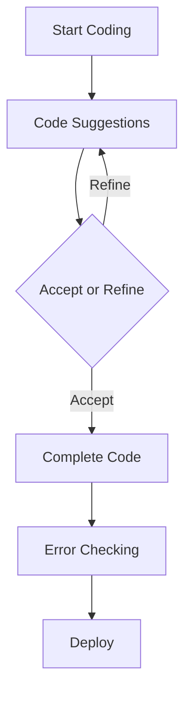

---

## AI Coding Tools: The Key to Faster Development Cycles

In the fast-paced world of software development, the pressure to deliver high-quality products quickly has never been greater. This is where AI coding tools come into play, revolutionizing the way developers approach their work. By leveraging artificial intelligence, these tools can help you code faster, reduce errors, and improve overall productivity. In this article, we’ll explore the various AI coding tools available, their benefits, and how they can help you achieve faster development cycles.

### What Are AI Coding Tools?

AI coding tools are software applications that utilize artificial intelligence to assist developers in writing code more efficiently. They can automate repetitive tasks, suggest code snippets, identify bugs, and even generate entire blocks of code based on simple prompts. This not only speeds up the development process but also helps developers focus on more complex challenges that require human creativity and problem-solving skills.

### Benefits of Using AI Coding Tools

1. **Increased Productivity**: By automating mundane coding tasks, developers can dedicate more time to critical aspects of their projects, ultimately reducing the overall development time.
   
2. **Error Reduction**: AI tools can identify potential bugs and errors in real-time, allowing developers to fix issues before they become problematic.
   
3. **Enhanced Collaboration**: Many AI coding tools facilitate better collaboration among team members by providing a shared platform for code review and suggestions.
   
4. **Learning and Adaptation**: AI coding tools can learn from previous coding patterns and adapt their suggestions accordingly, making them increasingly effective over time.

### Popular AI Coding Tools

Let’s dive into some of the top AI coding tools that can help you achieve faster development cycles.

#### 1. GitHub Copilot

**Overview**: [GitHub Copilot](https://github.com/features/copilot?ref=AFFILIATE_ID) is an AI pair programmer that suggests code snippets and entire functions based on the context of the code being written.

**Pros**:
- Provides context-aware suggestions.
- Supports multiple programming languages.
- Integrates seamlessly with popular IDEs like Visual Studio Code.

**Cons**:
- May suggest incorrect or inefficient code.
- Requires an active internet connection to function.

#### 2. TabNine

**Overview**: TabNine uses deep learning to provide code completions and suggestions. It works with a variety of languages and can be integrated into most code editors.

**Pros**:
- Supports many programming languages.
- Offers local and cloud-based models for flexibility.
- Can be customized to fit personal coding styles.

**Cons**:
- The free version has limited features compared to the pro version.
- May require some time to learn optimization settings.

#### 3. Kite

**Overview**: Kite is an AI-powered coding assistant that provides intelligent code completions and documentation. It also includes a feature called "Kite [Copilot](https://github.com/features/copilot?ref=AFFILIATE_ID)" for more advanced suggestions.

**Pros**:
- Supports more than 16 programming languages.
- Offers built-in documentation for quick reference.
- Works offline after initial setup.

**Cons**:
- The installation process can be complicated for some users.
- Limited functionality compared to competitors like [Copilot](https://github.com/features/copilot?ref=AFFILIATE_ID).

### Comparison of AI Coding Tools

Here’s a quick comparison of the AI coding tools mentioned above:

<table>
    <tr>
        <th>Tool</th>
        <th>Supported Languages</th>
        <th>IDE Integration</th>
        <th>Offline Capabilities</th>
        <th>Cost</th>
    </tr>
    <tr>
        <td>[GitHub Copilot](https://github.com/features/copilot?ref=AFFILIATE_ID)</td>
        <td>Multiple</td>
        <td>Visual Studio Code, JetBrains</td>
        <td>No</td>
        <td>Subscription-based</td>
    </tr>
    <tr>
        <td>TabNine</td>
        <td>Multiple</td>
        <td>Most Editors</td>
        <td>Yes (Local model)</td>
        <td>Free / Pro</td>
    </tr>
    <tr>
        <td>Kite</td>
        <td>16+</td>
        <td>Most Editors</td>
        <td>Yes</td>
        <td>Free / Pro</td>
    </tr>
</table>

### Use Cases for AI Coding Tools

1. **Rapid Prototyping**: When you need to quickly build a prototype for a client, AI coding tools can help you generate the necessary code much faster than traditional methods.

2. **Error Checking**: If your project involves complex algorithms, using AI tools to catch bugs early can save you countless hours of debugging later on.

3. **Learning New Languages**: For developers picking up new programming languages, AI coding tools can provide helpful syntax suggestions and examples, making the learning curve less steep.

### Workflow of AI Coding Tools

To better understand how AI coding tools integrate into the development process, here's a simple workflow diagram:

### Conclusion

AI coding tools are undeniably changing the landscape of software development. By leveraging these technologies, developers can code faster, reduce errors, and improve their overall productivity. As the demand for faster development cycles continues to grow, integrating AI coding tools into your workflow will be essential for staying competitive.

Are you ready to take your coding skills to the next level? Explore the AI coding tools mentioned in this article and see how they can transform your development process. Don't wait—start your journey towards faster development cycles today!

## 関連記事

- [AI Pair Programming: How Coding Assistants Are Replacing Rubber Ducks](/posts/ai-coding-tools-revolutionizing-software-development/)
- [AI Coding Tools for Beginners: Where to Start in 2026](/posts/how-ai-coding-tools-are-revolutionizing-software-development/)
- [Best Free AI Coding Tools for Budget-Conscious Developers](/posts/the-best-ai-coding-tools-to-boost-developer-efficiency/)
