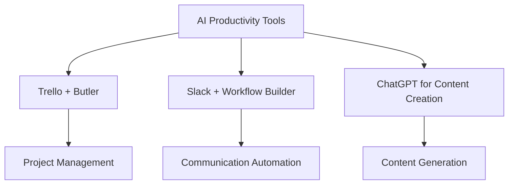

---

# AI-Driven Productivity: Tools Every Business Needs in 2026

As we step into 2026, the business landscape is evolving rapidly, driven by technological advancements and the integration of artificial intelligence (AI) into everyday tasks. AI productivity tools have become essential for organizations looking to enhance efficiency, streamline workflows, and improve overall productivity. In this blog post, we will explore the most effective AI productivity tools that every business should consider adopting this year.

## What Are AI Productivity Tools?

AI productivity tools leverage artificial intelligence to automate tasks, analyze data, and offer insights that help businesses operate more efficiently. These tools can perform a range of functions, from scheduling meetings to managing projects, analyzing customer behavior, and even generating content. By integrating AI into their workflows, businesses can save time, reduce errors, and ultimately drive growth.

## Why AI Productivity Tools Matter

The adoption of AI productivity tools is crucial for businesses aiming to stay competitive in 2026. Here are a few reasons why:

1. **Efficiency**: Automation of repetitive tasks allows employees to focus on higher-value activities.
2. **Data-Driven Decisions**: AI tools can provide insights and analytics that guide strategic decision-making.
3. **Enhanced Collaboration**: Many AI tools facilitate better communication and teamwork, regardless of location.
4. **Scalability**: AI-driven solutions can easily scale as businesses grow, accommodating increasing workloads without a corresponding rise in staffing.

## Top AI Productivity Tools for 2026

Let's dive into some of the most impactful AI productivity tools that businesses should consider in 2026.

### 1. Trello + Butler

**Overview**: Trello is a popular project management tool, and its automation feature, Butler, uses AI to streamline workflows.

**Use Case**: A marketing team can automate card movements, reminders, and due dates based on trigger actions, saving time on project updates.

**Pros**:
- User-friendly interface
- Highly customizable
- Integrates with various other tools

**Cons**:
- Limited reporting features
- May require a learning curve for advanced automation

### 2. Slack + Workflow Builder

**Overview**: Slack is a communication platform that offers a Workflow Builder powered by AI to automate routine messaging and notifications.

**Use Case**: A sales team can set up automated follow-up messages to leads based on their responses, ensuring timely communication.

**Pros**:
- Centralized communication
- Easy to set up workflows
- Integrates with many applications

**Cons**:
- Can become cluttered with too many channels
- Notifications can be overwhelming

### 3. ChatGPT for Content Creation

**Overview**: OpenAI's [ChatGPT](https://chat.openai.com/?ref=AFFILIATE_ID) is an AI language model that can generate high-quality content, assist with brainstorming, and even draft emails.

**Use Case**: Content marketers can use [ChatGPT](https://chat.openai.com/?ref=AFFILIATE_ID) to create blog posts, social media content, and email newsletters in a fraction of the time it would take manually.

**Pros**:
- Produces high-quality content quickly
- Versatile and can adapt to various writing styles
- Available 24/7

**Cons**:
- May require editing for accuracy and tone
- Can sometimes produce repetitive content

### 4. Notion AI

**Overview**: Notion is an all-in-one workspace that includes notes, databases, and task management. Its AI feature assists in generating content and organizing information.

**Use Case**: Teams can use [Notion AI](https://www.notion.so/product/ai?ref=AFFILIATE_ID) to draft meeting notes or summarize project updates, making it easier to keep everyone aligned.

**Pros**:
- Combines multiple functionalities
- Highly customizable workspace
- Strong collaboration features

**Cons**:
- Can be overwhelming with features
- Performance may lag with large databases

### 5. ClickUp

**Overview**: ClickUp is a comprehensive project management platform that incorporates AI for task prioritization and team collaboration.

**Use Case**: A software development team can use ClickUp to automatically prioritize tasks based on deadlines and team workload, ensuring efficient sprint planning.

**Pros**:
- All-in-one solution for project management
- Highly customizable
- Strong integration capabilities

**Cons**:
- Learning curve for new users
- Interface can feel cluttered at times

## Comparing AI Productivity Tools

To help you choose the right AI productivity tools for your business, here's a comparison table detailing the features, pros, and cons of the top tools discussed.

<table>
    <tr>
        <th>Tool</th>
        <th>Features</th>
        <th>Pros</th>
        <th>Cons</th>
    </tr>
    <tr>
        <td>Trello + Butler</td>
        <td>Project management, automation</td>
        <td>User-friendly, customizable</td>
        <td>Limited reporting features</td>
    </tr>
    <tr>
        <td>Slack + Workflow Builder</td>
        <td>Communication, automation</td>
        <td>Centralized communication</td>
        <td>Can become cluttered</td>
    </tr>
    <tr>
        <td>[ChatGPT](https://chat.openai.com/?ref=AFFILIATE_ID)</td>
        <td>Content generation</td>
        <td>Produces high-quality content</td>
        <td>May require editing</td>
    </tr>
    <tr>
        <td>[Notion AI](https://www.notion.so/product/ai?ref=AFFILIATE_ID)</td>
        <td>Notes, databases, task management</td>
        <td>All-in-one workspace</td>
        <td>Performance may lag</td>
    </tr>
    <tr>
        <td>ClickUp</td>
        <td>Project management, task prioritization</td>
        <td>Comprehensive solution</td>
        <td>Learning curve for new users</td>
    </tr>
</table>

## How to Choose the Right AI Productivity Tool

Choosing the right AI productivity tool depends on your organization’s specific needs, team size, and existing processes. Here are a few steps to guide your decision:

1. **Assess Your Needs**: Identify the tasks you want to automate or enhance with AI.
2. **Evaluate Features**: Look for tools that offer the features most relevant to your business operations.
3. **Consider Integration**: Make sure the tool can integrate seamlessly with your existing systems.
4. **Trial and Feedback**: Take advantage of free trials to gather feedback from your team before making a commitment.

## Conclusion

As AI continues to transform the business landscape, integrating AI productivity tools into your operations is no longer optional. The right tools can significantly enhance efficiency, streamline workflows, and empower your team to achieve more in less time. Whether you're looking to improve project management with Trello, enhance communication through Slack, or generate content with [ChatGPT](https://chat.openai.com/?ref=AFFILIATE_ID), there's an AI tool out there tailored to meet your needs.

Are you ready to elevate your business productivity in 2026? Start exploring these AI productivity tools today and watch your efficiency soar!

### Call to Action

Don’t wait to harness the power of AI! Subscribe to AI Tools Lab for more insights and updates on the latest AI productivity tools that can transform your business. Share your experiences with AI tools in the comments below, and let's start a conversation about the future of productivity!

## 関連記事

- [AI-Powered Productivity: Transforming Workflows](/posts/ai-powered-productivity-transforming-workflows/)
- [Top AI Tools Boosting Productivity in 2026](/posts/top-ai-tools-boosting-productivity-in-2026/)
- [AI Agents: The Future of Personal Assistants in 2026](/posts/ai-agents-the-future-of-personal-assistants-in-2026/)
