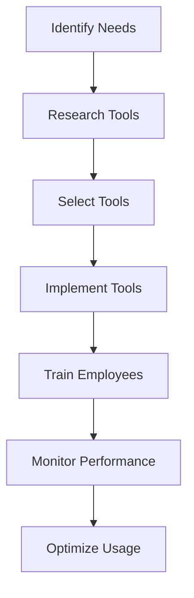

---

## AI for Business: Essential Tools Every Company Needs in 2026

As we step into 2026, the landscape of business technology is rapidly evolving, and artificial intelligence (AI) is at the forefront of this transformation. With the increasing demand for efficiency, data-driven decision-making, and enhanced customer experiences, AI tools for business are becoming indispensable. In this post, we will explore the essential AI tools every company should consider to stay competitive in the modern market.

### Why AI Tools Are Crucial for Businesses

AI tools have revolutionized how businesses operate, offering solutions that streamline processes, enhance productivity, and provide valuable insights through data analysis. From automating mundane tasks to predicting market trends, AI can help businesses of all sizes achieve their goals more efficiently.

### Key Categories of AI Tools for Business

1. **Customer Relationship Management (CRM)**
2. **Project Management**
3. **Data Analytics**
4. **Marketing Automation**
5. **Human Resources and Recruitment**
6. **Financial Management**

Each category presents unique tools that cater to specific business needs. Let’s dive deeper into some of the most essential AI tools in these categories.

### 1. Customer Relationship Management (CRM)

#### HubSpot

**Pros:**
- Intuitive interface.
- Robust automation features.
- Comprehensive analytics.

**Cons:**
- Can become costly as your contact list grows.

HubSpot is an all-in-one CRM that leverages AI to enhance customer interactions and drive sales. Its AI capabilities help businesses analyze customer behavior and segment their audience for targeted marketing campaigns.

#### Salesforce Einstein

**Pros:**
- Powerful AI analytics.
- Customizable dashboards.
- Seamless integration with third-party apps.

**Cons:**
- Steep learning curve for new users.

Salesforce Einstein is another powerful AI-driven CRM that provides predictive insights, helping businesses make informed decisions and personalize customer experiences.

### 2. Project Management

#### Trello

**Pros:**
- User-friendly interface.
- Versatile project tracking.
- Excellent collaboration tools.

**Cons:**
- Limited advanced features without integrations.

Trello utilizes AI to enhance task management and collaboration among teams. Its automation tools can help assign tasks based on team members’ workloads, ensuring no one is overwhelmed.

#### Monday.com

**Pros:**
- Highly customizable workflows.
- Visual project tracking.
- Integrates with various tools.

**Cons:**
- Can be overwhelming for small teams due to its features.

Monday.com uses AI to optimize project management by providing suggestions based on team activity and deadlines, ensuring smoother workflow management.

### 3. Data Analytics

#### Google Analytics 4

**Pros:**
- Comprehensive data insights.
- Predictive analytics capabilities.
- Easy integration with other Google tools.

**Cons:**
- Complexity can be challenging for beginners.

Google Analytics 4 leverages AI to provide insights into user behavior and website performance. The predictive insights can help businesses make data-driven decisions, enhancing their marketing strategies.

#### Tableau

**Pros:**
- Powerful data visualization.
- Supports large datasets.
- User-friendly interface for non-technical users.

**Cons:**
- Pricing can be high for small businesses.

Tableau utilizes AI and machine learning to analyze data and create interactive visualizations, allowing businesses to uncover trends and insights quickly.

### 4. Marketing Automation

#### Mailchimp

**Pros:**
- Excellent email marketing features.
- User-friendly design tools.
- Advanced analytics.

**Cons:**
- Limited automation features in lower-tier plans.

Mailchimp integrates AI to enhance email marketing campaigns by analyzing user engagement and optimizing send times.

#### Marketo

**Pros:**
- Comprehensive marketing solutions.
- Advanced lead scoring.
- Great integration capabilities.

**Cons:**
- Can be complex for new users.

Marketo leverages AI to automate marketing tasks and analyze customer interactions, helping businesses personalize their outreach efforts.

### 5. Human Resources and Recruitment

#### BambooHR

**Pros:**
- Intuitive HR management.
- Employee self-service features.
- Comprehensive reporting tools.

**Cons:**
- Limited customization options.

BambooHR employs AI to streamline recruitment processes and enhance employee engagement, helping HR teams manage their workforce effectively.

#### HireVue

**Pros:**
- AI-driven candidate assessments.
- Video interview capabilities.
- Reduces hiring bias.

**Cons:**
- May not fit all company cultures.

HireVue uses AI to analyze candidates’ video interviews, assessing their responses and providing data-driven insights to help HR teams make informed hiring decisions.

### 6. Financial Management

#### QuickBooks

**Pros:**
- Robust accounting features.
- Easy invoicing and expense tracking.
- Integrates with payroll systems.

**Cons:**
- Can be overwhelming for non-accountants.

QuickBooks employs AI to automate financial tasks, helping businesses manage their accounts efficiently and providing insights into cash flow.

#### Xero

**Pros:**
- User-friendly interface.
- Excellent mobile app.
- Strong bank reconciliation features.

**Cons:**
- Limited reporting features compared to competitors.

Xero utilizes AI to simplify bookkeeping and financial management, making it easier for businesses to stay on top of their finances.

### Comparison of Essential AI Tools for Business

Here’s a quick comparison of the essential AI tools discussed above, highlighting their key features:

<table>
  <tr>
    <th>Tool</th>
    <th>Category</th>
    <th>Key Features</th>
    <th>Pros</th>
    <th>Cons</th>
  </tr>
  <tr>
    <td>HubSpot</td>
    <td>CRM</td>
    <td>Analytics, automation, integrations</td>
    <td>User-friendly, comprehensive</td>
    <td>Costly with growth</td>
  </tr>
  <tr>
    <td>Salesforce Einstein</td>
    <td>CRM</td>
    <td>Predictive insights, customization</td>
    <td>Powerful analytics</td>
    <td>Steep learning curve</td>
  </tr>
  <tr>
    <td>Trello</td>
    <td>Project Management</td>
    <td>Task management, collaboration</td>
    <td>Intuitive interface</td>
    <td>Limited features without integrations</td>
  </tr>
  <tr>
    <td>Monday.com</td>
    <td>Project Management</td>
    <td>Custom workflows, visual tracking</td>
    <td>Highly customizable</td>
    <td>Overwhelming for small teams</td>
  </tr>
  <tr>
    <td>Google Analytics 4</td>
    <td>Data Analytics</td>
    <td>User insights, predictive analytics</td>
    <td>Comprehensive data</td>
    <td>Complex for beginners</td>
  </tr>
  <tr>
    <td>Tableau</td>
    <td>Data Analytics</td>
    <td>Data visualization, large datasets</td>
    <td>User-friendly for non-techies</td>
    <td>High pricing</td>
  </tr>
  <tr>
    <td>Mailchimp</td>
    <td>Marketing Automation</td>
    <td>Email marketing, analytics</td>
    <td>Excellent tools</td>
    <td>Limited features in lower-tier</td>
  </tr>
  <tr>
    <td>Marketo</td>
    <td>Marketing Automation</td>
    <td>Lead scoring, automation</td>
    <td>Comprehensive solutions</td>
    <td>Complex for new users</td>
  </tr>
  <tr>
    <td>BambooHR</td>
    <td>HR</td>
    <td>HR management, reporting</td>
    <td>Intuitive</td>
    <td>Limited customization</td>
  </tr>
  <tr>
    <td>HireVue</td>
    <td>HR</td>
    <td>Candidate assessments</td>
    <td>Reduces bias</td>
    <td>Culture fit issues</td>
  </tr>
  <tr>
    <td>QuickBooks</td>
    <td>Financial Management</td>
    <td>Accounting, invoicing</td>
    <td>Robust features</td>
    <td>Overwhelming for non-accountants</td>
  </tr>
  <tr>
    <td>Xero</td>
    <td>Financial Management</td>
    <td>Bookkeeping, bank reconciliation</td>
    <td>User-friendly</td>
    <td>Limited reporting</td>
  </tr>
</table>

### How to Choose the Right AI Tools for Your Business

When selecting AI tools for your business, consider the following factors:

- **Identify Your Needs:** Understand the specific challenges your business faces and what you aim to achieve with AI tools.
- **Budget:** Assess your budget and choose tools that provide the best return on investment.
- **Scalability:** Choose tools that can grow with your business.
- **User-Friendliness:** Ensure the tools are easy to use and implement within your team.

### Workflow of Implementing AI Tools in Business

To visualize how to go about implementing AI tools in your business, here's a simple workflow diagram:

### Conclusion

As we move further into 2026, adopting AI tools for business will not only enhance productivity but also give companies a competitive edge in their respective markets. From CRM to data analytics, the right tools can transform how businesses operate. 

Are you ready to embrace the power of AI in your organization? Start exploring these essential AI tools today and take your business to the next level!

For more insights on AI tools and productivity, subscribe to our newsletter and stay updated with the latest trends in technology.

## 関連記事

- [Choosing the Right AI Tools for Your Business Growth](/posts/choosing-the-right-ai-tools-for-your-business-growth/)
- [AI Agents: The Future of Personal Assistants in 2026](/posts/ai-agents-the-future-of-personal-assistants-in-2026/)
- [AI Automation: A Game Changer for Small Businesses](/posts/ai-automation-a-game-changer-for-small-businesses/)
