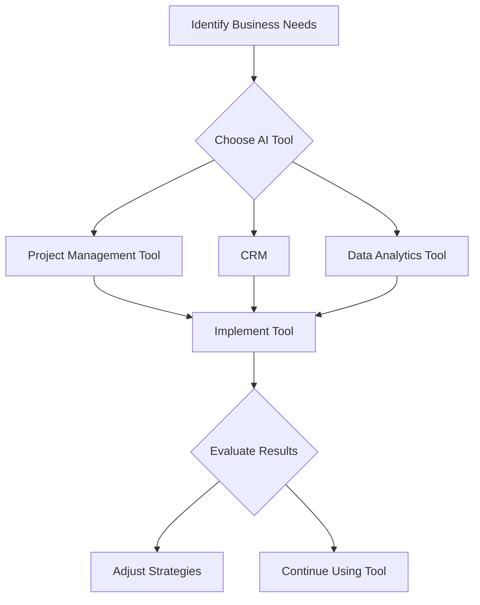

---

# AI for Business: Streamlining Operations with Intelligent Tools

In today’s fast-paced digital landscape, businesses are constantly searching for ways to increase efficiency, reduce costs, and enhance productivity. Enter AI for business—an innovative solution that is revolutionizing the way organizations operate. From automating mundane tasks to providing data-driven insights, intelligent tools are making waves across various industries. In this article, we’ll explore the myriad of ways AI can streamline operations and improve the overall performance of your business. 

## Understanding AI for Business

Before diving into specific tools, it's essential to grasp what AI for business entails. Artificial Intelligence (AI) refers to the simulation of human intelligence processes by machines, particularly computer systems. These processes include learning, reasoning, and self-correction. AI can analyze vast amounts of data, recognize patterns, and make predictions, which makes it a powerful asset in decision-making and operational efficiency.

### Key Benefits of AI for Business

1. **Increased Efficiency**: Automation of repetitive tasks frees up time for employees to focus on more strategic activities.
2. **Data-Driven Insights**: AI tools can analyze data at lightning speed, providing insights that help in making informed decisions.
3. **Cost Reduction**: By streamlining operations and minimizing errors, AI can significantly reduce operational costs.
4. **Enhanced Customer Experience**: AI tools can provide personalized interactions, leading to higher customer satisfaction and loyalty.

## Popular AI Tools for Streamlining Business Operations

### 1. Project Management Tools

AI-powered project management tools like Asana and Trello incorporate intelligent features that help teams collaborate more effectively. These platforms can automate task assignments, set priority levels based on deadlines, and even provide insights into team performance.

#### Pros and Cons

| Pros                                   | Cons                                   |
|----------------------------------------|----------------------------------------|
| Enhances team collaboration             | May require time for team training    |
| Automates repetitive tasks             | Some features can be overwhelming      |
| Provides real-time insights            | Subscription costs can add up         |

### 2. Customer Relationship Management (CRM)

AI-driven CRMs like Salesforce Einstein and HubSpot use machine learning algorithms to analyze customer interactions, predict customer behavior, and automate follow-up tasks. This helps businesses nurture leads and maintain strong relationships with customers.

#### Practical Example

Imagine a sales team using Salesforce Einstein. The CRM analyzes past interactions with a client and suggests the best time to reach out, the preferred communication method, and even offers insights on what products the client might be interested in based on their behavior.

#### Pros and Cons

| Pros                                   | Cons                                   |
|----------------------------------------|----------------------------------------|
| Personalizes customer interactions     | Requires accurate data input           |
| Automates follow-up processes          | Can be expensive for small businesses  |
| Increases sales effectiveness          | Complexity may lead to underutilization|

### 3. Data Analytics Tools

Platforms like Tableau and Google Analytics leverage AI to provide in-depth analytics and data visualization. These tools help businesses make sense of their data, identify trends, and make data-backed decisions.

#### Use Case

A retail company can use Google Analytics to analyze customer behavior on their website. By understanding which products are frequently viewed but not purchased, they can strategize marketing efforts to convert those views into sales.

#### Pros and Cons

| Pros                                   | Cons                                   |
|----------------------------------------|----------------------------------------|
| Visualizes complex data                | Requires data literacy to interpret    |
| Offers predictive analytics            | Can be resource-intensive              |
| Helps in strategic planning            | May require integration with other tools|

## Integrating AI Tools into Your Business

### Steps for Successful Implementation

1. **Identify Specific Needs**: Assess your business processes and identify areas that could benefit from AI.
2. **Choose the Right Tools**: Based on your needs, select AI tools that align with your business goals.
3. **Train Your Team**: Ensure your team is well-versed in the tools. Offer training sessions and resources to help them adapt.
4. **Monitor and Evaluate**: Regularly check the effectiveness of the tools and make adjustments as necessary.

### Comparison of Leading AI Tools for Business

Here’s a comparison table of the top AI tools mentioned above:

<table>
  <tr>
    <th>Tool</th>
    <th>Type</th>
    <th>Key Features</th>
    <th>Pricing</th>
  </tr>
  <tr>
    <td>Asana</td>
    <td>Project Management</td>
    <td>Task automation, team collaboration</td>
    <td>Starting at $10.99/user/month</td>
  </tr>
  <tr>
    <td>Salesforce Einstein</td>
    <td>CRM</td>
    <td>Predictive analytics, automated follow-ups</td>
    <td>Custom pricing based on needs</td>
  </tr>
  <tr>
    <td>Google Analytics</td>
    <td>Data Analytics</td>
    <td>Real-time analytics, data visualization</td>
    <td>Free with premium options</td>
  </tr>
</table>

## Conclusion

AI for business is not just a trend; it’s a necessity for organizations looking to thrive in a competitive landscape. By leveraging intelligent tools, businesses can streamline operations, make better decisions, and enhance customer experiences. Whether you’re a startup or an established enterprise, integrating AI into your operations can lead to substantial improvements.

### Call to Action

Ready to transform your business operations with AI? Explore various AI tools tailored for your specific needs today. Start your journey towards a more efficient and productive future by assessing which intelligent solutions can benefit your organization the most!

## 関連記事

- [AI Productivity Tools: A Complete Category Breakdown](/posts/ai-productivity-tools-transforming-the-future-of-work/)
- [Automating Business Processes with AI: A Step-by-Step Playbook](/posts/automating-business-processes-with-ai-a-complete-guide/)
- [Best AI Collaboration Tools for Remote Teams in 2026](/posts/best-ai-tools-for-improving-team-collaboration-in-2026/)
