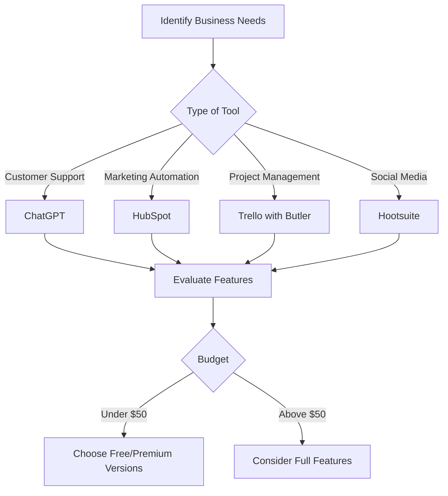

---

# AI for Small Businesses: Tools to Enhance Productivity

In the fast-paced world of small businesses, staying ahead of the competition requires innovation and efficiency. Enter AI tools for small business, which have transformed the way entrepreneurs operate, enabling them to automate tedious tasks, enhance customer engagement, and make data-driven decisions. In this article, we will explore some of the top AI tools that can significantly boost your productivity, along with practical examples and use cases.

## Why AI Tools Matter for Small Businesses

AI tools can be game-changers for small businesses, offering solutions that were once only available to larger organizations with extensive resources. These tools can help streamline operations, reduce costs, and improve overall productivity. By leveraging AI, small businesses can focus on what they do best—serving their customers and growing their brand.

## Key Areas Where AI Enhances Productivity

Before we dive into specific tools, it’s essential to understand the areas where AI can make a significant impact:

1. **Customer Service**: AI chatbots can handle customer inquiries 24/7, allowing businesses to provide immediate support without increasing staff costs.
  
2. **Marketing Automation**: AI tools can analyze data and help tailor marketing campaigns, ensuring you reach the right audience at the right time.

3. **Data Analysis**: AI can process vast amounts of data quickly, providing insights that can inform business decisions.

4. **Project Management**: AI tools can assist in tracking project progress, allocating resources, and managing deadlines effectively.

## Top AI Tools for Small Business

Now that we’ve established the benefits of AI, let’s take a look at some of the best AI tools currently available for small businesses.

### 1. ChatGPT

**Overview**: OpenAI’s ChatGPT is a conversational AI model that can assist with a variety of tasks, from customer service to content creation.

**Use Cases**:
- **Customer Support**: Automate responses to frequently asked questions.
- **Content Generation**: Create blog posts, social media updates, or marketing copy.

**Pros**:
- Versatile and easy to integrate.
- Can handle multiple conversations simultaneously.

**Cons**:
- May generate inaccurate information if not monitored.
- Requires training to optimize for specific business needs.

### 2. HubSpot

**Overview**: HubSpot is an all-in-one CRM platform that uses AI to enhance marketing, sales, and customer service.

**Use Cases**:
- **Lead Scoring**: AI analyzes data to prioritize leads based on their likelihood to convert.
- **Email Campaigns**: Automate personalized email campaigns using AI-driven insights.

**Pros**:
- Comprehensive platform with various tools.
- User-friendly interface.

**Cons**:
- Can be expensive for small businesses on a tight budget.
- Overwhelming features for beginners.

### 3. Trello with Butler

**Overview**: Trello is a project management tool that integrates AI through its Butler feature to automate repetitive tasks.

**Use Cases**:
- **Task Automation**: Automatically move cards when deadlines are approaching or tasks are completed.
- **Custom Commands**: Set up rules for repetitive actions, freeing up valuable time.

**Pros**:
- Visual interface that’s easy to navigate.
- Customizable automation options.

**Cons**:
- Limited features in the free version.
- May require a learning curve for new users.

### 4. Hootsuite

**Overview**: Hootsuite is a social media management platform that uses AI to optimize social media strategies.

**Use Cases**:
- **Content Scheduling**: AI suggests the best times to post based on audience engagement.
- **Sentiment Analysis**: Analyze social media interactions to gauge public sentiment about your brand.

**Pros**:
- Comprehensive analytics.
- Supports multiple social media platforms.

**Cons**:
- Monthly fees can add up.
- Complex interface for new users.

## Comparison of AI Tools for Small Business

Here’s a quick comparison of the tools discussed above:

<table>
    <tr>
        <th>Tool</th>
        <th>Best For</th>
        <th>Key Features</th>
        <th>Pricing</th>
    </tr>
    <tr>
        <td>ChatGPT</td>
        <td>Content Generation</td>
        <td>Conversational AI, Versatile</td>
        <td>Free with limitations</td>
    </tr>
    <tr>
        <td>HubSpot</td>
        <td>CRM & Marketing Automation</td>
        <td>Lead Scoring, Email Automation</td>
        <td>Starts at $45/month</td>
    </tr>
    <tr>
        <td>Trello with Butler</td>
        <td>Project Management</td>
        <td>Automation, Custom Commands</td>
        <td>Free with premium options</td>
    </tr>
    <tr>
        <td>Hootsuite</td>
        <td>Social Media Management</td>
        <td>Content Scheduling, Analytics</td>
        <td>Starts at $19/month</td>
    </tr>
</table>

## How to Choose the Right AI Tool for Your Business

Choosing the right AI tool depends on your specific business needs and goals. Here’s a simple decision-making tree to guide you through the process:

## Conclusion

Investing in AI tools is no longer a luxury reserved for large corporations; it’s a necessity for small businesses aiming to enhance productivity and streamline operations. From ChatGPT for customer support to HubSpot for marketing automation, the options are plentiful. 

As you consider which AI tools to implement, take the time to evaluate your business needs, compare features, and understand pricing structures. The right AI tool can help you work smarter, not harder, ultimately leading to greater success.

Ready to elevate your small business with AI tools? Start exploring the options today and see how they can transform your operations!

---

Call to Action: If you found this article helpful, share it with your network and subscribe to our newsletter for more insights on AI tools for small businesses!