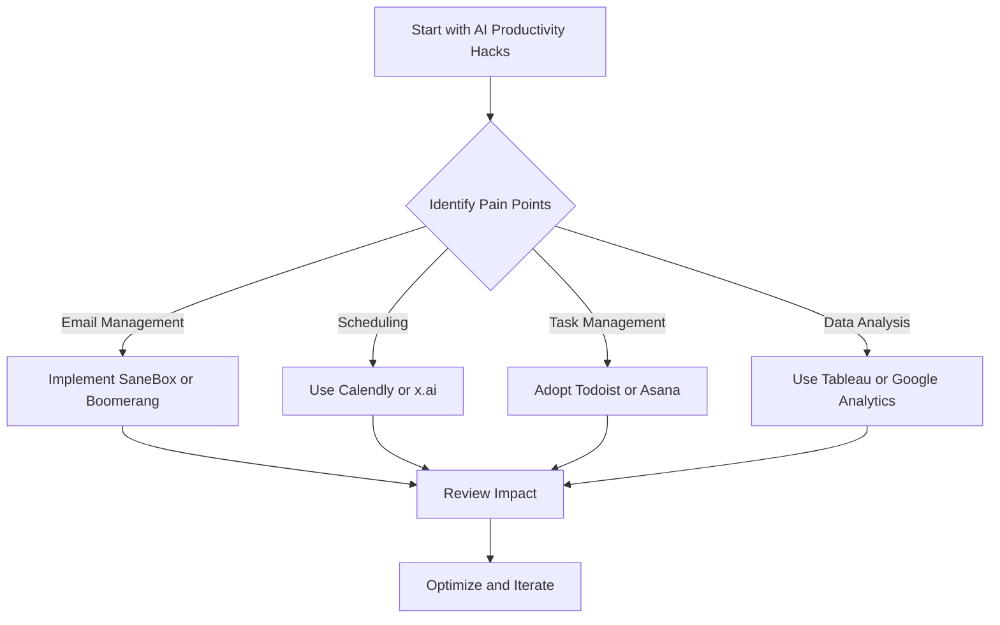

---

# AI-Powered Productivity Hacks for Entrepreneurs

In the fast-paced world of entrepreneurship, time is a precious commodity. Every minute counts, and finding ways to work smarter, not harder, is key to success. Enter AI productivity hacks—tools and strategies that leverage artificial intelligence to enhance your efficiency and effectiveness. Whether you're managing a startup, running a small business, or leading a team, AI can help you streamline processes, automate tasks, and boost productivity. In this article, we will explore some of the best AI productivity hacks that can transform the way you work.

## Understanding AI Productivity Hacks

Before diving into specific tools and strategies, let's clarify what AI productivity hacks are. They involve utilizing artificial intelligence to automate repetitive tasks, analyze data, and enhance decision-making. By integrating AI into your daily operations, you can free up time for more strategic initiatives, allowing you to focus on growing your business.

## 1. Automate Routine Tasks with AI Tools

### A. Email Management

One of the most time-consuming tasks for entrepreneurs is managing emails. AI tools like **SaneBox** and **Boomerang** can help you prioritize your inbox and schedule emails to send at optimal times. 

**Pros:**
- Reduces email overload
- Improves response times

**Cons:**
- Might miss context in emails
- Requires initial setup time

### B. Scheduling Meetings

Scheduling meetings can be a hassle, but AI scheduling assistants like **Calendly** or **x.ai** can simplify the process. These tools automatically find the best times for meetings based on everyone's availability.

**Pros:**
- Saves time coordinating schedules
- Integrates with calendars seamlessly

**Cons:**
- Limited customization options
- Some users prefer personal touch

## 2. Enhance Focus with AI-Powered Tools

### A. Task Management

AI-powered task management tools like **Todoist** and **Asana** can help you prioritize tasks and keep track of deadlines. These tools use algorithms to suggest the best times to work on specific tasks based on your productivity patterns.

**Pros:**
- Customizable task organization
- Integrates with other productivity tools

**Cons:**
- Can become overwhelming with too many features
- Requires consistent input to be effective

### B. Focus Boosters

Apps like **Focus@Will** leverage AI to create personalized music playlists that enhance focus and productivity. The app's algorithm adapts to your preferences, helping you get into the zone faster.

**Pros:**
- Personalized focus music
- Scientifically backed productivity methods

**Cons:**
- Subscription costs
- May not work for everyone

## 3. Use AI for Data Analysis

Entrepreneurs often face a deluge of data, and making sense of it can be challenging. AI tools like **Tableau** and **Google Analytics** can automate data analysis, providing actionable insights that help you make informed decisions.

**Pros:**
- Quickly identifies trends and anomalies
- Visualizes data for better understanding

**Cons:**
- Requires some learning curve
- Can be expensive for small businesses

### Workflow Visualization

To illustrate the workflow of integrating AI productivity hacks into your business, here's a simple decision tree diagram:

## 4. Boost Creativity with AI Tools

AI tools are not just about efficiency; they can also enhance creativity. Tools like **[Jasper](https://www.jasper.ai/?ref=AFFILIATE_ID)** and **[Copy.ai](https://www.copy.ai/?ref=AFFILIATE_ID)** leverage natural language processing to assist in content creation, helping entrepreneurs generate ideas for blogs, social media, and marketing materials.

**Pros:**
- Speeds up content creation
- Offers diverse perspectives and ideas

**Cons:**
- May lack a personal touch
- Requires editing for tone and style

## Comparison of Top AI Productivity Tools

To help you choose the right AI productivity tools for your needs, here’s a comparison table of popular options:

<table>
<tr>
<th>Tool</th>
<th>Primary Function</th>
<th>Key Features</th>
<th>Price</th>
</tr>
<tr>
<td>SaneBox</td>
<td>Email Management</td>
<td>Smart filtering, reminders</td>
<td>From $7/month</td>
</tr>
<tr>
<td>Calendly</td>
<td>Scheduling Meetings</td>
<td>Calendar integration, time zone detection</td>
<td>Free / Premium options</td>
</tr>
<tr>
<td>Todoist</td>
<td>Task Management</td>
<td>Task prioritization, project templates</td>
<td>Free / Premium from $3/month</td>
</tr>
<tr>
<td>Tableau</td>
<td>Data Analysis</td>
<td>Visual analytics, dashboard creation</td>
<td>From $70/month</td>
</tr>
<tr>
<td>[Jasper](https://www.jasper.ai/?ref=AFFILIATE_ID)</td>
<td>Content Generation</td>
<td>AI writing assistant, templates</td>
<td>From $29/month</td>
</tr>
</table>

## 5. Continuous Learning with AI

Entrepreneurs need to stay updated with industry trends and skills. AI-driven platforms like **Coursera** and **LinkedIn Learning** offer personalized learning paths based on your interests and career goals. They use algorithms to recommend courses that will enhance your skill set.

**Pros:**
- Custom learning experience
- Access to a wide range of topics

**Cons:**
- Requires time investment
- May not always align with specific business needs

## Conclusion

AI productivity hacks offer entrepreneurs the opportunity to maximize efficiency, streamline processes, and enhance decision-making. By automating routine tasks, improving focus, and leveraging data analysis, you can free up valuable time to focus on strategic initiatives that drive your business forward. 

Ready to supercharge your productivity with AI? Start by exploring some of the tools mentioned in this article and see how they can transform your workflow. The future of entrepreneurship is here—embrace it and unlock your full potential!

### Call to Action

Don't wait to enhance your productivity! Try out these AI tools today and discover how they can revolutionize your entrepreneurial journey. Share your experiences in the comments below and let’s grow together!

## 関連記事

- [AI Agents: The Future of Personal Assistants in 2026](/posts/ai-agents-the-future-of-personal-assistants-in-2026/)
- [AI Automation: A Game Changer for Small Businesses](/posts/ai-automation-a-game-changer-for-small-businesses/)
- [AI Automation: The Key to Enhanced Business Efficiency](/posts/ai-automation-the-key-to-enhanced-business-efficiency/)
