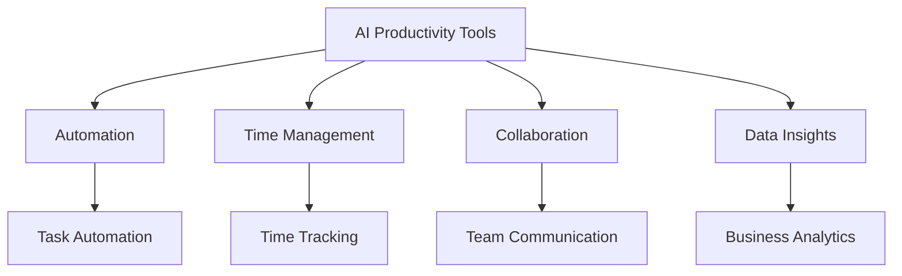

---

# AI-Powered Productivity: Transforming Workflows

In today's fast-paced business environment, the need for efficiency and productivity has never been greater. Enter AI productivity tools—transformative technologies that help streamline workflows, automate repetitive tasks, and ultimately boost overall performance. Whether you’re a solo entrepreneur, a small business owner, or part of a large enterprise, understanding how to leverage these tools can lead to significant improvements in your work life.

## What Are AI Productivity Tools?

AI productivity tools are software applications powered by artificial intelligence that assist in managing tasks, projects, and workflows. These tools can analyze data, automate mundane tasks, and offer insights that help users make informed decisions. From project management solutions to virtual assistants, the range of AI-powered tools available today is vast, and their applications are equally diverse.

### Examples of AI Productivity Tools

1. **Trello** - A project management tool that uses AI to suggest task assignments based on team members' strengths and workloads.
2. **Zapier** - Automates repetitive tasks between web apps, creating workflows that save time and reduce manual errors.
3. **[Otter.ai](https://otter.ai/?ref=AFFILIATE_ID)** - An AI-powered transcription service that converts voice conversations into text, making meeting notes easily accessible.
4. **[Grammarly](https://www.grammarly.com/?ref=AFFILIATE_ID)** - A writing assistant that uses AI to analyze text for grammar and style, ensuring clear and effective communication.

## How AI Tools Are Transforming Workflows

The integration of AI productivity tools can fundamentally change how teams operate. Here are some ways these tools enhance workflows:

### 1. Automation of Repetitive Tasks

One of the most significant advantages of AI tools is their ability to automate repetitive tasks. For example, Zapier allows users to set up automated workflows (or "Zaps") that connect different apps. This means that when a new email arrives, you can automatically save attachments to cloud storage without lifting a finger. 

### 2. Enhanced Time Management

AI tools like Clockify or Todoist help users manage their time better by analyzing how hours are spent. They can suggest improvements or flag time-wasting activities, enabling users to focus on what truly matters.

### 3. Improved Collaboration

AI productivity tools can foster better collaboration among team members. Tools like Microsoft Teams and Slack integrate AI features that provide smart suggestions for document sharing, scheduling meetings, and even generating automated responses, ensuring that everyone stays on the same page.

### 4. Data-Driven Insights

AI tools can sift through vast amounts of data to uncover insights that humans might overlook. For instance, tools like Tableau can analyze business metrics and visualize trends, helping businesses make informed decisions based on real data.

## Pros and Cons of AI Productivity Tools

Like any technology, AI productivity tools come with their own set of advantages and disadvantages. Let's break these down.

### Pros

- **Increased Efficiency**: By automating routine tasks, employees can focus more on high-value work.
- **Data-Driven Decisions**: Access to analytics helps teams make informed choices, leading to better outcomes.
- **Scalability**: AI tools can easily adapt and scale with business growth, accommodating an increasing workload without added strain.

### Cons

- **Cost**: Some AI tools can be expensive, especially for small businesses.
- **Learning Curve**: Employees may require time to adapt to new tools, which could temporarily disrupt workflows.
- **Dependence on Technology**: Over-reliance on AI could lead to issues if the technology fails or if there's a lack of human oversight.

## Comparison of Popular AI Productivity Tools

When considering which AI productivity tools to implement, it's essential to compare their features and benefits. Below is a comparison of some popular tools:

<table>
    <tr>
        <th>Tool</th>
        <th>Best For</th>
        <th>Key Features</th>
        <th>Pricing</th>
    </tr>
    <tr>
        <td>Trello</td>
        <td>Project Management</td>
        <td>Custom workflows, AI task suggestions</td>
        <td>Free with paid plans</td>
    </tr>
    <tr>
        <td>Zapier</td>
        <td>Task Automation</td>
        <td>Connects multiple apps, automated workflows</td>
        <td>Free with paid plans</td>
    </tr>
    <tr>
        <td>[Otter.ai](https://otter.ai/?ref=AFFILIATE_ID)</td>
        <td>Transcription</td>
        <td>Real-time transcription, shared notes</td>
        <td>Free with paid plans</td>
    </tr>
    <tr>
        <td>[Grammarly](https://www.grammarly.com/?ref=AFFILIATE_ID)</td>
        <td>Writing Assistance</td>
        <td>Grammar checks, style suggestions</td>
        <td>Free with premium options</td>
    </tr>
</table>

## Conclusion: Embracing AI Productivity Tools

AI productivity tools are not just a trend—they represent the future of how we work. By automating mundane tasks, enhancing collaboration, and providing data-driven insights, AI tools can significantly improve workflows, leading to greater efficiency and productivity. 

If you're looking to transform your own workflow, start by evaluating the tools mentioned above. Consider how they can fit into your current processes and help you achieve your goals. 

### Call to Action

Ready to supercharge your productivity? Explore the AI tools that best suit your needs and watch your workflows transform. Share your experiences with AI productivity tools in the comments below, and let’s spark a conversation on how technology can enhance our work lives!

## 関連記事

- [AI-Driven Productivity: Tools Every Business Needs in 2026](/posts/ai-driven-productivity-tools-every-business-needs-in-2026/)
- [Top AI Tools Boosting Productivity in 2026](/posts/top-ai-tools-boosting-productivity-in-2026/)
- [AI Agents: The Future of Personal Assistants in 2026](/posts/ai-agents-the-future-of-personal-assistants-in-2026/)
