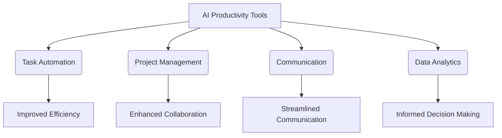

---

# AI Productivity Tools: Transforming the Future of Work

In recent years, the landscape of work has undergone a seismic shift, largely fueled by advances in artificial intelligence (AI). AI productivity tools have emerged as a game changer, helping professionals and teams streamline their tasks, foster collaboration, and ultimately boost productivity. This blog post will delve into the different types of AI productivity tools available, their benefits, and how they are reshaping the future of work.

## What are AI Productivity Tools?

AI productivity tools are software applications that leverage artificial intelligence to automate repetitive tasks, enhance decision-making, and facilitate collaboration. These tools can analyze vast amounts of data, learn from user behavior, and provide insights that help improve efficiency and effectiveness in various workflows.

### Types of AI Productivity Tools

1. **Task Automation Tools**: These tools automate repetitive tasks, freeing up time for employees to focus on more strategic activities. Examples include Zapier and Integromat.

2. **Project Management Tools**: AI-driven project management solutions like Asana and Trello enable teams to plan, track, and collaborate on projects seamlessly.

3. **Document Automation Tools**: Tools like DocuSign and PandaDoc use AI to facilitate document creation, signing, and management, ensuring timely approvals and reducing bottlenecks.

4. **Communication Tools**: AI-enhanced communication platforms like Slack and Microsoft Teams help teams stay connected and informed, improving collaboration and engagement.

5. **Data Analytics Tools**: AI-powered analytics tools like Tableau and Google Analytics enable businesses to extract actionable insights from data, driving informed decision-making.

## Benefits of AI Productivity Tools

### Enhanced Efficiency

One of the most significant advantages of AI productivity tools is their ability to enhance efficiency. By automating mundane tasks, employees can devote more time to high-value work, which can lead to increased innovation and creativity.

### Improved Collaboration

AI tools facilitate better collaboration among team members by providing real-time updates, seamless communication channels, and project tracking features. This can lead to improved morale and a more cohesive working environment.

### Data-Driven Decision Making

With AI analytics tools, organizations can leverage data to make informed decisions. These tools can identify patterns, trends, and insights that may not be immediately apparent, allowing businesses to adapt swiftly to changing market conditions.

### Scalability

As organizations grow, scaling operations can often lead to inefficiencies. AI productivity tools can easily be scaled to meet growing demands, ensuring that businesses can continue to operate smoothly, regardless of size.

## Popular AI Productivity Tools: A Comparison

To give you a clearer understanding of the landscape of AI productivity tools, here’s a comparison of some popular options available today.

<table>
  <tr>
    <th>Tool</th>
    <th>Type</th>
    <th>Key Features</th>
    <th>Pros</th>
    <th>Cons</th>
  </tr>
  <tr>
    <td>Asana</td>
    <td>Project Management</td>
    <td>Task assignments, timelines, dashboards</td>
    <td>User-friendly interface, integrates with various tools</td>
    <td>Can become complex with larger teams</td>
  </tr>
  <tr>
    <td>Zapier</td>
    <td>Task Automation</td>
    <td>Connects apps, automates workflows</td>
    <td>Easy to set up, supports many apps</td>
    <td>Limited to predefined workflows</td>
  </tr>
  <tr>
    <td>Slack</td>
    <td>Communication</td>
    <td>Channels, direct messaging, integrations</td>
    <td>Enhances team collaboration, searchable history</td>
    <td>Can be overwhelming with too many channels</td>
  </tr>
  <tr>
    <td>Tableau</td>
    <td>Data Analytics</td>
    <td>Data visualization, dashboards, real-time analytics</td>
    <td>Powerful data insights, user-friendly</td>
    <td>High learning curve for advanced features</td>
  </tr>
</table>

### Practical Use Cases for AI Productivity Tools

1. **Automating Customer Support**: Companies can use AI chatbots like Drift or Intercom to handle common customer inquiries, reducing response times and freeing up human agents for more complex issues.

2. **Streamlining Content Creation**: Tools like Grammarly and Jasper AI can help writers create error-free content efficiently, enabling marketing teams to focus on strategy rather than revisions.

3. **Enhancing Meeting Efficiency**: AI-driven scheduling tools like x.ai can automatically find suitable meeting times for all participants, eliminating the back-and-forth emails and ensuring that meetings are productive.

4. **Data-Driven Marketing**: With tools like HubSpot, businesses can analyze customer behavior and preferences, allowing them to tailor their marketing strategies for maximum effectiveness.

## Challenges of Implementing AI Productivity Tools

While AI productivity tools offer numerous benefits, organizations may face challenges during implementation:

### Resistance to Change

Employees may be resistant to adopting new technologies, fearing job loss or a steep learning curve. Providing adequate training and emphasizing the benefits of AI tools can help alleviate these concerns.

### Data Privacy Concerns

As AI tools often rely on data collection and analysis, organizations must be cautious about data privacy and security. Ensuring compliance with regulations like GDPR is essential.

### Integration Issues

Integrating AI tools with existing systems can be complex. Organizations should carefully evaluate compatibility and invest in training to ensure a smooth transition.

## The Future of Work with AI Productivity Tools

As AI technology continues to evolve, the potential for AI productivity tools in the workplace is virtually limitless. The future of work will likely see increased reliance on these tools, with organizations embracing AI to drive efficiency, innovation, and competitiveness.

## Conclusion

AI productivity tools are not just a trend; they are shaping the future of work by empowering organizations and their employees to achieve new levels of efficiency and creativity. By embracing these tools, businesses can navigate the complexities of modern work environments and stay ahead of the competition.

Are you ready to transform your workplace with AI productivity tools? Explore the options available, and take the first step towards a more efficient and productive future. Don’t wait—start your journey today!