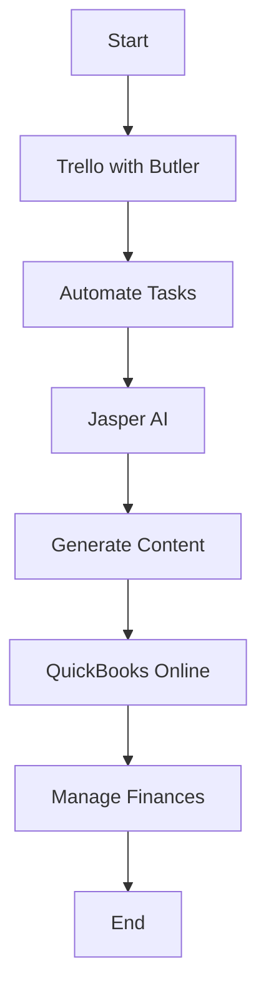

---

# AI Tools for Entrepreneurs: Streamlining Your Workflow

In the fast-paced world of entrepreneurship, efficiency is key. As an entrepreneur, you’re likely juggling multiple tasks—from managing finances to marketing your brand. Thankfully, AI tools for entrepreneurs have emerged as powerful allies in streamlining workflows and maximizing productivity. In this article, we’ll explore some of the best AI tools available, their practical applications, and how they can transform your daily operations.

## Understanding the Role of AI Tools for Entrepreneurs

AI tools leverage machine learning, data analysis, and automation to help entrepreneurs make better decisions, save time, and optimize processes. Whether you’re a solopreneur or leading a growing team, there’s an AI tool designed to meet your unique needs. 

### Why Use AI Tools?

1. **Time Savings**: Automate repetitive tasks, allowing you to focus on strategic initiatives.
2. **Enhanced Decision-Making**: Use data-driven insights to inform your business strategies.
3. **Cost Efficiency**: Reduce overheads by automating manual processes and minimizing errors.
4. **Scalability**: As your business grows, AI tools can adapt and scale with you.

## Key AI Tools for Entrepreneurs

Let’s dive into some of the top AI tools for entrepreneurs and explore their features, pros and cons, and use cases.

### 1. Trello with Butler

**Overview**: Trello is a project management tool that can be significantly enhanced with its automation feature, Butler. It allows you to automate tasks based on triggers, streamlining your workflow.

**Use Case**: Automating card movements, setting due dates, and creating recurring tasks.

**Pros**:
- User-friendly interface
- Great for visual project management
- Customizable automation

**Cons**:
- Limited functionality without Butler
- Can get cluttered with too many cards

### 2. Jasper AI

**Overview**: [Jasper](https://www.jasper.ai/?ref=AFFILIATE_ID) is an AI-powered writing assistant that helps entrepreneurs create high-quality content quickly. It’s perfect for blog posts, marketing copy, and social media content.

**Use Case**: Generating blog topics, social media posts, and email marketing campaigns.

**Pros**:
- Produces engaging content
- Saves time on ideation
- User-friendly interface

**Cons**:
- Requires editing for tone and style
- Pricing can be high for startups

### 3. QuickBooks Online with AI Features

**Overview**: QuickBooks Online is a financial management tool that includes AI features to automate bookkeeping and financial analysis.

**Use Case**: Automating invoice generation and expense tracking.

**Pros**:
- Comprehensive financial management
- Integrates with many other tools
- AI-driven insights

**Cons**:
- Can be overwhelming for beginners
- Monthly subscription fees can add up

### 4. Zapier

**Overview**: Zapier is an automation tool that connects various apps and services, allowing you to create automated workflows (Zaps) without needing to write code.

**Use Case**: Automatically adding new leads from your website to your CRM.

**Pros**:
- Supports thousands of apps
- Saves time on manual data entry
- Easy to set up

**Cons**:
- Limited functionality on the free plan
- Can become complex with advanced workflows

## Comparing the Best AI Tools for Entrepreneurs

To help you decide which AI tools are best for your needs, here’s a comparison table summarizing their key features:

<table>
  <tr>
    <th>Tool</th>
    <th>Best For</th>
    <th>Key Features</th>
    <th>Price</th>
  </tr>
  <tr>
    <td>Trello with Butler</td>
    <td>Project Management</td>
    <td>Visual boards, automation, integrations</td>
    <td>Free; Paid plans start at $10/month</td>
  </tr>
  <tr>
    <td>[Jasper](https://www.jasper.ai/?ref=AFFILIATE_ID) AI</td>
    <td>Content Creation</td>
    <td>Content generation, SEO optimization</td>
    <td>Starting at $29/month</td>
  </tr>
  <tr>
    <td>QuickBooks Online</td>
    <td>Financial Management</td>
    <td>Invoicing, expense tracking, reporting</td>
    <td>Starting at $25/month</td>
  </tr>
  <tr>
    <td>Zapier</td>
    <td>Automation</td>
    <td>App integrations, task automation</td>
    <td>Free; Paid plans start at $19.99/month</td>
  </tr>
</table>

## Visualizing Your Workflow with AI Tools

To give you a clear understanding of how these tools can integrate into your workflow, here’s a simple diagram illustrating the process of using AI tools for project management, content creation, and financial management:

## Making the Most of AI Tools

While AI tools can significantly improve efficiency, it’s important to integrate them thoughtfully into your existing workflow. Here are some strategies to maximize their potential:

1. **Assess Your Needs**: Identify which areas of your business require the most support—be it project management, content creation, or financial tracking.
2. **Start Small**: Implement one or two tools at a time to avoid overwhelm and ensure a smooth transition.
3. **Train Your Team**: Make sure that everyone understands how to use the tools effectively to maximize their benefits.
4. **Monitor and Adjust**: Regularly assess the performance of the tools and be willing to make changes if they are not meeting your expectations.

## Conclusion

Incorporating AI tools for entrepreneurs can drastically streamline your workflow and enhance productivity. By automating mundane tasks, generating content, and managing finances, these tools empower you to focus on what truly matters: growing your business.

Are you ready to take your entrepreneurial journey to the next level? Start exploring these AI tools today and watch how they transform your workflow! For more insights and updates on AI tools, subscribe to our newsletter at AI Tools Lab.

--- 

With the right AI tools at your disposal, you’ll not only save time but also unlock your potential as an entrepreneur. So, what are you waiting for? Dive into the world of AI and elevate your business today!

## 関連記事

- [AI Agents: The Future of Personal Assistants in 2026](/posts/ai-agents-the-future-of-personal-assistants-in-2026/)
- [AI Automation: A Game Changer for Small Businesses](/posts/ai-automation-a-game-changer-for-small-businesses/)
- [AI Automation: The Key to Enhanced Business Efficiency](/posts/ai-automation-the-key-to-enhanced-business-efficiency/)
