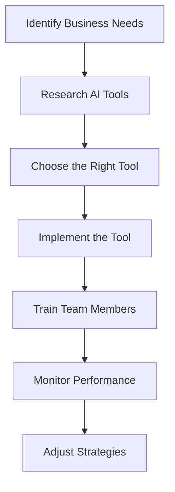

---

# AI Tools for Small Businesses: Increase Your ROI

In a world where technology evolves at breakneck speed, small businesses must leverage the latest tools to stay competitive. Enter AI tools—powerful assets that can streamline operations, enhance customer experience, and ultimately increase return on investment (ROI). If you're a small business owner looking to make smarter, data-driven decisions, this guide on AI tools for small businesses is for you.

## Why AI Tools Matter for Small Businesses

AI tools aren't just for tech giants anymore; they are essential for small businesses aiming to optimize their processes, save time, and reduce costs. From automating routine tasks to providing deep insights into customer behavior, AI can help small businesses operate more efficiently.

### Benefits of AI Tools for Small Businesses

- **Increased Efficiency**: Automate repetitive tasks, allowing your team to focus on strategy and creativity.
- **Cost Reduction**: Reduce labor costs by automating operations.
- **Enhanced Customer Insights**: Use data analytics to understand customer preferences and improve service.
- **Improved Marketing**: Target the right audience more effectively with AI-driven marketing tools.

## Popular AI Tools for Small Businesses

Here’s a selection of AI tools that can significantly impact your small business productivity and ROI. We’ll explore their features, pros and cons, and provide practical examples of how they can be used.

### 1. Chatbots for Customer Service

**Example Tool**: Drift

**[Descript](https://www.descript.com/?ref=AFFILIATE_ID)ion**: Drift uses AI to power chatbots that engage customers in real-time, answering queries and guiding them through the sales funnel.

**Pros**:
- 24/7 availability, providing immediate responses to customers.
- Reduces the workload for human customer service representatives.

**Cons**:
- May not handle complex inquiries as effectively as a human.
- Can frustrate customers if not properly programmed.

### 2. AI-Powered Email Marketing

**Example Tool**: Mailchimp

**[Descript](https://www.descript.com/?ref=AFFILIATE_ID)ion**: Mailchimp employs AI to personalize email campaigns, analyze customer data, and optimize send times for better engagement.

**Pros**:
- Highly customizable templates and automation features.
- Robust analytics to track performance.

**Cons**:
- Can become expensive as your email list grows.
- Some features may be overwhelming for beginners.

### 3. Automated Accounting Solutions

**Example Tool**: QuickBooks

**[Descript](https://www.descript.com/?ref=AFFILIATE_ID)ion**: QuickBooks uses AI to simplify bookkeeping, invoicing, and financial reporting, making financial management easier for small business owners.

**Pros**:
- Streamlines financial processes, saving time and reducing errors.
- Integrates with various payment systems.

**Cons**:
- Learning curve for those unfamiliar with accounting software.
- Subscription fees can add up over time.

### 4. Social Media Management Tools

**Example Tool**: Hootsuite

**[Descript](https://www.descript.com/?ref=AFFILIATE_ID)ion**: Hootsuite uses AI to analyze social media performance and suggest optimal posting times, as well as manage multiple accounts from one dashboard.

**Pros**:
- Easy scheduling and management of posts across multiple platforms.
- In-depth analytics to measure engagement.

**Cons**:
- The interface may be overwhelming for new users.
- Costs can be high for premium features.

### 5. Project Management Tools

**Example Tool**: Trello

**[Descript](https://www.descript.com/?ref=AFFILIATE_ID)ion**: Trello utilizes AI to help teams organize tasks and projects visually, making collaboration easier and more efficient.

**Pros**:
- User-friendly interface with drag-and-drop functionality.
- Integrates with other tools like Slack and Google Drive.

**Cons**:
- Limited features in the free version.
- May lack advanced functionalities for larger teams.

## Comparing AI Tools for Small Businesses

To help you choose the right AI tools for your small business, here’s a comparison table of the tools discussed above:

<table>
  <tr>
    <th>Tool</th>
    <th>Type</th>
    <th>Pros</th>
    <th>Cons</th>
  </tr>
  <tr>
    <td>Drift</td>
    <td>Chatbot</td>
    <td>24/7 customer service, reduces workload</td>
    <td>May struggle with complex queries</td>
  </tr>
  <tr>
    <td>Mailchimp</td>
    <td>Email Marketing</td>
    <td>Customizable, robust analytics</td>
    <td>Can be expensive, complex for beginners</td>
  </tr>
  <tr>
    <td>QuickBooks</td>
    <td>Accounting</td>
    <td>Streamlines processes, integrates with payments</td>
    <td>Learning curve, subscription fees</td>
  </tr>
  <tr>
    <td>Hootsuite</td>
    <td>Social Media</td>
    <td>Multiple account management, in-depth analytics</td>
    <td>Overwhelming interface, high costs</td>
  </tr>
  <tr>
    <td>Trello</td>
    <td>Project Management</td>
    <td>User-friendly, integrates with other tools</td>
    <td>Limited free features, lacks advanced functionalities</td>
  </tr>
</table>

## Workflow for Integrating AI Tools

Integrating AI tools into your small business can seem daunting, but it can be easily managed if you follow a structured approach. Here’s a simple workflow to help you get started:

## Making the Right Choice

When selecting AI tools for your small business, consider the specific needs of your operations and the budget you have allocated. Here are some tips to ensure you make the right choice:

- **Start Small**: Choose one or two tools that address your most pressing needs before expanding.
- **Trial Periods**: Take advantage of free trials to assess whether a tool fits your business model.
- **Seek Feedback**: After implementation, gather feedback from team members to ensure the tool is effective and user-friendly.

## Conclusion: The Time to Act is Now

AI tools can revolutionize how small businesses operate, directly contributing to enhanced productivity and improved ROI. By automating mundane tasks, offering enhanced customer service, and providing insights into customer behavior, these tools can help you focus on what truly matters—growing your business.

Ready to explore AI tools that can transform your small business? Start by experimenting with one of the tools discussed in this article, and watch how it can enhance your operations and boost your ROI.

### Call to Action

Don’t wait! Embrace the future of business technology today. Try out one of the AI tools mentioned above and see how it can streamline your operations and elevate your business to new heights. For more insights and updates on the latest AI tools, subscribe to our newsletter at AI Tools Lab!

## 関連記事

- [AI Agents: The Future of Personal Assistants in 2026](/posts/ai-agents-the-future-of-personal-assistants-in-2026/)
- [Automating Business Processes with AI in 2026](/posts/automating-business-processes-with-ai-in-2026/)
- [Choosing the Right AI Automation Tools for Your Business](/posts/choosing-the-right-ai-automation-tools-for-your-business/)
