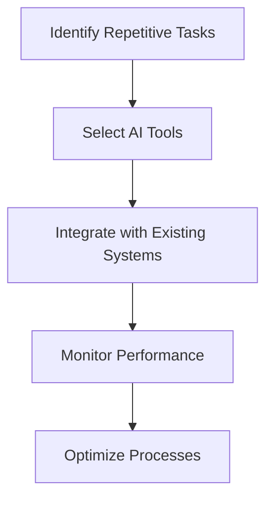

---

# Automating Business Processes with AI: A Complete Guide

In today's fast-paced business environment, efficiency and productivity are more important than ever. Companies are constantly seeking ways to streamline operations, reduce costs, and enhance customer experiences. Enter AI business automation—a game-changing solution that leverages artificial intelligence to optimize various business processes. In this comprehensive guide, we’ll explore what AI business automation is, how it works, its benefits, and practical use cases to help you understand how it can transform your organization.

## What is AI Business Automation?

AI business automation refers to the integration of artificial intelligence technologies into business processes to automate repetitive tasks, improve decision-making, and enhance overall operational efficiency. By utilizing machine learning, natural language processing, and data analytics, businesses can automate various functions ranging from customer service to supply chain management.

### How Does AI Business Automation Work?

AI business automation works by using algorithms and data-driven insights to automate tasks that traditionally require human intervention. Here's a simplified workflow to illustrate the process:

1. **Identify Repetitive Tasks**: Businesses pinpoint tasks that can be automated, such as data entry, customer inquiries, or inventory management.
2. **Select AI Tools**: Choose the appropriate AI tools that suit your business needs.
3. **Integrate with Existing Systems**: Seamlessly incorporate AI solutions into your current technology stack.
4. **Monitor Performance**: Track the performance of automated processes to ensure efficiency.
5. **Optimize Processes**: Continuously improve and adapt processes based on performance data.

## Benefits of AI Business Automation

AI business automation offers numerous benefits that can significantly impact your organization. Here are some key advantages:

### 1. Increased Efficiency

Automating repetitive tasks frees up human resources, allowing employees to focus on higher-value activities. For example, chatbots can handle customer inquiries 24/7, reducing the workload on customer service teams.

### 2. Cost Reduction

By automating tasks, businesses can reduce labor costs and minimize human error, leading to significant savings. For instance, automated inventory management can help prevent overstocking or stockouts, optimizing inventory costs.

### 3. Improved Accuracy

AI-driven processes are less prone to errors compared to manual operations. For example, using AI to analyze data can lead to more accurate insights, improving decision-making.

### 4. Enhanced Customer Experience

AI tools can personalize customer interactions, providing tailored recommendations and timely responses. For example, AI algorithms can analyze customer behavior to offer personalized product suggestions, enhancing user satisfaction.

### 5. Scalability

AI business automation allows organizations to scale operations without proportionally increasing costs. As your business grows, automated systems can easily handle increased workloads without the need for additional staff.

## Use Cases of AI Business Automation

AI business automation can be applied across various industries and functions. Here are some compelling use cases:

### Customer Service Automation

Chatbots and virtual assistants can handle customer inquiries, resolve issues, and provide information around the clock. For example, a retail company might implement a chatbot on its website to answer frequently asked questions, reducing the volume of calls to their support team.

### Marketing Automation

AI can enhance marketing efforts by analyzing customer data and automating campaign management. Tools like HubSpot or Marketo use AI to segment audiences, personalize content, and optimize email campaigns based on user behavior.

### Supply Chain Management

AI-driven analytics can predict demand, optimize inventory levels, and streamline logistics. For instance, a manufacturing company might use AI to forecast demand trends, allowing them to adjust production schedules accordingly.

### Financial Operations

Automating financial processes, such as invoicing or expense reporting, can save time and improve accuracy. Software like QuickBooks uses AI to categorize expenses and streamline bookkeeping tasks.

### Human Resources Automation

AI can assist in recruitment by screening resumes and identifying suitable candidates. Tools like HireVue use AI to analyze video interviews, assessing candidates based on predefined criteria.

## Comparing AI Business Automation Tools

With many AI business automation tools available, choosing the right one for your needs can be challenging. Below is a comparison of some popular options:

<table>
  <tr>
    <th>Tool</th>
    <th>Features</th>
    <th>Pros</th>
    <th>Cons</th>
  </tr>
  <tr>
    <td>Zapier</td>
    <td>Workflow automation, integrates with thousands of apps.</td>
    <td>Easy to use, no coding required, extensive integrations.</td>
    <td>Limited advanced features, can become costly with high usage.</td>
  </tr>
  <tr>
    <td>UiPath</td>
    <td>Robotic Process Automation (RPA), AI capabilities.</td>
    <td>Powerful automation, suitable for complex tasks.</td>
    <td>Steeper learning curve, higher cost for small businesses.</td>
  </tr>
  <tr>
    <td>Microsoft Power Automate</td>
    <td>Automates workflows across Microsoft apps and third-party services.</td>
    <td>Seamless integration with Microsoft products, user-friendly.</td>
    <td>Limited to Microsoft ecosystem for full benefits.</td>
  </tr>
  <tr>
    <td>Salesforce Einstein</td>
    <td>AI capabilities for customer relationship management.</td>
    <td>Enhanced customer insights, personalized marketing.</td>
    <td>Requires Salesforce platform, can be expensive.</td>
  </tr>
</table>

## Challenges and Considerations

While AI business automation brings many advantages, it also presents challenges. Here are some key considerations:

### 1. Data Privacy and Security

Automating processes often involves handling sensitive data. Businesses must ensure compliance with data protection regulations and implement robust security measures.

### 2. Initial Investment

Implementing AI tools may require significant upfront investment in software and training. However, the long-term savings can justify the initial costs.

### 3. Resistance to Change

Employees may be resistant to adopting new technologies. It’s essential to provide training and communicate the benefits of automation to foster a positive attitude toward change.

## Conclusion

AI business automation is revolutionizing the way organizations operate, offering unparalleled efficiency, cost savings, and enhanced customer experiences. Whether you’re looking to automate customer service, marketing, or financial operations, there are numerous tools available to help you achieve your goals. 

If you’re ready to embrace the future of work and transform your business processes with AI, start exploring the tools and strategies that best fit your needs today. Don’t hesitate to reach out if you have questions or need guidance on your AI automation journey!

**Call to Action**: Ready to take your business to the next level with AI business automation? Explore our recommended tools and resources at AI Tools Lab to get started today!