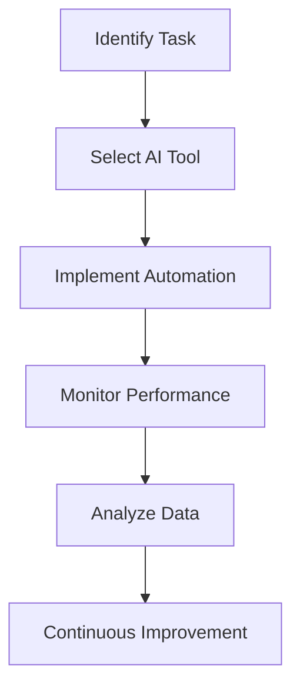

---

# Automating Business Processes with AI in 2026

As we step into 2026, businesses are increasingly recognizing the transformative power of AI automation. The way companies operate, make decisions, and interact with customers is being reshaped by artificial intelligence. In this post, we will explore how AI automation is streamlining business processes, enhance productivity, and drive growth.

## Understanding AI Automation in Business

AI automation refers to the use of artificial intelligence technologies to automate complex business processes and tasks. This can range from automating customer service inquiries to managing supply chain logistics more efficiently. By leveraging AI, organizations can minimize human errors, increase operational efficiency, and ultimately save costs.

### Why AI Automation Matters

1. **Increased Efficiency**: Automating repetitive tasks allows employees to focus on higher-value work, leading to increased productivity.
2. **Cost Reduction**: AI tools can significantly reduce labor costs by taking over tasks that would otherwise require human intervention.
3. **Data-Driven Insights**: AI systems can analyze vast amounts of data quickly, providing businesses with actionable insights to inform decision-making.
4. **Enhanced Customer Experience**: AI chatbots and virtual assistants can provide instant support and personalized experiences for customers.

## Key Areas Where AI Automation is Making an Impact

### 1. Customer Service

AI chatbots are becoming essential for managing customer inquiries. For example, companies like Zendesk and Drift offer AI-driven customer service solutions that can handle common questions, schedule appointments, and even process orders.

#### Use Case: E-commerce
An e-commerce platform using an AI chatbot can provide 24/7 support, answer FAQs, and track orders, enhancing customer satisfaction while reducing the workload on human agents.

### 2. Human Resources

AI tools like Workday and BambooHR are automating various HR processes, from recruitment to employee management. These systems can screen resumes, schedule interviews, and even conduct initial assessments.

#### Use Case: Recruitment
By utilizing AI in recruitment, companies can filter candidates based on specific criteria, allowing HR teams to focus on interviewing the best candidates rather than sifting through countless applications.

### 3. Finance and Accounting

AI automation in finance helps organizations manage accounts payable, expense management, and financial forecasting. Tools like UiPath and Xero are streamlining these processes.

#### Use Case: Expense Management
AI tools can automatically categorize expenses and flag unusual transactions, ensuring compliance and reducing the risk of fraud.

### 4. Supply Chain Management

AI-driven supply chain automation can optimize inventory levels, forecast demand, and manage logistics. Companies like Llamasoft and Blue Yonder are leading the way in this space.

#### Use Case: Inventory Management
By analyzing historical sales data, AI tools can predict inventory requirements, helping businesses maintain optimal stock levels and reduce waste.

## Comparing Top AI Automation Tools

To help you choose the right AI automation tools for your business processes, here’s a comparison of some of the leading options available in 2026:

<table>
  <tr>
    <th>Tool</th>
    <th>Primary Function</th>
    <th>Pros</th>
    <th>Cons</th>
  </tr>
  <tr>
    <td>Zendesk</td>
    <td>Customer Service Automation</td>
    <td>Easy integration, excellent analytics</td>
    <td>Can become expensive with scaling</td>
  </tr>
  <tr>
    <td>Workday</td>
    <td>HR Management</td>
    <td>Comprehensive features, user-friendly</td>
    <td>Steep learning curve for new users</td>
  </tr>
  <tr>
    <td>UiPath</td>
    <td>Finance Automation</td>
    <td>Highly customizable, strong community support</td>
    <td>Requires technical expertise to set up</td>
  </tr>
  <tr>
    <td>Llamasoft</td>
    <td>Supply Chain Optimization</td>
    <td>Strong analytics capabilities</td>
    <td>High initial investment</td>
  </tr>
</table>

## The Future of AI Automation in Business

The integration of AI automation into business processes is not just a trend; it is a necessity for survival in a competitive market. As technology evolves, we can expect even more sophisticated solutions that can understand context, emotions, and preferences.

### Visualizing the Workflow

To illustrate how AI automation operates across different business processes, here’s a simple workflow diagram:

This diagram shows the iterative process of identifying tasks suitable for automation and continually improving performance based on data analysis.

## Conclusion

AI automation is revolutionizing how businesses operate, offering unprecedented opportunities for efficiency and growth. As we move forward in 2026, harnessing the power of AI tools will be crucial for any organization looking to stay ahead.

If you haven’t started exploring AI automation yet, now is the time! Research the tools mentioned in this post and consider how they can streamline your processes and enhance productivity. 

### Call to Action

Ready to take your business to the next level with AI automation? Sign up for our newsletter for the latest insights on AI tools and strategies to boost your productivity!