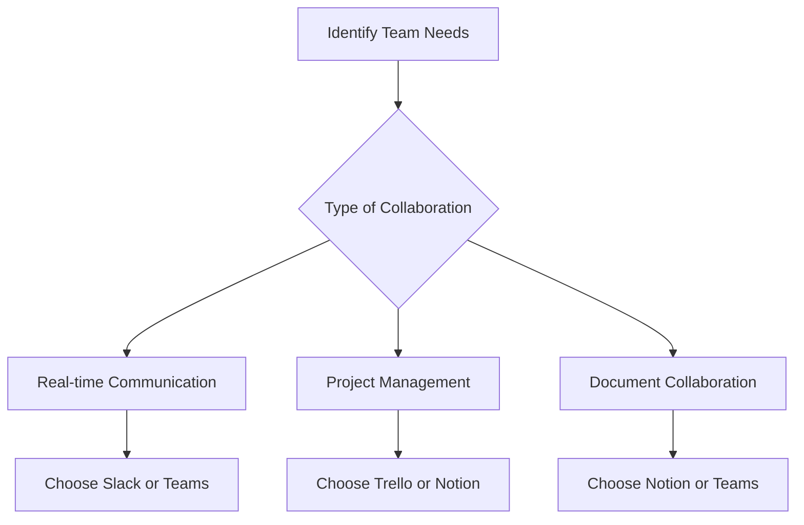

---

# Best AI Tools for Improving Team Collaboration in 2026

The way we work has evolved dramatically in recent years, and the rise of artificial intelligence (AI) is reshaping team collaboration. In 2026, AI collaboration tools have become essential for enhancing productivity, streamlining communication, and fostering a more connected work environment, especially in remote settings. This blog will explore the top AI collaboration tools available today, their unique features, and how they can benefit your team.

## The Importance of AI Collaboration Tools

As teams become increasingly distributed, traditional methods of collaboration often fall short. AI collaboration tools leverage advanced algorithms and machine learning to facilitate teamwork, making processes smoother and more efficient. Here are a few key benefits of using AI in collaboration:

- **Enhanced Communication**: AI tools can analyze communication patterns and suggest improvements, ensuring that team members are always on the same page.
- **Task Automation**: Routine tasks can be automated, freeing up time for employees to focus on higher-value work.
- **Data-Driven Insights**: AI can analyze team performance data, providing actionable insights that help improve collaboration strategies.

## Top AI Collaboration Tools of 2026

Let’s dive into some of the best AI collaboration tools available in 2026 that can help your team work smarter, not harder.

### 1. **Slack with AI Assistant**

#### Overview

Slack has long been a favorite for team communication, and with its AI Assistant, it has taken collaboration to the next level. The AI Assistant helps in organizing conversations, suggesting relevant channels, and even summarizing discussions.

#### Pros:
- Real-time communication and file sharing.
- AI-driven suggestions for improving engagement.
- Integration with numerous third-party apps.

#### Cons:
- Can become cluttered with too many channels.
- Learning curve for new users.

### 2. **Microsoft Teams with Copilot**

#### Overview

Microsoft Teams is a robust platform that integrates seamlessly with other Microsoft 365 tools. With [Copilot](https://github.com/features/copilot?ref=AFFILIATE_ID), its AI feature, Teams can help organize meetings, summarize them, and suggest tasks based on discussions.

#### Pros:
- Deep integration with Microsoft 365.
- Advanced scheduling and meeting management features.
- Excellent security features.

#### Cons:
- Requires a Microsoft subscription.
- May feel overwhelming for smaller teams.

### 3. **Trello with Butler AI**

#### Overview

Trello, a popular project management tool, has incorporated Butler AI to automate tasks and streamline workflows. The AI can create custom rules, automate repetitive tasks, and provide insights on project progress.

#### Pros:
- Visual task management with boards and cards.
- Highly customizable automation features.
- Ideal for agile teams.

#### Cons:
- Limited features in the free version.
- May not suit larger, more complex projects.

### 4. **Zoom with AI Insights**

#### Overview

Zoom is not just for video conferencing anymore; its AI Insights feature analyzes meeting data to improve future interactions. It can track engagement levels and suggest optimal meeting times.

#### Pros:
- High-quality video and audio.
- User-friendly interface.
- Insights help improve team collaboration.

#### Cons:
- Can become costly with larger teams.
- Limited features in the free version.

### 5. **Notion with AI Enhancements**

#### Overview

Notion is a powerful workspace tool that has recently integrated AI enhancements. It helps teams collaborate on documents, manage projects, and even generate content based on prompts.

#### Pros:
- All-in-one workspace for notes, tasks, and databases.
- AI content generation aids in brainstorming.
- Flexible and customizable templates.

#### Cons:
- Requires time to set up effectively.
- May overwhelm new users with its flexibility.

### Comparison of AI Collaboration Tools

To provide you with a clearer picture of how these tools stack up against one another, here’s a comparison table highlighting their key features:

<table>
    <tr>
        <th>Tool</th>
        <th>Key Features</th>
        <th>Pros</th>
        <th>Cons</th>
    </tr>
    <tr>
        <td>Slack with AI Assistant</td>
        <td>Real-time communication, channel suggestions</td>
        <td>Integration with many apps</td>
        <td>Can be cluttered</td>
    </tr>
    <tr>
        <td>Microsoft Teams with [Copilot](https://github.com/features/copilot?ref=AFFILIATE_ID)</td>
        <td>Meeting organization, task suggestions</td>
        <td>Strong security features</td>
        <td>Requires subscription</td>
    </tr>
    <tr>
        <td>Trello with Butler AI</td>
        <td>Task automation, project insights</td>
        <td>Customizable automation</td>
        <td>Limited features in free version</td>
    </tr>
    <tr>
        <td>Zoom with AI Insights</td>
        <td>Meeting analytics, engagement tracking</td>
        <td>High-quality meetings</td>
        <td>Costs can add up</td>
    </tr>
    <tr>
        <td>Notion with AI Enhancements</td>
        <td>Document collaboration, content generation</td>
        <td>All-in-one workspace</td>
        <td>Can be overwhelming</td>
    </tr>
</table>

## How to Choose the Right AI Collaboration Tool

With so many options available, how do you choose the right AI collaboration tool for your team? Here’s a simple decision-making process illustrated in the diagram below:

### Tips for Effective Use of AI Collaboration Tools

- **Training and Onboarding**: Ensure that your team is adequately trained on the selected tools. Some AI features may take time to learn.
- **Set Clear Guidelines**: Establish guidelines for communication, project management, and document sharing to avoid confusion.
- **Regular Check-ins**: Utilize AI insights to conduct regular check-ins, ensuring that the tools are being used effectively and that your team remains engaged.

## Conclusion

As we move further into 2026, the importance of AI collaboration tools cannot be overstated. They are revolutionizing the way teams work together, making communication and task management more efficient than ever. By leveraging the right AI collaboration tools, you can enhance your team’s productivity and foster a more collaborative work environment.

Ready to transform your team's collaboration experience? Explore these AI collaboration tools today and discover the perfect fit for your needs!

### Call to Action

Interested in learning more about how AI tools can elevate your team's collaboration? Subscribe to our newsletter for the latest insights and updates on AI tools for productivity!

## 関連記事

- [AI-Powered Meetings: Tools That Make Every Meeting Count](/posts/boosting-team-collaboration-using-ai-powered-tools/)
- [Async Collaboration with AI: Bridging Time Zones Effortlessly](/posts/boosting-team-collaboration-with-ai-tools-in-2026/)
- [How AI Optimizes Cross-Functional Team Collaboration](/posts/how-ai-can-optimize-team-collaboration-and-productivity/)
