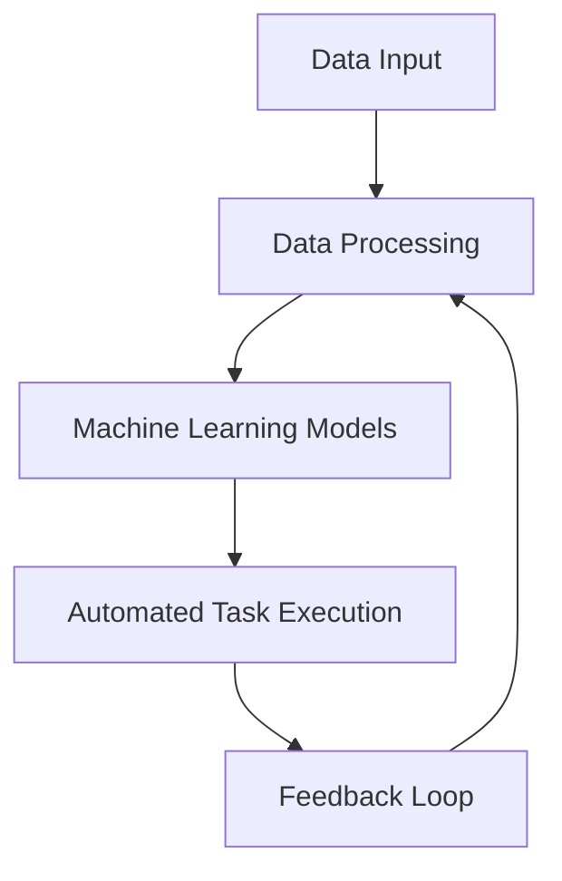

---

## Boost Business Efficiency with AI Automation Tools

In today's fast-paced business environment, the quest for efficiency has become more critical than ever. Companies are continually seeking ways to streamline operations, reduce costs, and improve productivity. Enter AI automation tools—powerful allies that can transform how businesses operate. In this article, we will delve into what AI automation tools are, how they work, and practical examples of their use in various business contexts.

### What Are AI Automation Tools?

AI automation tools leverage artificial intelligence to perform tasks that typically require human intervention. These tasks can range from simple data entry to complex decision-making processes. By automating routine tasks, businesses can free up valuable time for employees to focus on strategic initiatives that drive growth.

### How Do AI Automation Tools Work?

AI automation tools work by employing algorithms to analyze data, learning from patterns and making predictions. They often utilize machine learning, natural language processing (NLP), and robotics process automation (RPA) to enhance their capabilities. 

Here's a simplified workflow of how AI automation tools function:

### Benefits of Using AI Automation Tools

The integration of AI automation tools can lead to significant advantages for businesses, including:

1. **Increased Efficiency**: Automating repetitive tasks reduces human error and speeds up processes.
2. **Cost Savings**: Fewer resources are needed for manual tasks, leading to lower operational costs.
3. **Enhanced Accuracy**: AI tools can process large amounts of data with high precision, minimizing mistakes.
4. **Improved Employee Satisfaction**: By relieving employees from mundane tasks, they can focus on more creative and strategic work.

### Use Cases of AI Automation Tools

Let’s explore some practical applications of AI automation tools across various industries:

#### 1. Customer Support

AI-powered chatbots can handle customer inquiries 24/7, significantly reducing response times. For instance, companies like Zendesk use AI to automate ticket classification, ensuring that customer issues are prioritized correctly.

#### 2. Marketing Automation

Tools like HubSpot incorporate AI to analyze customer behavior and personalize marketing efforts. By automating email campaigns based on user interactions, businesses can enhance engagement and increase conversion rates.

#### 3. Financial Services

AI automation tools in finance can streamline processes such as fraud detection and transaction processing. For example, Kabbage uses AI to analyze data in real-time to provide instant loan decisions.

#### 4. Human Resources

AI recruitment tools like HireVue use AI to screen resumes and conduct initial interviews, helping HR departments save time and find the best candidates more efficiently.

### Pros and Cons of AI Automation Tools

While the benefits of AI automation tools are substantial, they are not without challenges. Here’s a breakdown of the pros and cons:

| Pros                                   | Cons                                   |
|----------------------------------------|----------------------------------------|
| Increased efficiency and productivity   | Initial setup costs can be high       |
| Reduction in human error                | May require ongoing maintenance        |
| Scalability of operations               | Potential job displacement concerns    |
| Ability to analyze large data sets      | Dependence on technology and data quality |

### Popular AI Automation Tools

To help you get started, here’s a comparison of some popular AI automation tools currently available:

<table>
    <tr>
        <th>Tool</th>
        <th>Key Features</th>
        <th>Best For</th>
        <th>Pricing</th>
    </tr>
    <tr>
        <td>Zapier</td>
        <td>Workflow automation, App integrations</td>
        <td>Small to medium businesses</td>
        <td>Starts at $19.99/month</td>
    </tr>
    <tr>
        <td>UiPath</td>
        <td>Robotic process automation, AI integration</td>
        <td>Large enterprises</td>
        <td>Custom pricing</td>
    </tr>
    <tr>
        <td>HubSpot</td>
        <td>Marketing automation, CRM features</td>
        <td>Marketing teams</td>
        <td>Free tier available, Premium starts at $50/month</td>
    </tr>
    <tr>
        <td>[ChatGPT](https://chat.openai.com/?ref=AFFILIATE_ID)</td>
        <td>Natural language processing, Chatbot creation</td>
        <td>Customer support</td>
        <td>Free tier available, Premium starts at $20/month</td>
    </tr>
</table>

### Choosing the Right AI Automation Tool

When selecting the right AI automation tool for your business, consider the following factors:

1. **Business Needs**: Identify the specific tasks you want to automate.
2. **Budget**: Evaluate the cost versus the expected benefits.
3. **Scalability**: Ensure the tool can grow as your business expands.
4. **User-Friendliness**: Choose tools that are easy for employees to adopt.

### Conclusion

AI automation tools are revolutionizing the way businesses operate, offering efficiency, cost savings, and improved accuracy. By carefully choosing the right tools and understanding their implications, companies can not only boost their productivity but also enhance employee satisfaction. 

Are you ready to explore the potential of AI automation tools for your business? Start by assessing your needs and consider testing out one of the tools mentioned in this guide. 

**Call to Action**: Don’t wait! Embrace the future of business efficiency with AI automation tools today. Visit our website for more insights, reviews, and practical guides on implementing AI solutions in your operations.

## 関連記事

- [AI Automation: Top Tools for Enhancing Team Productivity](/posts/ai-automation-top-tools-for-enhancing-team-productivity/)
- [Choosing the Right AI Automation Tools for Your Business](/posts/choosing-the-right-ai-automation-tools-for-your-business/)
- [Maximize Team Efficiency with AI Automation Tools](/posts/maximize-team-efficiency-with-ai-automation-tools/)
