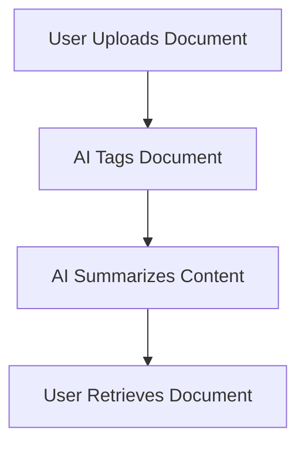

---

# Boost Productivity with AI Agents: 2026 Strategies

In the fast-paced world of 2026, the role of AI agents in enhancing productivity has become more essential than ever. Whether you’re a freelancer, a corporate employee, or a small business owner, these digital assistants can streamline your tasks, automate routine work, and help you focus on what truly matters. In this post, we’ll explore innovative strategies to harness the power of AI agents for maximum productivity.

## Understanding AI Agents

Before diving into productivity strategies, let’s clarify what AI agents are. AI agents are sophisticated software programs designed to perform tasks that usually require human intelligence. They can learn from data, adapt to user preferences, and effectively manage a variety of tasks ranging from scheduling appointments to analyzing complex data.

### Types of AI Agents

1. **Personal Assistants:** These agents, like Google Assistant and Siri, help manage daily tasks, reminders, and information retrieval.
2. **Chatbots:** Often used in customer service, chatbots engage users and provide support using natural language processing.
3. **RPA Tools:** Robotic Process Automation (RPA) tools automate repetitive tasks in business processes, increasing efficiency.

## Why AI Agents Matter in 2026

As we venture further into the digital age, the need for efficiency and time management is paramount. AI agents can assist in:

- **Reducing Workload:** By automating mundane tasks, they free up time for more strategic work.
- **Enhancing Decision-Making:** AI agents analyze vast amounts of data quickly, providing insights that inform better decisions.
- **Improving Communication:** They can manage email correspondence, set up meetings, and even draft responses.

## Top Strategies to Boost Productivity with AI Agents

### 1. Automate Scheduling

One of the most time-consuming tasks is scheduling meetings. AI agents can handle this effortlessly. Tools like Calendly and x.ai can coordinate between multiple calendars, suggest optimal meeting times, and send out invites automatically.

#### Example Use Case

Imagine you’re organizing a team meeting with members spread across different time zones. Instead of going back-and-forth via email, you can use an AI scheduling tool to find the best time that works for everyone, thus saving hours of communication.

### 2. Streamline Communication

AI-driven communication tools like Slack and Microsoft Teams have integrated bots that help manage messages, set reminders, and even summarize conversations. These bots can also scan through discussions to extract actionable items.

#### Pros and Cons

| Pros                              | Cons                                  |
|-----------------------------------|---------------------------------------|
| Reduces email overload             | May misinterpret context              |
| Quick access to information        | Can lead to reliance on AI            |
| Keeps teams aligned                | Requires initial setup and training    |

### 3. Enhance Customer Support

Integrating AI chatbots on your website can significantly enhance customer support. These bots can answer FAQs, guide users through processes, and even escalate issues to human agents when necessary.

#### Practical Example

A retail website can utilize a chatbot to handle inquiries about order status, return policies, and product information, freeing up human agents to deal with more complex issues.

### 4. Smart Document Management

AI agents can assist in document management by categorizing files, tagging them for easy retrieval, and even summarizing lengthy reports. Tools like Notion and Evernote are great for this.

### 5. Data Analysis and Reporting

AI agents can process large datasets, generate reports, and identify trends much faster than humans can. Tools like Tableau and Microsoft Power BI leverage AI to provide actionable insights.

#### Example Use Case

A marketing team can use an AI tool to analyze customer behavior data from different channels, generating a report that highlights which campaigns are most effective—all in a matter of minutes.

### 6. Personalized Learning and Development

AI agents can tailor educational content to individual learning styles and preferences. Tools like Coursera and Udacity employ AI to recommend courses and resources based on user behavior.

## Comparison of AI Productivity Tools

Here’s a comparison of some popular AI productivity tools to help you choose the best one for your needs:

<table>
    <tr>
        <th>Tool</th>
        <th>Type</th>
        <th>Key Features</th>
        <th>Best For</th>
    </tr>
    <tr>
        <td>Calendly</td>
        <td>Scheduling</td>
        <td>Automated scheduling, time zone detection</td>
        <td>Individuals and Teams</td>
    </tr>
    <tr>
        <td>Slack</td>
        <td>Communication</td>
        <td>Integrated bots, message organization</td>
        <td>Teams and Organizations</td>
    </tr>
    <tr>
        <td>Freshdesk</td>
        <td>Customer Support</td>
        <td>AI chatbots, ticket management</td>
        <td>Customer Service Teams</td>
    </tr>
    <tr>
        <td>Notion</td>
        <td>Document Management</td>
        <td>Tagging, summarization</td>
        <td>Individuals and Teams</td>
    </tr>
    <tr>
        <td>Tableau</td>
        <td>Data Analysis</td>
        <td>Visual analytics, AI insights</td>
        <td>Data-Driven Teams</td>
    </tr>
</table>

## Conclusion: Embrace AI Agents for Enhanced Productivity

As we move deeper into 2026, harnessing the power of AI agents is not just an option but a necessity for anyone looking to enhance productivity. From automating mundane tasks to providing actionable insights, these tools are designed to empower you to work smarter, not harder.

By implementing the strategies discussed above, you can leverage AI agents to save time, reduce stress, and ultimately increase your output. The future of productivity is here, and it’s time to embrace it.

### Call to Action

Ready to transform your productivity with AI agents? Start exploring the tools mentioned in this article, and don’t hesitate to share your experiences or questions in the comments below! Let's harness the power of AI together!

## 関連記事

- [Boosting Productivity with AI Agents in 2026](/posts/boosting-productivity-with-ai-agents-in-2026/)
- [Enhancing Productivity with AI Agents in 2026](/posts/enhancing-productivity-with-ai-agents-in-2026/)
- [Harnessing AI Agents for Enhanced Workplace Productivity](/posts/harnessing-ai-agents-for-enhanced-workplace-productivity/)
