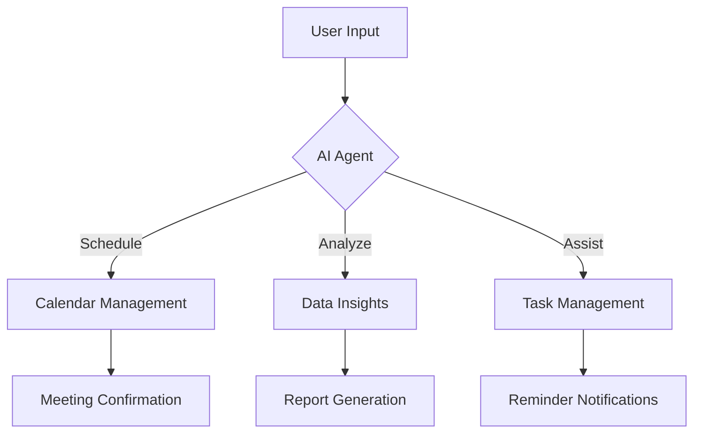

---

# Boost Productivity with AI Agents in 2026: A Guide

The landscape of work is evolving, and 2026 is no exception. As artificial intelligence (AI) continues to advance, AI agents are becoming essential tools for enhancing productivity across various industries. In this guide, we’ll explore what AI agents are, how they can boost productivity, and practical examples to illustrate their potential impact on your work life.

## What Are AI Agents?

AI agents are software programs that use artificial intelligence to perform tasks, make decisions, and interact with users in a human-like manner. These agents can automate repetitive tasks, analyze data, and provide insights, all while learning from user interactions to improve their performance over time.

### Key Features of AI Agents

- **Automation**: AI agents can handle mundane tasks such as scheduling appointments, managing emails, and generating reports.
- **Learning**: They utilize machine learning algorithms to adapt and improve based on user feedback and behavior.
- **Natural Language Processing (NLP)**: AI agents can understand and respond to human language, making interactions seamless and intuitive.

## How AI Agents Enhance Productivity

The productivity benefits of using AI agents are vast and varied. Here are some practical applications:

### 1. Time Management

AI agents can help you manage your time more effectively. Tools like **x.ai** and **Calendly** can schedule meetings by analyzing your calendar and preferences, eliminating the back-and-forth often associated with finding suitable times.

#### Example: Automated Scheduling

Imagine a typical workday where you have multiple meetings to attend. An AI agent can assess your availability, suggest optimal meeting times, and even send calendar invites to participants, saving you precious minutes that can be redirected towards more critical tasks.

### 2. Data Analysis

For teams that rely on data-driven decisions, AI agents can analyze large datasets quickly and provide actionable insights. Tools like **Tableau** and **Google Analytics** integrate AI capabilities to visualize data trends and forecast outcomes.

#### Example: Predictive Analytics

Consider a marketing team that needs to understand customer behavior. An AI agent can sift through historical data, recognize patterns, and suggest targeted marketing strategies based on predictive analytics, allowing for more informed decision-making.

### 3. Enhanced Communication

AI agents can facilitate communication within teams. Tools like **Slack** and **Microsoft Teams** have integrated AI chatbots that can answer common queries, provide updates, and even assist in project management.

#### Example: AI-Powered Chatbots

In a customer support setting, an AI chatbot can handle inquiries 24/7, providing instant responses and resolving issues without human intervention, which frees up support staff to tackle more complex inquiries.

### 4. Personal Assistance

Virtual assistants like **Google Assistant**, **Siri**, and **Amazon Alexa** can help manage daily tasks, reminders, and even control other smart devices in your office, making for a more connected and efficient work environment.

#### Example: Voice Commands for Task Management

Picture this: You’re in the middle of a project deadline, and you need to send out a report. Instead of breaking your concentration, you can simply tell your virtual assistant to send the report to your team, allowing you to maintain focus.

## Pros and Cons of AI Agents in Productivity

While AI agents present numerous advantages, they are not without their challenges. Below is a summary of the pros and cons:

### Pros

- **Efficiency**: Automate repetitive tasks to save time and focus on core activities.
- **Accuracy**: Reduce human error in tasks such as data entry and analysis.
- **Scalability**: Handle an increasing workload without the need for additional human resources.
- **Availability**: Operate 24/7, providing support whenever needed.

### Cons

- **Cost**: Initial investment in AI tools can be significant.
- **Dependence**: Over-reliance on AI can lead to skill degradation among employees.
- **Privacy Concerns**: Handling sensitive data may raise compliance and security issues.
- **Limitations**: AI agents may not fully understand complex human emotions or context.

## Comparing Top AI Agents for Productivity

To help you choose the right AI agent for your needs, here’s a comparison of some of the most popular tools available in 2026:

<table>
  <tr>
    <th>Tool</th>
    <th>Features</th>
    <th>Best For</th>
    <th>Pricing</th>
  </tr>
  <tr>
    <td>x.ai</td>
    <td>Automated scheduling</td>
    <td>Meeting management</td>
    <td>$15/month</td>
  </tr>
  <tr>
    <td>Tableau</td>
    <td>Data visualization and analytics</td>
    <td>Data-driven decision making</td>
    <td>$70/month</td>
  </tr>
  <tr>
    <td>Slack</td>
    <td>Team communication with AI chatbots</td>
    <td>Collaborative projects</td>
    <td>Free/$6/month (Pro)</td>
  </tr>
  <tr>
    <td>Google Assistant</td>
    <td>Voice-activated personal assistant</td>
    <td>Task management</td>
    <td>Free</td>
  </tr>
</table>

## Visualizing AI Workflow with Agents

To better understand how AI agents can integrate into your workflow, here’s a simple diagram illustrating a typical AI agent's operational flow:

## The Future of AI Agents in Productivity

As AI technology continues to evolve, we can expect even more advanced features and capabilities from AI agents in the coming years. From improved machine learning algorithms to enhanced natural language processing, the potential for productivity gains is enormous.

### Final Thoughts

In 2026, embracing AI agents can significantly enhance your productivity and streamline your workflow. By automating mundane tasks, analyzing data, and facilitating communication, these tools can help you focus on what truly matters—growing your business and achieving your goals.

Are you ready to take the leap into the world of AI agents? Start exploring the tools mentioned in this guide to discover how they can transform your productivity today!

## Call-To-Action

Don’t wait to boost your productivity! Explore AI tools today and integrate them into your workflow for a more efficient tomorrow. Visit AI Tools Lab for more insights and recommendations on the best AI tools available.