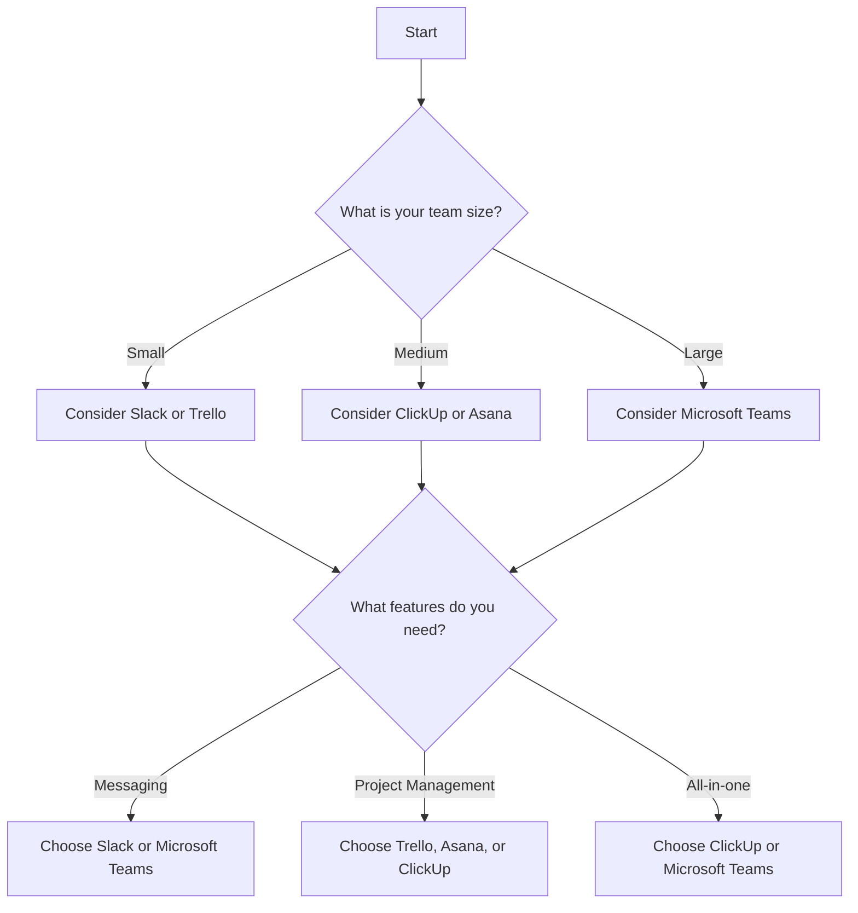

---

# Boost Team Collaboration with AI-driven Tools

In today's fast-paced digital landscape, effective collaboration is vital for any team's success. Whether you're working remotely or in a hybrid environment, AI collaboration tools are transforming how teams communicate, share ideas, and complete tasks. Let's dive into the benefits of these tools, explore some top options available, and see how they can supercharge your team's collaboration efforts.

## What Are AI Collaboration Tools?

AI collaboration tools leverage artificial intelligence to improve how people work together. They can automate repetitive tasks, provide intelligent insights, and streamline communication, making collaboration more efficient and effective. From project management to real-time editing, these tools offer features that enhance productivity and foster better teamwork.

### Why Use AI Collaboration Tools?

1. **Enhanced Communication**: AI tools can facilitate real-time communication, reduce misunderstandings, and ensure that everyone is on the same page.
   
2. **Task Automation**: By automating mundane tasks, teams can focus on higher-value activities, thus improving overall productivity.

3. **Data-Driven Insights**: AI can analyze vast amounts of data to provide actionable insights, helping teams make informed decisions quickly.

4. **Flexibility and Scalability**: These tools can easily adapt to the needs of growing teams, making them a perfect choice for businesses of any size.

5. **Improved Accessibility**: Cloud-based AI collaboration tools allow team members to access files and projects from anywhere, fostering a flexible work environment.

## Top AI Collaboration Tools to Consider

When it comes to AI collaboration tools, the market is teeming with options. Here are some of the best tools that can help boost your team's collaboration efforts:

### 1. Microsoft Teams

Microsoft Teams combines chat, video conferencing, and file collaboration in one platform, making it an all-in-one solution for team communication.

**Pros**:
- Seamless integration with Microsoft 365 tools
- Robust security features
- Excellent for large organizations

**Cons**:
- Can be overwhelming for new users
- Limited features in the free version

### 2. Slack

Slack is a popular messaging platform that uses AI to enhance communication through smart suggestions and integrations with other apps.

**Pros**:
- User-friendly interface
- Extensive app integrations
- Customizable notifications

**Cons**:
- Search functionality can be cumbersome
- Free version limits message history

### 3. Trello

Trello utilizes AI to help teams manage projects visually through boards, lists, and cards, making it easy to track progress and assign tasks.

**Pros**:
- Intuitive drag-and-drop interface
- Easy to use for beginners
- Flexible project management capabilities

**Cons**:
- Limited features in the free version
- May lack complexity for larger projects

### 4. Asana

Asana is a task and project management tool that employs AI to help teams prioritize tasks and manage workflows effectively.

**Pros**:
- Powerful task management features
- Customizable project templates
- Excellent reporting and analytics tools

**Cons**:
- Can be complex for new users
- Pricing can be high for premium features

### 5. ClickUp

ClickUp is a versatile project management tool that incorporates AI for smart task assignment and workflow automation.

**Pros**:
- All-in-one workspace
- Highly customizable
- Affordable pricing plans

**Cons**:
- Learning curve for new users
- Some features may be overwhelming

### Comparison of AI Collaboration Tools

To help you make an informed decision, here's a comparison of the AI collaboration tools mentioned above:

<table>
  <tr>
    <th>Tool</th>
    <th>Best For</th>
    <th>Key Features</th>
    <th>Free Version</th>
  </tr>
  <tr>
    <td>Microsoft Teams</td>
    <td>Large organizations</td>
    <td>Chat, video, file sharing</td>
    <td>Yes</td>
  </tr>
  <tr>
    <td>Slack</td>
    <td>Small to medium teams</td>
    <td>Messaging, integrations</td>
    <td>Yes (limited)</td>
  </tr>
  <tr>
    <td>Trello</td>
    <td>Visual project management</td>
    <td>Boards, lists, cards</td>
    <td>Yes (limited)</td>
  </tr>
  <tr>
    <td>Asana</td>
    <td>Task management</td>
    <td>Task prioritization, reporting</td>
    <td>Yes (limited)</td>
  </tr>
  <tr>
    <td>ClickUp</td>
    <td>All-in-one project management</td>
    <td>Customizable workflows</td>
    <td>Yes</td>
  </tr>
</table>

## How to Choose the Right AI Collaboration Tool

Choosing the right AI collaboration tool can be daunting, given the plethora of options available. Here’s a simple decision tree to guide you in selecting the ideal tool for your team:

## Implementing AI Collaboration Tools in Your Team

Once you've selected an AI collaboration tool, the next step is implementation. Here are some tips to ensure a smooth transition:

1. **Training and Onboarding**: Offer training sessions to help team members get acquainted with the new tool's features and functionalities.

2. **Set Clear Guidelines**: Establish clear communication protocols to ensure that everyone uses the tool effectively.

3. **Encourage Feedback**: Regularly solicit feedback from your team to identify areas for improvement and ensure the tool meets their needs.

4. **Monitor Usage**: Keep track of how the tool is being used and adjust strategies as needed to maximize its effectiveness.

5. **Celebrate Wins**: Recognize and celebrate improvements in collaboration and productivity as a result of using the tool.

## Conclusion

AI collaboration tools are revolutionizing the way teams work together, providing them with the resources they need to communicate effectively, manage projects seamlessly, and enhance overall productivity. By choosing the right tool and implementing it thoughtfully, you can foster a more collaborative environment that leads to exceptional results.

Are you ready to elevate your team's collaboration with AI-driven tools? Explore the options mentioned in this post and find the perfect fit for your organization. Start your journey towards enhanced teamwork today!