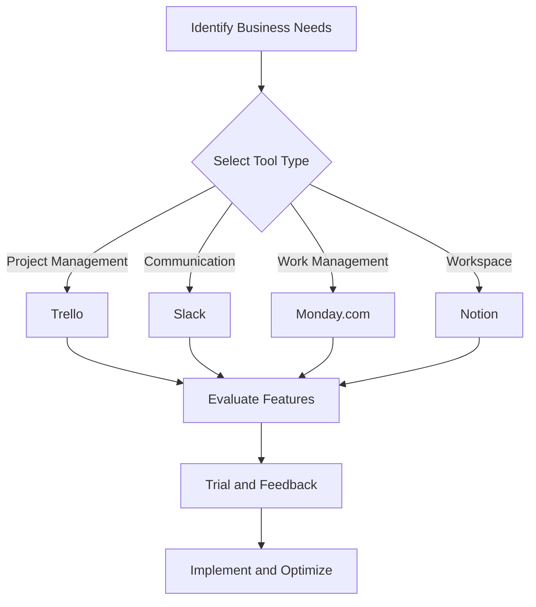

Boost Your Business with AI-Powered Productivity Tools

In today's fast-paced business environment, staying ahead of the competition requires more than just hard work. Enter AI productivity tools—your new best friends in the quest for increased efficiency and streamlined operations. These innovative solutions harness the power of artificial intelligence to automate mundane tasks, analyze data, and enhance decision-making processes. In this article, we will explore some of the best AI productivity tools available, their pros and cons, and how they can help you boost your business. 

### What Are AI Productivity Tools?

AI productivity tools are software applications that leverage artificial intelligence to improve workplace efficiency. These tools automate repetitive tasks, optimize workflows, and provide insights that help you make better decisions. Whether you're looking to enhance project management, streamline communication, or analyze data, there's an AI tool designed to meet your needs.

### Why Use AI Productivity Tools?

1. **Time-Saving**: AI tools can automate routine tasks, allowing you and your team to focus on strategic initiatives.
2. **Data Analysis**: With AI's ability to process large volumes of data quickly, you can gain insights that would take humans much longer to uncover.
3. **Enhanced Collaboration**: AI tools often come with features that promote teamwork and streamline communication, making it easier to collaborate on projects.
4. **Cost-Effective**: By improving efficiency and reducing the time spent on tasks, AI tools can lead to cost savings in the long run.

### Top AI Productivity Tools to Consider

Let’s dive into some of the best AI productivity tools available today, along with their features, pros, and cons.

#### 1. Trello with Butler

**Overview**: Trello is a popular project management tool that uses a card-based system to organize tasks. The Butler feature utilizes AI to automate repetitive tasks.

**Pros**:
- User-friendly interface
- Customizable automation rules
- Great for team collaboration

**Cons**:
- Limited advanced features without integrations
- The free version has restrictions

#### 2. Slack with Workflow Builder

**Overview**: Slack is a communication platform that enhances team collaboration. The Workflow Builder feature allows users to automate routine messages and tasks.

**Pros**:
- Centralized communication
- Easy integration with other tools
- Customizable workflows

**Cons**:
- Information overload with multiple channels
- Can become costly with premium plans

#### 3. Monday.com with Automations

**Overview**: Monday.com is a work operating system that facilitates project management and team collaboration. Its automation capabilities help streamline repetitive tasks.

**Pros**:
- Highly customizable workflows
- Visual project tracking
- Strong automation features

**Cons**:
- Can be overwhelming for new users
- Pricing can add up with additional features

#### 4. Notion with AI Assistant

**Overview**: Notion is an all-in-one workspace for notes, databases, tasks, and collaboration. Its AI assistant offers enhanced productivity features.

**Pros**:
- Versatile and flexible tool
- Combines multiple functionalities in one platform
- AI assistant for smart suggestions

**Cons**:
- Some features require a learning curve
- Limited offline access

### Comparison of AI Productivity Tools

Here’s a comparison table of the tools mentioned above to help you choose the right one for your business:

<table>
  <tr>
    <th>Tool</th>
    <th>Best For</th>
    <th>Key Features</th>
    <th>Price</th>
  </tr>
  <tr>
    <td>Trello</td>
    <td>Project Management</td>
    <td>Card-based system, Butler automation</td>
    <td>Free/Paid plans from $5/user/month</td>
  </tr>
  <tr>
    <td>Slack</td>
    <td>Team Communication</td>
    <td>Channels, Workflow Builder</td>
    <td>Free/Paid plans from $6.67/user/month</td>
  </tr>
  <tr>
    <td>Monday.com</td>
    <td>Work Management</td>
    <td>Customizable boards, Automations</td>
    <td>Paid plans from $8/user/month</td>
  </tr>
  <tr>
    <td>Notion</td>
    <td>All-in-One Workspace</td>
    <td>Notes, Databases, AI Assistant</td>
    <td>Free/Paid plans from $4/user/month</td>
  </tr>
</table>

### How to Implement AI Productivity Tools in Your Business

1. **Identify Pain Points**: Start by identifying repetitive tasks and bottlenecks in your current processes. This will help you choose the right tool for your needs.
  
2. **Trial and Evaluation**: Most AI tools offer free trials. Use these to test the tools and evaluate their effectiveness in improving your workflow.

3. **Training and Adoption**: Invest time in training your team to use the tools effectively. Encourage them to explore features and automations that can enhance their daily tasks.

4. **Monitor and Optimize**: After implementation, continuously monitor the performance of the tools and make adjustments as necessary. Gather feedback from your team to ensure they are getting the most out of the tools.

### Visualizing the AI Tool Selection Process

To help you visualize the decision-making process for selecting the right AI productivity tool, here’s a simple flowchart:

### The Future of AI Productivity Tools

As technology continues to evolve, AI productivity tools are becoming more sophisticated. They are not only automating tasks but also providing predictive analytics, advanced data insights, and enhanced user experiences. Investing in these tools today means preparing your business for the future.

### Conclusion: Take Action Now!

Incorporating AI productivity tools into your business strategy can significantly enhance your operational efficiency, reduce costs, and improve team collaboration. With the right tool, you can automate repetitive tasks, gain valuable insights, and focus on what truly matters—growing your business.

Ready to supercharge your productivity with AI? Start exploring the tools mentioned in this article today, and see how they can transform your workflow. Don’t wait—boost your business productivity now!

If you found this article helpful, please share it with your network and leave a comment below with your favorite AI productivity tools!

## 関連記事

- [AI-Driven Productivity: Tools Every Business Needs in 2026](/posts/ai-driven-productivity-tools-every-business-needs-in-2026/)
- [AI-Powered Productivity: Transforming Workflows](/posts/ai-powered-productivity-transforming-workflows/)
- [Top AI Tools Boosting Productivity in 2026](/posts/top-ai-tools-boosting-productivity-in-2026/)
