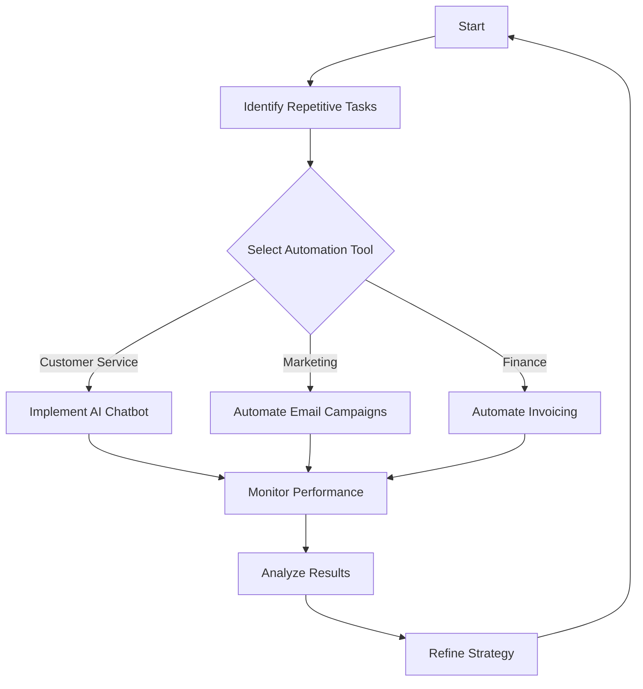

---

# Boosting Business Efficiency: AI Automation Strategies

In today’s fast-paced business landscape, maximizing efficiency is not just a goal—it's a necessity. Leveraging AI automation strategies can significantly streamline operations, reduce manual workloads, and improve decision-making processes. Whether you're a small startup or a large corporation, integrating AI into your business model can transform the way you work. In this article, we'll dive into actionable AI automation strategies that can help you achieve your efficiency goals.

## What is AI Automation?

AI automation refers to the use of artificial intelligence technologies to automate repetitive tasks, making processes faster and more accurate. These can range from simple data entry tasks to complex decision-making processes involving predictive analytics. By automating routine tasks, businesses can free up valuable human resources for more strategic activities.

## Why AI Automation Matters for Business Efficiency

### 1. Time Savings

One of the most compelling reasons to implement AI automation strategies is the time saved. Consider tasks like data entry or inventory management, which can consume hours of employee time each week. By automating these tasks, businesses can redirect their workforce to more impactful projects.

### 2. Reduced Errors

Human error is an inevitable part of any business process. AI systems can minimize these errors by executing tasks with precision. This is particularly crucial in fields such as finance and healthcare, where mistakes can have serious consequences.

### 3. Improved Decision-Making

AI can analyze vast amounts of data quickly, providing insights that would take humans much longer to ascertain. This enables faster, data-driven decision-making, which is essential in a competitive market.

## Key AI Automation Strategies for Businesses

### 1. Automating Customer Service

**Example**: Chatbots

Chatbots are a prime example of AI automation in customer service. They can handle inquiries, provide product recommendations, and even process orders, all while operating 24/7. For instance, companies like Zendesk and Drift offer AI-driven chatbots that integrate with existing customer relationship management (CRM) systems.

**Pros**:
- Reduces customer wait times
- Provides instant responses to frequently asked questions

**Cons**:
- May struggle with complex queries
- Can lack the personal touch of human interaction

### 2. Streamlining Marketing Efforts

**Example**: Email Automation

AI can optimize marketing campaigns by automating email marketing. Tools like Mailchimp and HubSpot use AI to analyze customer behavior and tailor messages accordingly. For instance, they can segment audiences and send personalized emails at optimal times for engagement.

**Pros**:
- Improves engagement rates
- Saves time on manual email campaigns

**Cons**:
- Requires initial setup and strategy
- May lead to over-segmentation if not monitored

### 3. Enhancing Workflow Management

**Example**: Project Management Tools

Tools like Asana and Trello are integrating AI features to help teams manage projects more efficiently. AI can predict project timelines based on historical data, suggest task assignments, and even automate status updates.

**Pros**:
- Increases transparency in project management
- Helps in resource allocation

**Cons**:
- Learning curve for new users
- Dependence on technology can lead to issues if systems fail

### 4. Automating Financial Processes

**Example**: Invoice Processing

AI tools like Expensify and QuickBooks can automate invoice processing, reducing the time spent on manual data entry. These tools use machine learning to recognize and categorize expenses, which can streamline financial workflows.

**Pros**:
- Reduces administrative overhead
- Enhances accuracy in financial reporting

**Cons**:
- Initial costs can be high
- May require training for staff

### 5. Data Analysis Automation

**Example**: Business Intelligence Tools

AI-driven business intelligence tools like Tableau and Power BI can automate data collection and visualization. By analyzing trends and presenting data visually, businesses can make informed decisions quickly.

**Pros**:
- Provides real-time insights
- Simplifies complex data analysis

**Cons**:
- Can be expensive
- Requires a data-driven culture to be effective

## AI Automation Tools Comparison

When choosing the right AI automation tools for your business, it's crucial to consider several factors, including functionality, ease of integration, and scalability. Here's a comparison of some popular AI automation tools:

<table>
  <tr>
    <th>Tool</th>
    <th>Best For</th>
    <th>Key Features</th>
    <th>Pricing</th>
  </tr>
  <tr>
    <td>Zendesk</td>
    <td>Customer Service</td>
    <td>AI chatbots, ticket management, analytics</td>
    <td>Starts at $19/month</td>
  </tr>
  <tr>
    <td>Mailchimp</td>
    <td>Email Marketing</td>
    <td>Segmentation, automation, analytics</td>
    <td>Free for basic, $10/month for premium</td>
  </tr>
  <tr>
    <td>Asana</td>
    <td>Project Management</td>
    <td>Task assignments, timelines, reporting</td>
    <td>Free for basic, $10.99/month for premium</td>
  </tr>
  <tr>
    <td>Expensify</td>
    <td>Expense Management</td>
    <td>Receipt scanning, expense tracking, reporting</td>
    <td>Free for basic, $5/month per user</td>
  </tr>
  <tr>
    <td>Tableau</td>
    <td>Data Visualization</td>
    <td>Real-time analytics, dashboards, integrations</td>
    <td>Starts at $70/month</td>
  </tr>
</table>

## Workflow Automation with AI: A Visual Guide

To further illustrate how AI automation can enhance business efficiency, here’s a simple workflow diagram showing how AI can streamline various business functions.

## Conclusion

Implementing AI automation strategies can profoundly impact your business efficiency, from reducing manual workloads to enhancing decision-making capabilities. As we've explored, various tools are available to help you automate customer service, marketing, project management, financial processes, and data analysis. 

### Call to Action

Are you ready to boost your business efficiency with AI automation? Start by exploring the tools mentioned in this article and assess how they can be integrated into your operations. For more insights on AI tools and productivity, subscribe to our newsletter and stay updated with the latest trends in AI technology!

## 関連記事

- [Boost Business Efficiency with AI Automation Strategies](/posts/boost-business-efficiency-with-ai-automation-strategies/)
- [AI Agents: The Future of Personal Assistants in 2026](/posts/ai-agents-the-future-of-personal-assistants-in-2026/)
- [AI Automation: A Game Changer for Small Businesses](/posts/ai-automation-a-game-changer-for-small-businesses/)
