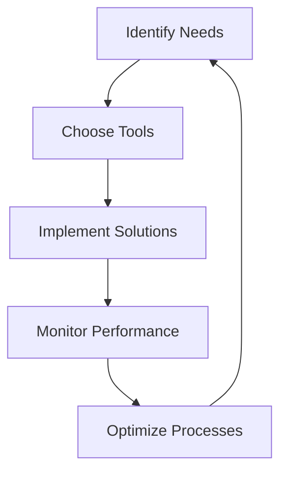

---

# Boosting Business Efficiency with AI Automation Strategies

In today's fast-paced business environment, efficiency isn't just a goal; it's a necessity. With the advent of AI automation, companies can streamline their processes, reduce errors, and ultimately save time and money. But how do you effectively integrate AI automation into your business strategy? In this post, we’ll explore some powerful AI automation strategies that can significantly boost your business efficiency.

## Understanding AI Automation in Business

AI automation refers to the use of artificial intelligence technologies to automate tasks that traditionally require human intervention. This can range from simple data entry to complex decision-making processes. By leveraging AI automation, businesses can improve operational efficiency, enhance customer experiences, and even drive innovation.

### Why AI Automation?

1. **Increased Efficiency**: AI can perform repetitive tasks much faster than humans, freeing up valuable time for employees to focus on strategic initiatives.
2. **Cost Reduction**: Automating processes can lead to significant cost savings by reducing labor costs and minimizing errors.
3. **Enhanced Accuracy**: AI systems can analyze vast amounts of data with high precision, leading to more informed decision-making.
4. **Scalability**: With AI, businesses can easily scale operations without a proportional increase in labor costs.

## Practical Examples of AI Automation

Let’s delve into a few areas where AI automation can significantly impact business efficiency:

### 1. Customer Service Automation

One of the most visible applications of AI automation is in customer service. Chatbots and virtual assistants can handle common customer inquiries, provide 24/7 support, and free human agents for more complex issues. For example, companies like **Zendesk** leverage AI to streamline their customer service workflow, ensuring faster response times.

### 2. Marketing Automation

AI-driven tools can analyze customer behavior and automate marketing campaigns. For instance, platforms like **HubSpot** and **Marketo** use AI to segment audiences and personalize email marketing efforts, leading to higher engagement and conversion rates.

### 3. Human Resources Automation

AI tools can streamline recruitment processes by screening resumes and identifying the best candidates based on predefined criteria. **HireVue**, for instance, employs AI to analyze video interviews, helping HR teams make data-driven hiring decisions.

### 4. Financial Automation

Automating financial processes, such as invoicing and expense management, can save hours of manual work. Tools like **Xero** and **QuickBooks** use AI to automate bookkeeping tasks, allowing finance teams to focus on strategic financial planning.

## Choosing the Right AI Automation Tools

When considering AI automation for your business, it’s crucial to choose the right tools that align with your specific needs. Here’s a comparison of popular AI automation tools that can help you get started:

<table>
    <tr>
        <th>Tool</th>
        <th>Best For</th>
        <th>Key Features</th>
        <th>Pros</th>
        <th>Cons</th>
    </tr>
    <tr>
        <td>Zendesk</td>
        <td>Customer Support</td>
        <td>AI chatbots, ticketing system</td>
        <td>24/7 support, easy integration</td>
        <td>Can be expensive for larger teams</td>
    </tr>
    <tr>
        <td>HubSpot</td>
        <td>Marketing</td>
        <td>Email automation, CRM</td>
        <td>User-friendly, rich analytics</td>
        <td>Limited features in free version</td>
    </tr>
    <tr>
        <td>HireVue</td>
        <td>Recruitment</td>
        <td>Video interviewing, AI scoring</td>
        <td>Reduces hiring time, data-driven</td>
        <td>Can miss nuances in candidate evaluation</td>
    </tr>
    <tr>
        <td>Xero</td>
        <td>Finance</td>
        <td>Bookkeeping, invoicing</td>
        <td>Real-time collaboration, mobile access</td>
        <td>Learning curve for new users</td>
    </tr>
</table>

## Developing an AI Automation Strategy

Implementing AI automation requires a thoughtful approach. Here’s a simple workflow to help you develop an effective strategy:

### Step 1: Identify Your Needs

Start by assessing your business processes. Which tasks are repetitive and time-consuming? Where do you see the potential for AI to improve efficiency?

### Step 2: Choose the Right Tools

Select AI automation tools that align with your identified needs. Consider factors like cost, scalability, and ease of integration.

### Step 3: Implement Solutions

Once you've chosen your tools, begin the implementation process. Ensure that your team is trained and comfortable using the new systems.

### Step 4: Monitor Performance

After implementation, closely monitor the performance of the AI tools. Are they meeting your efficiency goals? What feedback do you receive from employees and customers?

### Step 5: Optimize Processes

Based on your monitoring, make necessary adjustments to improve efficiency further. AI tools can often be fine-tuned to better meet your specific requirements.

## Final Thoughts

AI automation is not just a trend; it's a powerful strategy that can transform your business operations. By identifying the right areas for automation and choosing the appropriate tools, you can enhance efficiency, reduce costs, and improve overall productivity.

Are you ready to take your business to the next level with AI automation strategies? Start exploring the tools mentioned in this post, and don't hesitate to reach out for guidance on integrating AI solutions into your operations.

### Call to Action

Join the AI revolution today! Subscribe to our newsletter for more insights on AI tools and strategies to boost your business efficiency. Let’s work together to make your business smarter and more productive!

## 関連記事

- [Automating Business Processes with AI: A Step-by-Step Playbook](/posts/automating-business-processes-with-ai-a-complete-guide/)
- [AI Automation 101: What It Is and Why Your Business Needs It](/posts/how-ai-automation-is-transforming-business-operations/)
- [AI for Project Management: Automating Planning, Tracking, and Reporting](/posts/how-ai-is-revolutionizing-project-management-tasks/)
