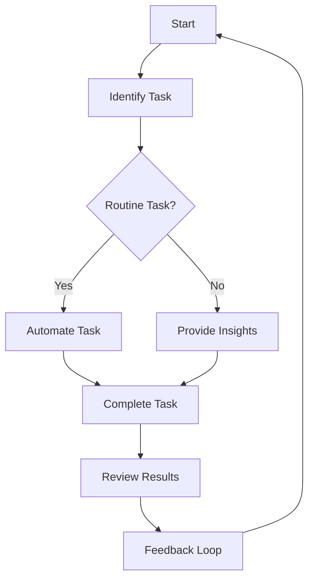

---

## Boosting Productivity with AI Agents in 2026

In the fast-paced world of 2026, the landscape of productivity has undergone a significant transformation thanks to the rise of AI agents. These intelligent tools are no longer just concepts but essential companions in our daily work routines. From automating mundane tasks to providing insightful analytics, AI agents are helping individuals and businesses enhance their productivity levels dramatically. In this blog post, we’ll explore the various ways AI agents are boosting productivity, along with practical examples, pros and cons, and a visual representation of their workflow.

### What are AI Agents?

AI agents are autonomous software entities designed to perform tasks on behalf of users. These tasks can range from simple functions like scheduling meetings to complex operations such as data analysis and customer engagement. By utilizing machine learning algorithms and vast datasets, AI agents can adapt to user preferences and improve their performance over time, allowing for a more personalized experience.

### How AI Agents are Boosting Productivity

#### 1. Automating Routine Tasks

One of the most significant ways AI agents enhance productivity is through automation. By taking over repetitive tasks, these agents free up valuable time for individuals to focus on more strategic initiatives.

**Example Use Case:** Imagine an AI agent managing your email inbox. It can categorize, prioritize, and even draft responses to common inquiries, saving you hours each week. Tools like Microsoft Outlook’s Cortana or Google Assistant are leading the charge in this area.

#### 2. Enhancing Decision-Making

AI agents can analyze vast amounts of data in real-time, providing insights that would be impossible for a human to achieve alone. This capability allows for quicker, more informed decision-making.

**Example Use Case:** Businesses can use AI agents to analyze customer data and identify trends. For instance, an e-commerce platform might use AI to determine which products are likely to be popular based on historical data, thus optimizing inventory and marketing strategies.

#### 3. Personalized Learning and Development

In the corporate world, AI agents can also tailor training and development programs to individual employee needs, making learning more effective.

**Example Use Case:** Platforms like LinkedIn Learning use AI to recommend courses based on your career goals and skills gaps, ensuring that you’re always working on the most relevant material.

#### 4. Streamlining Communication

AI agents can facilitate smoother communication between teams, whether they are in the same office or working remotely. By integrating with communication tools, they can summarize meetings, remind team members of important deadlines, and even schedule follow-up tasks.

**Example Use Case:** Slack has integrated AI capabilities that summarize conversations and highlight important action items, making it easier for team members to stay aligned.

### Pros and Cons of Using AI Agents for Productivity

While there are numerous advantages to implementing AI agents, it’s essential to consider some potential drawbacks as well.

#### Pros:
- **Time-saving:** Automating routine tasks allows you to focus on more critical responsibilities.
- **Enhanced accuracy:** AI reduces human error in data processing and analysis.
- **Data-driven decisions:** Real-time analytics lead to better-informed choices.
- **Personalization:** Tailored learning and development enhance employee engagement.

#### Cons:
- **Dependence on technology:** Over-reliance on AI agents can lead to skill degradation.
- **Job displacement concerns:** Automation may threaten certain job roles.
- **Data privacy issues:** Handling sensitive information raises security concerns.
- **Initial setup costs:** Implementing AI solutions can be expensive and time-consuming.

### Visualizing the Workflow of AI Agents

To further illustrate the impact of AI agents on productivity, let’s take a look at a simple workflow diagram that outlines how these agents can streamline tasks effectively:

### Comparing Leading AI Agents in 2026

As the market for AI agents continues to grow, several tools have emerged as frontrunners. Below is a comparison table to help you choose the right AI agent for your productivity needs.

<table>
  <tr>
    <th>AI Agent</th>
    <th>Best For</th>
    <th>Key Features</th>
    <th>Pricing</th>
  </tr>
  <tr>
    <td>Cortana</td>
    <td>Email Management</td>
    <td>Task scheduling, email drafting, reminders</td>
    <td>Free with Microsoft 365</td>
  </tr>
  <tr>
    <td>Google Assistant</td>
    <td>Personal Productivity</td>
    <td>Voice commands, smart home integration, reminders</td>
    <td>Free</td>
  </tr>
  <tr>
    <td>Slack AI</td>
    <td>Team Communication</td>
    <td>Meeting summaries, action item tracking</td>
    <td>Starting at $6.67/user/month</td>
  </tr>
  <tr>
    <td>LinkedIn Learning</td>
    <td>Personalized Learning</td>
    <td>Course recommendations, progress tracking</td>
    <td>$29.99/month</td>
  </tr>
</table>

### Conclusion: Embracing AI Agents for Enhanced Productivity

As we move deeper into 2026, AI agents are proving to be invaluable assets in our quest for enhanced productivity. By automating routine tasks, providing insights for decision-making, personalizing learning experiences, and streamlining communication, these intelligent tools can dramatically transform how we work. 

However, it’s crucial to find a balance between leveraging AI capabilities and maintaining essential human skills. 

Are you ready to embrace AI agents in your productivity toolkit? Explore the tools mentioned above, and start your journey towards a more efficient work life today!

### Call to Action

Join the conversation! Share your experiences with AI agents in the comments below, and let us know which tools have boosted your productivity the most. Don't forget to subscribe to our blog for more insights into the world of AI tools and productivity strategies!

## 関連記事

- [Boost Productivity with AI Agents: 2026 Strategies](/posts/boost-productivity-with-ai-agents-2026-strategies/)
- [Boosting Team Productivity with AI Agents in 2026](/posts/boosting-team-productivity-with-ai-agents-in-2026/)
- [Enhancing Productivity with AI Agents in 2026](/posts/enhancing-productivity-with-ai-agents-in-2026/)
