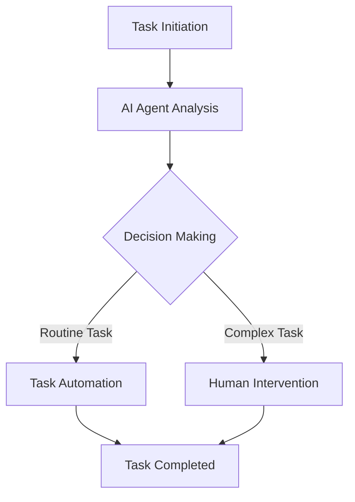

---

## Boosting Productivity with AI Agents in 2026

As we step into the future, the role of AI agents in boosting productivity has become increasingly significant. In 2026, these intelligent assistants are not just futuristic concepts—they are real tools that are reshaping how businesses and individuals approach tasks, manage time, and enhance overall efficiency. So, how exactly are AI agents boosting productivity, and what can you do to harness their potential?

### What Are AI Agents?

AI agents are software programs designed to perform tasks autonomously or semi-autonomously. They can learn from data, adapt to changes, and provide insights to improve decision-making. Think of them as virtual assistants that not only follow commands but also anticipate your needs and suggest actions based on historical data and trends.

### The Rise of AI Agents in 2026

The advancements in natural language processing (NLP), machine learning algorithms, and data analytics have propelled AI agents into the mainstream. In 2026, the landscape is filled with numerous AI tools that can handle a variety of tasks, from scheduling meetings to analyzing complex datasets. But why are they particularly effective in enhancing productivity? Let’s delve into some practical examples and use cases.

### Use Cases of AI Agents in Productivity

#### 1. Task Automation

One of the primary benefits of AI agents is their ability to automate repetitive tasks. For instance, an AI agent like Zapier can connect different applications to automate workflows. If you receive an email with an attachment, Zapier can automatically save that attachment to your cloud storage and notify you via Slack.

**Pros:**
- Saves time and reduces human error
- Frees up resources for more strategic tasks

**Cons:**
- Initial setup can be time-consuming
- May require ongoing adjustments to workflows

#### 2. Intelligent Scheduling

AI-powered scheduling assistants like x.ai or Calendly can take the grunt work out of finding meeting times. They analyze participants' calendars and suggest the best possible times for everyone involved. This not only saves time but also reduces the back-and-forth communication that often plagues scheduling.

**Pros:**
- Eliminates scheduling conflicts
- Enhances collaboration among team members

**Cons:**
- Limited to users who have compatible calendar tools
- May not handle complex scheduling scenarios effectively

#### 3. Data Analysis and Insights

AI agents like Tableau and Microsoft Power BI are equipped with data analytics capabilities that allow them to sift through large datasets and generate insights. For example, a marketing team can use AI agents to analyze customer behavior data and create personalized marketing strategies.

**Pros:**
- Provides actionable insights quickly
- Supports data-driven decision-making

**Cons:**
- Requires a certain level of data literacy to interpret results
- Can be expensive for small businesses

### The Workflow of AI Agents in Productivity

To better understand how AI agents enhance productivity, let’s take a look at a simplified workflow diagram that outlines the process from task initiation to completion.

### Comparing Top AI Agents for Productivity

To help you choose the right AI agent for your needs, here’s a comparison of some of the leading tools available in 2026:

<table>
  <tr>
    <th>Feature</th>
    <th>Zapier</th>
    <th>x.ai</th>
    <th>Tableau</th>
  </tr>
  <tr>
    <td>Task Automation</td>
    <td>Yes</td>
    <td>No</td>
    <td>No</td>
  </tr>
  <tr>
    <td>Scheduling</td>
    <td>No</td>
    <td>Yes</td>
    <td>No</td>
  </tr>
  <tr>
    <td>Data Analysis</td>
    <td>No</td>
    <td>No</td>
    <td>Yes</td>
  </tr>
  <tr>
    <td>Integration with Other Tools</td>
    <td>Extensive</td>
    <td>Limited</td>
    <td>Moderate</td>
  </tr>
</table>

### Conclusion

AI agents are revolutionizing productivity in 2026 by automating mundane tasks, enhancing scheduling processes, and providing critical data insights. As you consider incorporating these tools into your workflow, think about your specific needs and how these agents can help streamline processes and free up time for more strategic initiatives.

### Call to Action

Are you ready to boost your productivity with AI agents? Explore the tools mentioned in this article, or dive deeper into the world of AI productivity solutions. Start your journey today and witness how these intelligent assistants can transform your daily workflow!