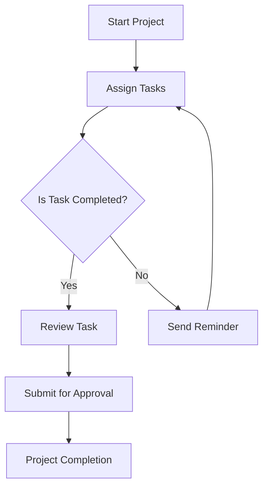

---

# Boosting Productivity with AI Agents in 2026

The future of work is here, and it’s powered by AI agents that are set to transform the productivity landscape in 2026. As we approach this fascinating year, many organizations are integrating AI agents into their workflows to boost efficiency, streamline processes, and enhance decision-making. Understanding how these AI tools work and how they can be leveraged for productivity is crucial for any business leader or individual looking to stay ahead of the curve.

## What Are AI Agents?

AI agents are sophisticated software programs that can perform tasks, make decisions, and interact with users intelligently. Unlike traditional software, AI agents can learn from data, adapt to changing circumstances, and provide insights that lead to better outcomes. They can handle anything from scheduling meetings to analyzing complex datasets, making them invaluable in a fast-paced environment.

### Use Cases of AI Agents in 2026

1. **Virtual Assistants**: Modern virtual assistants are more than just voice-activated tools; they are AI agents capable of managing your calendar, sending reminders, and even suggesting optimal times for meetings based on your preferences and past behavior.

2. **Data Analysis**: AI agents are revolutionizing how businesses analyze data. They can process vast amounts of information, identify trends, and provide actionable insights in real-time, allowing companies to make informed decisions swiftly.

3. **Customer Support**: In 2026, AI agents will dominate customer service interactions. They can handle customer inquiries, troubleshoot problems, and provide personalized responses, all while learning from each interaction to improve future service.

4. **Project Management**: AI agents can track project progress, allocate resources, and even predict project risks based on historical data. This proactive approach enables teams to stay on track and meet deadlines more efficiently.

5. **Content Creation**: From drafting emails to generating reports, AI agents are becoming essential for content creation. They can assist in brainstorming ideas, formatting documents, and even optimizing content for SEO.

## How AI Agents Enhance Productivity

### 1. Time Management

One of the most significant benefits of using AI agents is time management. By automating repetitive tasks, AI agents free up precious time for employees to focus on strategic initiatives. For example, a marketing team can use AI to schedule social media posts, analyze engagement metrics, and generate reports without manual input.

### 2. Improved Accuracy

AI agents reduce the chances of human error. They can analyze data with precision, ensuring that businesses operate on accurate information. This improved accuracy leads to better decision-making and ultimately boosts productivity.

### 3. Enhanced Collaboration

AI agents can facilitate collaboration among team members by centralizing communication and project management. Tools like Slack and Microsoft Teams are increasingly integrating AI capabilities to streamline discussions, file sharing, and task assignments.

### 4. Customization and Personalization

AI agents can learn user preferences and tailor their responses accordingly. This personalization can enhance user experience and make interactions more efficient. For example, CRM systems powered by AI can provide sales teams with insights on customer behavior, leading to more effective outreach.

## Pros and Cons of Using AI Agents

While AI agents offer numerous advantages for productivity, they do come with their own set of challenges. Here's a breakdown of the pros and cons:

### Pros

- **Increased Efficiency**: Automate routine tasks and free up time for more strategic work.
- **Data-Driven Insights**: Leverage data analysis to make informed decisions quickly.
- **24/7 Availability**: AI agents can operate around the clock, providing support whenever needed.
- **Scalability**: Easily scale operations with AI without a proportional increase in costs.

### Cons

- **Implementation Costs**: Initial setup and integration of AI agents can be expensive.
- **Dependence on Technology**: Over-reliance on AI can lead to decreased human oversight and creativity.
- **Data Privacy Concerns**: Handling sensitive information with AI tools raises privacy and security issues.
- **Job Displacement**: Automation may lead to job losses in certain sectors, creating workforce challenges.

## Comparison of Popular AI Agents for Productivity

When considering which AI agent to integrate into your workflow, it helps to compare the most popular tools available. Below is a comparison table of three leading AI agents in 2026:

<table>
  <tr>
    <th>AI Agent</th>
    <th>Features</th>
    <th>Best For</th>
    <th>Price</th>
  </tr>
  <tr>
    <td>Zapier</td>
    <td>Automation of workflows, app integrations</td>
    <td>Small to medium businesses</td>
    <td>Starts at $19.99/month</td>
  </tr>
  <tr>
    <td>[Otter.ai](https://otter.ai/?ref=AFFILIATE_ID)</td>
    <td>Transcription, meeting notes, collaboration</td>
    <td>Teams and remote workers</td>
    <td>Starts at $8.33/month</td>
  </tr>
  <tr>
    <td>[Grammarly](https://www.grammarly.com/?ref=AFFILIATE_ID)</td>
    <td>Writing assistance, grammar checking, tone adjustments</td>
    <td>Content creators, marketers</td>
    <td>Starts at $12/month</td>
  </tr>
</table>

## Visualizing AI Agent Workflows

To fully understand how AI agents can enhance productivity, let’s visualize a typical workflow using an AI agent for project management. 

This diagram illustrates how an AI agent can manage tasks and reminders, ensuring that projects stay on track and deadlines are met.

## Conclusion: Embrace the Future of Productivity

As we approach 2026, the role of AI agents in boosting productivity is becoming increasingly significant. From automating mundane tasks to providing valuable insights, these tools are essential for anyone looking to enhance their workflow. By understanding the functionality and potential of AI agents, you can make informed decisions about which tools to adopt.

Are you ready to transform your productivity with AI agents? Explore the options available and consider how they can fit into your workflow. Start by trying out one of the tools mentioned above and see the difference it makes in your efficiency.

Don't wait—embrace the future of productivity today and watch your work transform!

## 関連記事

- [Enhancing Productivity with AI Agents in 2026](/posts/enhancing-productivity-with-ai-agents-in-2026/)
- [Harnessing AI Agents for Enhanced Workplace Productivity](/posts/harnessing-ai-agents-for-enhanced-workplace-productivity/)
- [How AI Agents Are Revolutionizing Workplace Productivity](/posts/how-ai-agents-are-revolutionizing-workplace-productivity/)
