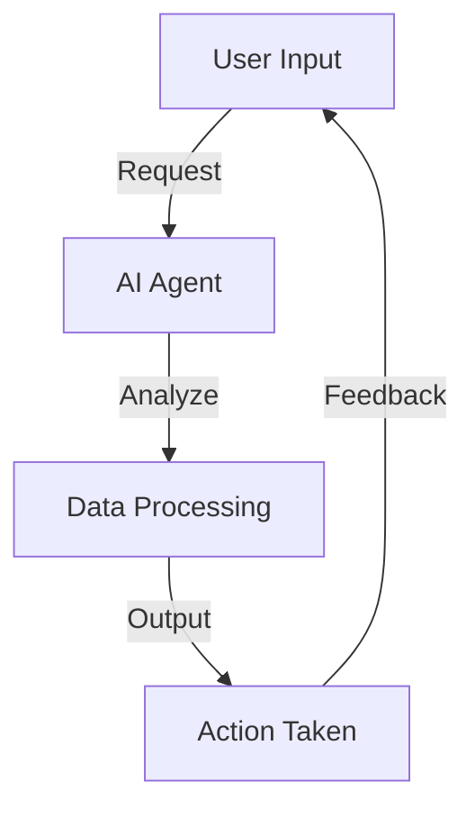

### Boosting Productivity with AI Agents in 2026

As we step into 2026, the landscape of productivity is evolving at an unprecedented pace, driven largely by advancements in artificial intelligence (AI). AI agents are at the forefront of this transformation, acting as virtual assistants that can handle a myriad of tasks, from scheduling meetings to managing customer inquiries. In this blog post, we’ll explore the role of AI agents in enhancing productivity, discuss practical examples and use cases, and highlight the pros and cons to help you understand their impact on your workflow.

### What Are AI Agents?

AI agents are software programs designed to perform tasks autonomously or semi-autonomously. They utilize machine learning, natural language processing, and data analytics to execute tasks that typically require human intervention. In the context of productivity, AI agents can help streamline operations, save time, and reduce human error.

### The Role of AI Agents in Boosting Productivity

#### 1. Task Automation

One of the most significant advantages of AI agents is their ability to automate repetitive and mundane tasks. For example, an AI agent can automatically sort emails, schedule appointments, and even generate reports based on data analysis. This automation frees up valuable time for employees to focus on more strategic and creative tasks.

**Use Case:** Imagine a marketing team where an AI agent handles daily social media scheduling, allowing team members to concentrate on content creation and strategy rather than getting bogged down with routine tasks.

#### 2. Data Analysis and Insights

AI agents excel at processing large volumes of data quickly and accurately. They can analyze trends, generate insights, and provide recommendations based on real-time data, leading to informed decision-making.

**Example:** A sales team can use an AI agent to analyze customer purchase patterns and predict future buying behaviors, allowing for targeted marketing strategies that can significantly boost sales.

#### 3. Personalization

In customer-facing roles, AI agents can enhance productivity by providing personalized experiences. They can analyze customer data to tailor interactions, making responses more relevant and timely.

**Use Case:** Customer service AI agents can handle inquiries through chat applications, offering personalized responses based on the customer’s history with the company.

### Pros and Cons of AI Agents

#### Pros

- **Increased Efficiency:** AI agents can handle multiple tasks simultaneously, significantly speeding up processes.
- **Cost Savings:** By automating tasks, businesses can reduce labor costs and allocate resources more effectively.
- **Enhanced Accuracy:** AI agents minimize human error, leading to higher quality and consistency in work.

#### Cons

- **Dependence on Technology:** Over-reliance on AI agents can lead to skills degradation among employees.
- **Initial Setup Costs:** Implementing AI solutions can require significant upfront investment.
- **Data Privacy Concerns:** The use of AI agents raises questions about data security and privacy, especially when handling sensitive information.

### Future Trends in AI Agents and Productivity

As we look ahead, several trends are emerging that will shape the future of AI agents in the productivity space:

1. **Integration with Other Technologies:** AI agents will increasingly be integrated with other technologies like the Internet of Things (IoT) and blockchain, creating more seamless workflows.

2. **Enhanced Natural Language Processing:** As AI agents become better at understanding human language, their ability to interact and assist will improve, making them more effective in customer service and support roles.

3. **Augmented Collaboration:** AI agents will serve as collaborators, working alongside humans to enhance teamwork and project management.

### Comparing Top AI Agents for Productivity

To help you identify the best AI agents for your needs, here’s a comparison of three leading tools currently making waves in productivity enhancement:

<table>
  <tr>
    <th>AI Tool</th>
    <th>Key Features</th>
    <th>Best For</th>
    <th>Price</th>
  </tr>
  <tr>
    <td>Zapier</td>
    <td>Task automation, integration with over 3,000 apps</td>
    <td>Businesses looking to automate workflows</td>
    <td>Starts at $19.99/month</td>
  </tr>
  <tr>
    <td>Otter.ai</td>
    <td>Real-time transcription, collaboration tools</td>
    <td>Teams needing meeting notes and documentation</td>
    <td>Starts at $8.33/month</td>
  </tr>
  <tr>
    <td>ChatGPT</td>
    <td>Conversational AI, content generation</td>
    <td>Marketing and content creation teams</td>
    <td>Free with premium options available</td>
  </tr>
</table>

### Visualizing the AI Agents Workflow

To better understand how AI agents can fit into your productivity strategy, consider the following workflow diagram:

### Conclusion

As we navigate the complexities of 2026, AI agents will undoubtedly play a pivotal role in reshaping productivity across industries. From automating mundane tasks to providing actionable insights, they have the potential to transform how we work, collaborate, and achieve our goals. 

Are you ready to embrace the future of productivity with AI agents? Start exploring the tools mentioned above, and witness how they can revolutionize your workflow. Don’t wait—take the first step towards a more efficient and productive work environment today!