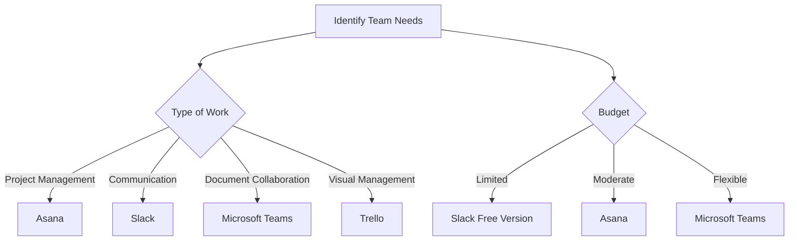

---

# Boosting Team Collaboration Using AI-Powered Tools

In today’s fast-paced digital world, effective collaboration is key to a successful team. Gone are the days when teams relied solely on emails and meetings to communicate. With the advent of AI collaboration tools, teams can now work smarter, faster, and more cohesively than ever before. In this article, we’ll explore how AI-powered tools can transform your team dynamics, enhance productivity, and foster a collaborative environment.

## What Are AI Collaboration Tools?

AI collaboration tools are software solutions that leverage artificial intelligence to enhance communication and teamwork among individuals and groups. These tools can analyze patterns, automate repetitive tasks, facilitate real-time communication, and provide insights that help teams make data-driven decisions.

### Why Use AI Collaboration Tools?

As teams become more distributed and remote work continues to rise, the need for effective collaboration tools becomes paramount. Here are some compelling reasons to integrate AI collaboration tools into your workflow:

1. **Enhanced Communication**: Real-time messaging and video conferencing features keep everyone connected.
2. **Task Automation**: AI tools can take over mundane tasks, allowing team members to focus on high-priority work.
3. **Data-Driven Insights**: AI can analyze team performance and suggest improvements.
4. **Accessibility**: Cloud-based AI tools can be accessed from anywhere, making them ideal for remote teams.

## Leading AI Collaboration Tools

Let’s take a closer look at some of the leading AI collaboration tools currently available on the market. We’ll highlight their features, pros and cons, and use cases to help you make an informed choice.

### 1. Microsoft Teams

Microsoft Teams is a versatile collaboration platform that integrates well with other Microsoft Office tools. It offers chat, video conferencing, file sharing, and collaboration on documents.

**Pros:**
- Seamless integration with Microsoft Office Suite.
- Robust security and compliance features.
- Customizable through various apps and extensions.

**Cons:**
- Can be overwhelming for new users due to its extensive features.
- May require a subscription for advanced features.

**Use Case:** Ideal for teams already using Microsoft products, Teams can enhance productivity by allowing real-time collaboration on Word, Excel, and PowerPoint documents.

### 2. Slack

Slack is a popular messaging app designed for teams. It allows for organized communication through channels, direct messages, and integrations with various apps.

**Pros:**
- User-friendly interface that encourages engagement.
- Extensive integrations with third-party applications.
- Powerful search capabilities for past conversations.

**Cons:**
- Free version has limitations on message history and integrations.
- Can become chaotic in large teams with too many channels.

**Use Case:** Great for tech teams and startups, Slack enables quick discussions and feedback loops, enhancing project efficiency.

### 3. Asana

Asana is primarily a project management tool that also incorporates AI features to streamline workflows. It helps teams track tasks and manage projects seamlessly.

**Pros:**
- Visual project tracking with timelines and boards.
- Automation features reduce manual task management.
- AI suggestions for task assignments and deadlines.

**Cons:**
- Can be complex for teams unfamiliar with project management tools.
- Pricing can become steep with larger teams.

**Use Case:** Perfect for teams managing multiple projects simultaneously, Asana helps ensure that everyone knows their responsibilities and deadlines.

### 4. Trello

Trello uses a card-based system to help teams organize tasks and projects visually. Its simplicity is one of its biggest strengths.

**Pros:**
- Easy-to-use interface that is visually appealing.
- Flexible organization of tasks through boards and lists.
- Automation via Butler feature to save time on repetitive tasks.

**Cons:**
- Limited features in the free version.
- May not be suitable for very complex projects.

**Use Case:** Ideal for creative teams needing a visual representation of their workflows, Trello makes task management engaging and straightforward.

### Comparison Table of AI Collaboration Tools

<table>
  <tr>
    <th>Tool</th>
    <th>Best For</th>
    <th>Key Features</th>
    <th>Pricing</th>
  </tr>
  <tr>
    <td>Microsoft Teams</td>
    <td>Microsoft Users</td>
    <td>Video calls, document collaboration, app integrations</td>
    <td>Free; paid plans start at $5/user/month</td>
  </tr>
  <tr>
    <td>Slack</td>
    <td>Communication</td>
    <td>Channels, direct messaging, third-party integrations</td>
    <td>Free; paid plans start at $6.67/user/month</td>
  </tr>
  <tr>
    <td>Asana</td>
    <td>Project Management</td>
    <td>Task tracking, automation, project timelines</td>
    <td>Free; paid plans start at $10.99/user/month</td>
  </tr>
  <tr>
    <td>Trello</td>
    <td>Visual Task Management</td>
    <td>Boards, lists, automation with Butler</td>
    <td>Free; paid plans start at $10/user/month</td>
  </tr>
</table>

## How to Choose the Right AI Collaboration Tool

Selecting the right AI collaboration tool for your team can be daunting. Here’s a simple decision-making workflow to guide you:

### Factors to Consider

1. **Team Size**: Large teams may require tools that can handle multiple channels and projects simultaneously.
2. **Budget**: Consider free trials to evaluate tools before committing to a paid plan.
3. **Features**: Identify which features are essential for your team’s workflow.
4. **Ease of Use**: Choose a tool that your team can easily adopt without extensive training.

## Conclusion

AI collaboration tools are revolutionizing the way teams work together. By integrating tools like Microsoft Teams, Slack, Asana, or Trello, you can enhance communication, streamline processes, and boost overall productivity. The right choice depends on your team’s specific needs, size, and budget.

As you explore these AI-powered solutions, remember that the ultimate goal is to foster a collaborative culture that drives results. So why not take the leap? Start by trying out one of these tools today and watch your team’s productivity soar!

**Ready to transform your team’s collaboration?** Explore the world of AI collaboration tools and find the perfect fit for your team today!

## 関連記事

- [Best AI Collaboration Tools for Remote Teams in 2026](/posts/best-ai-tools-for-improving-team-collaboration-in-2026/)
- [Async Collaboration with AI: Bridging Time Zones Effortlessly](/posts/boosting-team-collaboration-with-ai-tools-in-2026/)
- [How AI Optimizes Cross-Functional Team Collaboration](/posts/how-ai-can-optimize-team-collaboration-and-productivity/)
