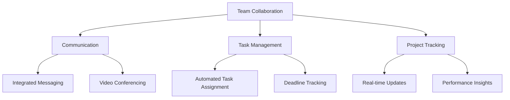

---

# Boosting Team Collaboration with AI Automation Tools

In today’s fast-paced digital landscape, maintaining effective teamwork can be a challenge, especially when teams are distributed across various locations. Enter AI collaboration tools—powerful software solutions designed to streamline communication, automate repetitive tasks, and enhance overall productivity. Whether you're part of a small startup or a large corporation, leveraging these tools can lead to improved team dynamics and more efficient workflows.

## What Are AI Collaboration Tools?

AI collaboration tools utilize artificial intelligence to facilitate better teamwork and streamline operations. These tools can help teams manage tasks, schedule meetings, share files, and communicate in real-time, all while automating mundane tasks that often bog down productivity. With features like natural language processing, machine learning, and workflow automation, these tools can help teams stay organized and focused.

## Why Use AI Collaboration Tools?

1. **Enhanced Communication**: AI tools can analyze communication patterns and suggest improvements, ensuring that everyone stays on the same page.
2. **Time-Saving Automation**: By automating repetitive tasks, teams can concentrate on more strategic functions, leading to better outcomes.
3. **Data-Driven Insights**: AI can interpret vast amounts of data, providing actionable insights that help teams make informed decisions.
4. **Improved Project Management**: AI tools can help in task allocation, deadline tracking, and resource management, making project execution smoother.

## Popular AI Collaboration Tools

Let’s dive into some of the most popular AI collaboration tools available today, exploring their features, benefits, and potential drawbacks.

### 1. Slack

Slack is a widely-used communication platform that integrates AI features to streamline interactions.

**Pros:**
- Real-time messaging and file sharing
- Extensive integrations with third-party apps
- Searchable message history

**Cons:**
- Can become overwhelming with too many notifications
- Limited features for project management

### 2. Microsoft Teams

Microsoft Teams combines chat, video meetings, and document collaboration into one platform.

**Pros:**
- Seamless integration with Microsoft Office Suite
- Robust video conferencing features
- Excellent for organizations already using Microsoft products

**Cons:**
- Can be complex for new users
- May require additional licenses for full functionality

### 3. Trello

Trello is a project management tool that uses boards, lists, and cards to organize tasks.

**Pros:**
- Visual interface makes project tracking easy
- Automation features with Butler
- Flexible and customizable workflows

**Cons:**
- May lack advanced project management features
- Can become cluttered with too many boards

### 4. Asana

Asana is a task management tool that helps teams plan, organize, and track their work.

**Pros:**
- User-friendly interface
- Powerful automation features
- Good for tracking project deadlines

**Cons:**
- Limited functionality in the free version
- May require some onboarding for new users

### Comparison Table

<table>
  <tr>
    <th>Tool</th>
    <th>Key Features</th>
    <th>Pros</th>
    <th>Cons</th>
  </tr>
  <tr>
    <td>Slack</td>
    <td>Real-time messaging, file sharing</td>
    <td>Extensive integrations, searchable history</td>
    <td>Overwhelming notifications</td>
  </tr>
  <tr>
    <td>Microsoft Teams</td>
    <td>Chat, video meetings, Office integration</td>
    <td>Great for Microsoft users, robust features</td>
    <td>Complex for new users</td>
  </tr>
  <tr>
    <td>Trello</td>
    <td>Boards, lists, cards</td>
    <td>Visual interface, customizable</td>
    <td>Lacks advanced features</td>
  </tr>
  <tr>
    <td>Asana</td>
    <td>Task tracking, project management</td>
    <td>User-friendly, powerful automation</td>
    <td>Limited free version</td>
  </tr>
</table>

## Use Cases for AI Collaboration Tools

### Scenario 1: Remote Team Meetings

With teams working remotely, scheduling and conducting meetings can be a hassle. AI collaboration tools like Microsoft Teams can automate the scheduling process, send out reminders, and even summarize meeting notes using AI-driven transcription services.

### Scenario 2: Project Management

Imagine a marketing team working on a campaign. They can use Trello to create a visual workflow, assign tasks, and monitor progress. With the automation features, they can set triggers for overdue tasks, ensuring everyone stays accountable.

### Scenario 3: Enhancing Communication

For teams that rely heavily on communication, Slack can be a game-changer. AI features can suggest the best times for meetings based on team availability and analyze message trends to provide insights into team dynamics.

### Workflow Example with Mermaid Diagram

To better illustrate how AI collaboration tools can enhance team collaboration, here’s a simple workflow diagram:

## Conclusion

AI collaboration tools are transforming how teams operate, making it easier to communicate, manage tasks, and track projects. By implementing these tools, organizations can foster a collaborative culture that not only boosts productivity but also enhances employee satisfaction.

### Call to Action

Ready to supercharge your team's collaboration? Explore various AI collaboration tools today and find the perfect fit for your organization. Don’t let inefficiencies hold your team back—embrace the power of AI and watch your productivity soar!

## 関連記事

- [AI Agents: The Future of Personal Assistants in 2026](/posts/ai-agents-the-future-of-personal-assistants-in-2026/)
- [AI Automation: A Game Changer for Small Businesses](/posts/ai-automation-a-game-changer-for-small-businesses/)
- [AI Automation: The Key to Enhanced Business Efficiency](/posts/ai-automation-the-key-to-enhanced-business-efficiency/)
