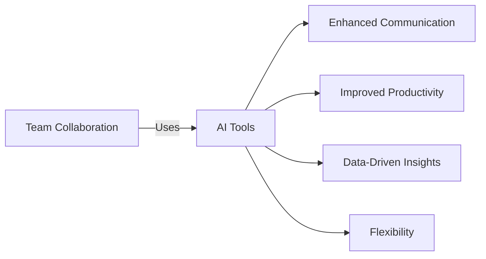

---

## Boosting Team Collaboration with AI Tools in 2026

In today’s fast-paced digital landscape, effective teamwork is paramount for success. As we head into 2026, the emergence of AI collaboration tools is revolutionizing how teams communicate, share ideas, and execute projects. These tools not only streamline workflows but also foster creativity and innovation among team members, regardless of their geographical locations. In this article, we will explore the latest AI collaboration tools available in 2026, their benefits, and practical use cases that can elevate your team collaboration to new heights.

### The Importance of AI Collaboration Tools

Before diving into specific tools and their functionalities, let's discuss why AI collaboration tools are becoming indispensable in modern workplaces. 

1. **Enhanced Communication**: AI tools facilitate seamless communication among team members, reducing misunderstandings and ensuring clarity in the information shared.

2. **Improved Productivity**: With automation features that handle repetitive tasks, teams can focus on strategic initiatives that drive business growth.

3. **Data-Driven Insights**: AI analytics can provide insights into team performance, helping to identify bottlenecks and improve overall efficiency.

4. **Flexibility and Accessibility**: AI collaboration tools are often cloud-based, allowing teams to collaborate from anywhere, at any time, which is essential in the era of remote work.

### Key AI Collaboration Tools in 2026

Let’s take a closer look at some of the most effective AI collaboration tools dominating the market in 2026:

#### 1. Slack + AI

**Overview**: Slack has long been a staple in team communication, and in 2026, it has integrated advanced AI features to enhance its functionality. AI-powered bots can now summarize conversations, suggest relevant documents, and even schedule meetings based on team availability.

**Pros**:
- User-friendly interface
- Integrates with numerous third-party applications
- AI-driven insights into team engagement

**Cons**:
- Can become overwhelming with too many notifications
- Requires a learning curve for advanced features

#### 2. Microsoft Teams with Copilot

**Overview**: Microsoft Teams continues to be a robust platform for collaboration, now enhanced with [Copilot](https://github.com/features/copilot?ref=AFFILIATE_ID), an AI tool that assists in generating meeting notes, action items, and project summaries. 

**Pros**:
- Seamless integration with Microsoft Office Suite
- Advanced AI features for documentation
- Strong security and compliance measures

**Cons**:
- Can be resource-intensive
- Some users may find it complex for simple tasks

#### 3. Trello + AI

**Overview**: Trello has transformed its project management capabilities with AI tools that automate task assignments based on team members' workloads and project priorities.

**Pros**:
- Visual task management with boards and cards
- AI automation saves time on task delegation
- Easy to use for teams of all sizes

**Cons**:
- Limited features in the free version
- May require third-party integrations for advanced functionalities

#### 4. Zoom with AI Insights

**Overview**: Zoom has evolved from a video conferencing tool to a comprehensive collaboration platform with AI-driven insights. Features include automatic transcription, sentiment analysis during meetings, and post-meeting summaries.

**Pros**:
- High-quality video and audio
- Rich AI features for meeting management
- Easy sharing of recorded meetings

**Cons**:
- Can experience latency issues with poor internet connections
- Subscription costs can add up for larger teams

### Comparison of AI Collaboration Tools

Choosing the right tool for your team can be daunting, so here’s a quick comparison of the aforementioned platforms:

<table>
  <tr>
    <th>Feature</th>
    <th>Slack + AI</th>
    <th>Microsoft Teams with [Copilot](https://github.com/features/copilot?ref=AFFILIATE_ID)</th>
    <th>Trello + AI</th>
    <th>Zoom with AI Insights</th>
  </tr>
  <tr>
    <td>AI Automation</td>
    <td>Moderate</td>
    <td>High</td>
    <td>High</td>
    <td>Moderate</td>
  </tr>
  <tr>
    <td>User Interface</td>
    <td>Friendly</td>
    <td>Complex</td>
    <td>Visual</td>
    <td>Friendly</td>
  </tr>
  <tr>
    <td>Integration</td>
    <td>Extensive</td>
    <td>Microsoft Suite</td>
    <td>Moderate</td>
    <td>Moderate</td>
  </tr>
  <tr>
    <td>Cost</td>
    <td>Free/Paid</td>
    <td>Paid</td>
    <td>Free/Paid</td>
    <td>Free/Paid</td>
  </tr>
</table>

### Practical Use Cases

#### Example 1: Remote Team Collaboration

Imagine a marketing team distributed across multiple time zones. Using Slack + AI, they can create dedicated channels for specific campaigns, where AI bots summarize discussions and highlight important updates. This ensures that every team member stays informed, regardless of when they log in.

#### Example 2: Project Management

A product development team uses Trello + AI to manage their workflow. The AI feature assigns tasks based on team members’ current workloads and project deadlines, allowing for efficient resource allocation. As a result, the team can meet deadlines without burnout.

#### Example 3: Meeting Efficiency

Consider a sales team relying on Zoom with AI Insights. After each meeting, the AI generates a summary that includes key takeaways and action items. This ensures that all team members are aligned and can follow up efficiently.

### The Future of AI Collaboration Tools

As we look ahead, AI collaboration tools are expected to become even more sophisticated. Features such as natural language processing (NLP), advanced sentiment analysis, and enhanced predictive analytics will further streamline communication and collaboration in teams. The integration of virtual and augmented reality may also redefine how teams interact, bringing remote collaboration to a new level.

### Conclusion

The landscape of teamwork is evolving, and AI collaboration tools are at the forefront of this transformation. By leveraging these technologies, teams can enhance communication, increase productivity, and foster an environment of innovation. Whether you choose Slack + AI, Microsoft Teams with [Copilot](https://github.com/features/copilot?ref=AFFILIATE_ID), Trello + AI, or Zoom with AI Insights, you’re bound to find significant improvements in your collaboration efforts.

Are you ready to elevate your team's collaboration in 2026? Explore these AI tools today and experience the future of teamwork. Don't forget to share your experiences and insights in the comments below!

### Call to Action

If you found this article helpful, subscribe to our newsletter for more insights on AI tools and productivity tips. Let's stay ahead in this rapidly changing digital landscape together!

## 関連記事

- [Best AI Collaboration Tools for Remote Teams in 2026](/posts/best-ai-tools-for-improving-team-collaboration-in-2026/)
- [AI-Powered Meetings: Tools That Make Every Meeting Count](/posts/boosting-team-collaboration-using-ai-powered-tools/)
- [How AI Optimizes Cross-Functional Team Collaboration](/posts/how-ai-can-optimize-team-collaboration-and-productivity/)
