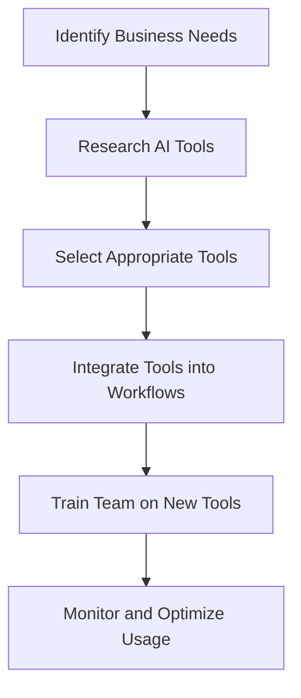

---

As we step into 2026, the landscape of business operations is increasingly shaped by artificial intelligence. Gone are the days when AI tools were merely a buzzword; they have become essential components for enhancing productivity and streamlining workflows. In this article, we’ll explore some of the most effective AI tools for business that can significantly boost team efficiency, ensuring you stay competitive in this fast-paced digital age.

### Understanding AI Tools for Business

AI tools for business are software applications that leverage artificial intelligence technologies to automate processes, analyze data, and enhance decision-making. These tools can range from simple task management apps to sophisticated machine learning platforms. By integrating AI into your business operations, you can not only improve efficiency but also drive innovation.

### Why Use AI Tools?

Before we dive into specific tools, let’s discuss the benefits of implementing AI in your business:

1. **Increased Efficiency**: Automating repetitive tasks allows your team to focus on more strategic initiatives.
2. **Enhanced Decision-Making**: AI tools provide data-driven insights that help in making informed business decisions.
3. **Cost Savings**: By streamlining processes, businesses can reduce operational costs.
4. **Improved Customer Experience**: AI tools can personalize interactions, leading to higher customer satisfaction.

### Top AI Tools for Business in 2026

To give you a clearer picture, let’s explore some of the leading AI tools for business available in 2026. We’ll look into their features, use cases, pros, and cons.

#### 1. **Trello with AI Enhancements**

**Overview**: Trello is a popular project management tool that recently integrated AI features to help teams prioritize tasks and manage projects more effectively.

**Use Case**: A marketing team can use Trello to organize campaigns, with AI suggesting priority tasks based on deadlines and past performance.

**Pros**:
- User-friendly interface
- Customizable workflows
- AI suggestions for task prioritization

**Cons**:
- Limited advanced analytics
- May require training for full utilization

#### 2. **Slack with AI Integration**

**Overview**: Slack has become a staple for team communication, and with its AI capabilities, it can now analyze conversation trends and suggest relevant information.

**Use Case**: A software development team can use Slack to quickly find information from previous discussions or documents, streamlining their workflow.

**Pros**:
- Instant communication
- AI-driven search capabilities
- Integrates with numerous other tools

**Cons**:
- Can become overwhelming with notifications
- Dependence on internet connectivity

#### 3. **HubSpot's AI-Powered CRM**

**Overview**: HubSpot offers a customer relationship management (CRM) platform enhanced with AI features that help in lead scoring and personalized marketing.

**Use Case**: A sales team can utilize HubSpot to automatically prioritize leads based on their engagement level, improving conversion rates.

**Pros**:
- Comprehensive marketing tools
- AI-driven insights on customer behavior
- Easy integration with other platforms

**Cons**:
- Subscription costs can add up
- Some features may be complex for new users

### Comparison of AI Tools for Business

Here’s a quick comparison of the AI tools we discussed to help you make an informed decision:

<table>
    <tr>
        <th>Tool</th>
        <th>Key Features</th>
        <th>Pros</th>
        <th>Cons</th>
    </tr>
    <tr>
        <td>Trello</td>
        <td>Task management, AI suggestions</td>
        <td>User-friendly, customizable</td>
        <td>Limited analytics</td>
    </tr>
    <tr>
        <td>Slack</td>
        <td>Team communication, AI search</td>
        <td>Instant messaging, integrations</td>
        <td>Notification overload</td>
    </tr>
    <tr>
        <td>HubSpot CRM</td>
        <td>Lead scoring, marketing automation</td>
        <td>Comprehensive tools, insights</td>
        <td>Costly subscription</td>
    </tr>
</table>

### Implementing AI Tools: A Workflow Diagram

To help visualize the implementation of AI tools in your business processes, here’s a workflow diagram:

### Overcoming Challenges in Adoption

While AI tools can greatly enhance efficiency, businesses often face challenges during adoption. Here are some common hurdles and how to overcome them:

1. **Resistance to Change**: Encourage a culture of innovation within your team. Communicate the benefits of AI and how it will make their jobs easier.
   
2. **Training Needs**: Invest in proper training sessions to ensure all team members are comfortable using the new tools.

3. **Integration Issues**: Choose tools that seamlessly integrate with your existing systems to minimize disruption.

### Conclusion

As we move further into 2026, leveraging AI tools for business is no longer a luxury but a necessity for those looking to enhance team efficiency and productivity. From project management to customer relationship management, the right AI tools can transform how your team operates.

By embracing these technologies, you can not only streamline your processes but also foster a more innovative and responsive work environment. 

Are you ready to take your business to the next level with AI? Explore these tools today and watch your efficiency soar!

### Call to Action

Don’t let your team fall behind in the AI revolution! Start implementing these AI tools for business now and unlock your full potential. Visit our website for more insights and resources on the best AI tools tailored for your business needs!