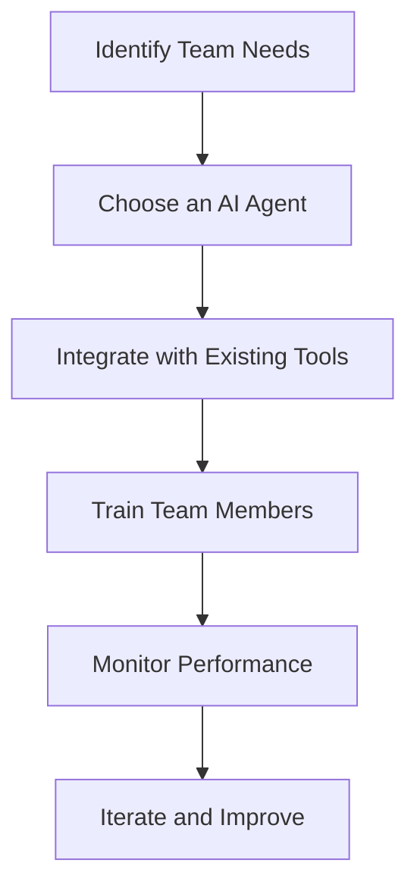

---

# Boosting Team Productivity with AI Agents in 2026

In an era where technology is evolving faster than ever, the workplace landscape is undergoing a significant transformation. By 2026, AI agents will play a pivotal role in enhancing team productivity, streamlining workflows, and revolutionizing collaboration. But what exactly are AI agents, and how can they boost productivity in your team? Let's dive in!

## Understanding AI Agents

AI agents are software applications that use artificial intelligence to perform tasks and assist users in various activities. They can analyze data, automate repetitive tasks, and even provide insights and recommendations based on user input. With advancements in machine learning and natural language processing, these agents are becoming increasingly sophisticated, capable of understanding context and making decisions.

### Use Cases of AI Agents in Team Productivity

1. **Task Automation**: AI agents can automate mundane tasks such as scheduling meetings, sending reminders, and managing emails. This allows team members to focus on higher-value activities that require human intelligence.

2. **Data Analysis**: Teams often struggle with processing large volumes of data. AI agents can sift through data, identify patterns, and provide actionable insights, enabling teams to make informed decisions quickly.

3. **Collaboration Enhancement**: By integrating with communication platforms like Slack or Microsoft Teams, AI agents can facilitate discussions, summarize meeting notes, and even suggest relevant documents, ensuring everyone is on the same page.

4. **Personalized Learning**: AI agents can tailor training programs for team members based on their skills and career goals, promoting continuous learning and professional development.

## The Impact of AI Agents on Team Dynamics

### Improved Communication

AI agents foster better communication by providing real-time updates and facilitating discussions. For instance, imagine an AI agent integrated into your project management tool that automatically alerts team members about task deadlines or project changes. This ensures everyone is informed without overwhelming them with notifications.

### Enhanced Decision-Making

With access to vast amounts of data, AI agents can present insights that help teams make strategic decisions. For example, a sales team can use an AI agent to analyze customer behavior and predict future trends, allowing them to tailor their strategies accordingly.

### Increased Accountability

AI agents can track progress and performance metrics, making it easier for teams to hold each other accountable. This transparency fosters a culture of responsibility and motivates team members to meet their goals.

## Pros and Cons of Using AI Agents for Productivity

### Pros

- **Efficiency**: Automating routine tasks can save significant time.
- **Accuracy**: AI agents reduce human error in data handling and task management.
- **Scalability**: As teams grow, AI agents can easily adapt to increased workloads.

### Cons

- **Dependence**: Over-reliance on AI agents may hinder the development of critical thinking skills.
- **Privacy Concerns**: Data handling by AI agents raises questions about security and privacy.
- **Cost**: Implementing AI solutions can require a substantial investment.

## Popular AI Agents for Enhancing Team Productivity

To help you navigate the plethora of AI tools available, we’ve compiled a comparison of some of the most popular AI agents that can boost team productivity in 2026.

<table>
  <tr>
    <th>Tool</th>
    <th>Key Features</th>
    <th>Best For</th>
    <th>Pricing</th>
  </tr>
  <tr>
    <td>Zapier</td>
    <td>Automates workflows across apps</td>
    <td>Small to medium teams</td>
    <td>From $19.99/month</td>
  </tr>
  <tr>
    <td>Slackbot</td>
    <td>Facilitates communication and reminders</td>
    <td>Teams using Slack</td>
    <td>Free with Slack subscription</td>
  </tr>
  <tr>
    <td>Trello + Butler</td>
    <td>Automates tasks within Trello boards</td>
    <td>Project management</td>
    <td>Free with Trello subscription</td>
  </tr>
  <tr>
    <td>Crystal</td>
    <td>Provides personality insights for better communication</td>
    <td>Sales and HR teams</td>
    <td>From $29/month</td>
  </tr>
</table>

## Workflow for Implementing AI Agents

To effectively integrate AI agents into your team’s workflow, consider the following steps:

### Step-by-Step Implementation

1. **Identify Team Needs**: Assess what productivity challenges your team faces and how AI can address them.
2. **Choose an AI Agent**: Select an AI agent that fits your team’s specific requirements from the comparison table above.
3. **Integrate with Existing Tools**: Ensure seamless integration with the tools your team already uses.
4. **Train Team Members**: Provide training sessions to help your team become comfortable using the new AI agent.
5. **Monitor Performance**: Track the effectiveness of the AI agent in improving productivity.
6. **Iterate and Improve**: Gather feedback and make adjustments to maximize the benefits of the AI agent.

## The Future of AI Agents in the Workplace

As we look ahead to 2026, the capabilities of AI agents will continue to expand. We can expect advancements in natural language processing, allowing these agents to understand and respond to complex queries more naturally. Additionally, AI agents will likely become more customizable, adapting to the unique workflows and preferences of individual teams.

### Conclusion: Embrace AI for Enhanced Productivity

AI agents are no longer just a futuristic concept; they are practical tools that can significantly boost team productivity today. By automating tasks, enhancing communication, and providing valuable insights, these agents will help teams become more efficient and focused on what truly matters.

Are you ready to take your team's productivity to the next level with AI agents? Explore the tools mentioned in this article and start your journey towards a more efficient and collaborative workplace. Don’t wait—embrace the future of work today!

## 関連記事

- [Boost Productivity with AI Agents: 2026 Strategies](/posts/boost-productivity-with-ai-agents-2026-strategies/)
- [Boosting Productivity with AI Agents in 2026](/posts/boosting-productivity-with-ai-agents-in-2026/)
- [Enhancing Productivity with AI Agents in 2026](/posts/enhancing-productivity-with-ai-agents-in-2026/)
