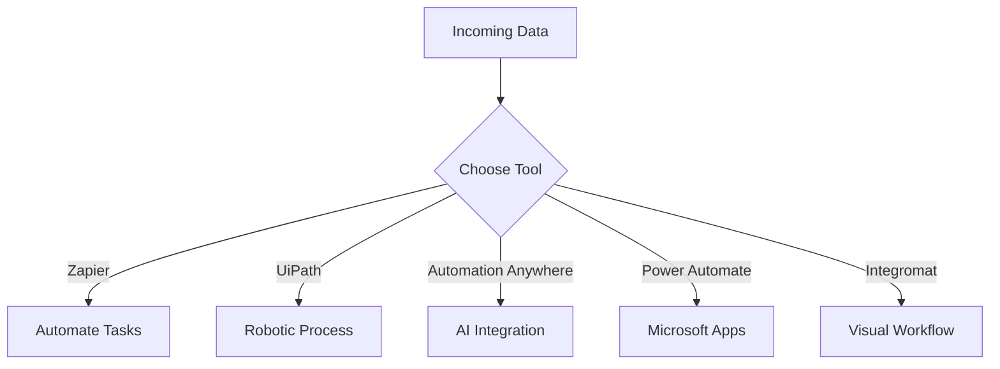

---

# Choosing the Best AI Automation Tools for Your Business

In an era where efficiency is key, businesses are increasingly turning to AI automation tools to streamline operations, reduce costs, and enhance productivity. But with so many options available, how do you choose the best AI automation tools for your specific needs? In this article, we’ll explore some of the top contenders on the market, their use cases, and how they can transform your business operations.

## Understanding AI Automation Tools

Before we dive into the specifics, let’s clarify what AI automation tools are. These technologies leverage artificial intelligence to perform repetitive tasks, analyze data, and even make decisions without human intervention. From chatbots that handle customer inquiries to systems that automate marketing campaigns, AI automation tools can significantly reduce the workload of your team and improve efficiency.

## Why You Need AI Automation Tools

The benefits of incorporating AI automation tools into your business are manifold. Here are a few compelling reasons:

1. **Increased Efficiency**: Automating routine tasks allows your team to focus on higher-value activities.
2. **Cost Savings**: Reducing manual labor can lead to significant cost reductions over time.
3. **Improved Accuracy**: AI tools can minimize human error, ensuring tasks are completed correctly and consistently.
4. **Scalability**: As your business grows, AI tools can help you scale your operations without needing to proportionally increase your workforce.

## Top AI Automation Tools for Businesses

To help you navigate the vast landscape of AI automation tools, here are some of the best options available:

### 1. Zapier

**Overview**: Zapier is a widely-used automation tool that connects various applications to automate workflows without needing coding skills.

**Use Cases**:
- Automatically send Slack notifications for new leads in your CRM.
- Schedule social media posts based on specific triggers.

**Pros**:
- User-friendly interface.
- Supports thousands of apps.
- No coding required.

**Cons**:
- Can become expensive with high-volume tasks.
- Limited functionality in the free tier.

### 2. UiPath

**Overview**: UiPath is a leader in Robotic Process Automation (RPA), ideal for businesses looking to automate complex workflows.

**Use Cases**:
- Automate data entry across multiple platforms.
- Streamline invoice processing in finance departments.

**Pros**:
- Powerful for complex automation.
- Excellent for large enterprises.

**Cons**:
- Steeper learning curve.
- Higher price point than some competitors.

### 3. Automation Anywhere

**Overview**: This tool combines RPA with cognitive capabilities to automate both simple and complex processes.

**Use Cases**:
- Automate customer support tasks using AI chatbots.
- Streamline HR processes like onboarding.

**Pros**:
- Integrates AI and machine learning.
- Strong analytics capabilities.

**Cons**:
- Can be overwhelming for small businesses.
- Requires significant setup time.

### 4. Microsoft Power Automate

**Overview**: Part of the Microsoft 365 suite, Power Automate allows businesses to create automated workflows between apps and services.

**Use Cases**:
- Automatically save email attachments to OneDrive.
- Sync data between SharePoint and Salesforce.

**Pros**:
- Seamless integration with Microsoft products.
- Flexible and easy to use.

**Cons**:
- Limited functionality with non-Microsoft apps.
- May require additional licensing costs.

### 5. Integromat (Make)

**Overview**: Integromat, recently rebranded as Make, is another powerful automation tool that allows users to visually create workflows.

**Use Cases**:
- Automate email responses based on specific triggers.
- Create complex workflows across multiple apps with conditional logic.

**Pros**:
- Visual interface makes it easy to design workflows.
- Extensive app integrations.

**Cons**:
- Can be complex for beginners.
- Limited support for legacy systems.

## Comparison of AI Automation Tools

To help you make an informed decision, here’s a quick comparison of the tools discussed:

<table>
    <tr>
        <th>Tool</th>
        <th>Best For</th>
        <th>Ease of Use</th>
        <th>Price</th>
        <th>Key Features</th>
    </tr>
    <tr>
        <td>Zapier</td>
        <td>Small to medium businesses</td>
        <td>High</td>
        <td>Free tier available, paid plans start at $19.99/month</td>
        <td>Integrates with 2000+ apps</td>
    </tr>
    <tr>
        <td>UiPath</td>
        <td>Large enterprises</td>
        <td>Medium</td>
        <td>Contact for pricing</td>
        <td>Advanced RPA capabilities</td>
    </tr>
    <tr>
        <td>Automation Anywhere</td>
        <td>Complex workflows</td>
        <td>Medium</td>
        <td>Contact for pricing</td>
        <td>AI and ML integration</td>
    </tr>
    <tr>
        <td>Microsoft Power Automate</td>
        <td>Microsoft 365 users</td>
        <td>High</td>
        <td>Free tier available, paid plans start at $15/month</td>
        <td>Seamless MS integration</td>
    </tr>
    <tr>
        <td>Integromat (Make)</td>
        <td>Visual workflow design</td>
        <td>Medium</td>
        <td>Free tier available, paid plans start at $9/month</td>
        <td>Conditional logic capabilities</td>
    </tr>
</table>

## Workflow Visualization

To better illustrate how these tools can interact and automate tasks, here’s a simple workflow diagram:

## How to Choose the Right AI Automation Tool

Choosing the best AI automation tool for your business depends on several factors:

1. **Business Size**: Smaller businesses may benefit from user-friendly tools like Zapier or Microsoft Power Automate, while larger enterprises might require the advanced capabilities of UiPath or Automation Anywhere.

2. **Budget**: Consider your budget for automation tools. Some tools offer free tiers, while others may require a significant investment.

3. **Specific Needs**: Evaluate the specific tasks you want to automate. If you need complex workflows, Integromat or Automation Anywhere may be ideal.

4. **Integration Requirements**: Ensure the tool you choose integrates well with the applications you already use.

## Conclusion

The best AI automation tools can dramatically improve your business processes, allowing you to save time, reduce costs, and enhance accuracy. By understanding your specific needs and comparing the available options, you can select the right tool that aligns with your goals.

Ready to take your business to the next level with AI automation? Explore these tools today and start your journey towards a more efficient future!

**Call to Action**: Don’t wait! Begin automating your business processes today with one of the best AI automation tools we've discussed. Visit their websites, sign up for trials, and see the difference automation can make!