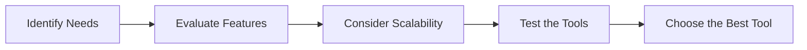

---

# Choosing the Best AI Tools for Enhanced Productivity

In today's fast-paced digital world, the quest for increased productivity is a top priority for both individuals and organizations. With the rise of artificial intelligence (AI), a new arsenal of tools is at our disposal, enabling us to work smarter, not harder. But with so many options out there, how do you choose the best AI productivity tools for your specific needs? In this article, we’ll explore some of the most effective AI tools currently available, their pros and cons, and practical use cases to help you make an informed decision.

## Understanding AI Productivity Tools

AI productivity tools are software applications that leverage artificial intelligence to automate tasks, enhance workflows, and optimize decision-making processes. They can analyze vast amounts of data, provide insights, and even take action based on predictive analytics. The best AI productivity tools can help you save time, reduce errors, and improve overall efficiency.

### Why Use AI Tools?

The integration of AI tools into your daily workflow can unlock significant benefits:

- **Time Savings**: Automate repetitive tasks to free up time for more strategic work.
- **Improved Accuracy**: Reduce human error with data-driven insights and automation.
- **Enhanced Collaboration**: Facilitate better communication and collaboration among teams.
- **Data-Driven Decision Making**: Leverage insights from data analytics to make informed choices.

## Top AI Productivity Tools to Consider

Here are some of the best AI productivity tools currently making waves in the market:

### 1. Trello with Butler

Trello is a popular project management tool, and when combined with its AI-powered automation feature, Butler, it becomes a powerhouse for enhancing productivity.

**Pros:**
- User-friendly interface.
- Customizable workflows.
- Automate repetitive tasks with Butler.

**Cons:**
- Limited features in the free version.
- May require time to set up complex automations.

**Use Case:** A marketing team can use Trello to manage campaigns, with Butler automating task assignments and due date reminders.

### 2. Notion

Notion is an all-in-one workspace that combines note-taking, task management, and database functionalities, enhanced by AI capabilities.

**Pros:**
- Highly customizable templates.
- AI features for summarization and content generation.
- Strong collaboration tools.

**Cons:**
- Can be overwhelming for new users.
- Some advanced features require a premium subscription.

**Use Case:** A content creation team can use Notion to brainstorm ideas, draft articles, and track project progress seamlessly.

### 3. Otter.ai

[Otter.ai](https://otter.ai/?ref=AFFILIATE_ID) is an AI-powered transcription service that converts speech to text in real time, making it ideal for meetings and interviews.

**Pros:**
- Real-time transcription.
- Easy sharing and collaboration.
- Integrates with Zoom and other platforms.

**Cons:**
- Accuracy can vary based on audio quality.
- Certain features require a paid plan.

**Use Case:** A project manager can use [Otter.ai](https://otter.ai/?ref=AFFILIATE_ID) to transcribe meetings, ensuring that all action items are accurately captured.

### 4. Grammarly

[Grammarly](https://www.grammarly.com/?ref=AFFILIATE_ID) uses AI to enhance writing by providing grammar checks, style suggestions, and tone adjustments.

**Pros:**
- Comprehensive writing assistance.
- Browser extension for easy access.
- Real-time feedback.

**Cons:**
- Advanced features locked behind a paywall.
- May not always understand context.

**Use Case:** A team of writers can use [Grammarly](https://www.grammarly.com/?ref=AFFILIATE_ID) to ensure consistent quality across all written materials, from emails to reports.

### 5. Microsoft Power Automate

Power Automate is a cloud service that allows users to create automated workflows between various applications and services.

**Pros:**
- Supports a wide range of apps.
- Easy integration with Microsoft products.
- User-friendly interface.

**Cons:**
- Can become complex for advanced automations.
- Limited features in the free version.

**Use Case:** An HR team can use Power Automate to streamline employee onboarding by automating document submissions and notifications.

## Comparison of AI Productivity Tools

Here’s a quick comparison of the tools discussed above to help you make a choice:

<table>
  <tr>
    <th>Tool</th>
    <th>Key Feature</th>
    <th>Best For</th>
    <th>Pricing</th>
  </tr>
  <tr>
    <td>Trello with Butler</td>
    <td>Task automation</td>
    <td>Project management</td>
    <td>Free, with premium features</td>
  </tr>
  <tr>
    <td>Notion</td>
    <td>All-in-one workspace</td>
    <td>Content creation</td>
    <td>Free, with premium features</td>
  </tr>
  <tr>
    <td>[Otter.ai](https://otter.ai/?ref=AFFILIATE_ID)</td>
    <td>Real-time transcription</td>
    <td>Meetings and interviews</td>
    <td>Free, with premium features</td>
  </tr>
  <tr>
    <td>[Grammarly](https://www.grammarly.com/?ref=AFFILIATE_ID)</td>
    <td>Writing assistance</td>
    <td>Content quality</td>
    <td>Free, with premium features</td>
  </tr>
  <tr>
    <td>Microsoft Power Automate</td>
    <td>Workflow automation</td>
    <td>Business processes</td>
    <td>Free, with premium features</td>
  </tr>
</table>

## How to Choose the Right AI Tool

Choosing the right AI productivity tool depends on several factors:

1. **Identify Your Needs**: Assess your workflow and identify areas where productivity can be enhanced.
2. **Evaluate Features**: Compare the features of different tools to find the ones that best match your requirements.
3. **Consider Scalability**: Choose tools that can grow with your team or organization.
4. **Test the Tools**: Take advantage of free trials to test the tools before committing.

## Conclusion

The right AI productivity tools can drastically improve your efficiency and streamline your workflows, allowing you to focus on what truly matters. Whether you’re managing projects, enhancing collaboration, or improving your writing, there’s an AI tool designed for your needs.

Ready to take your productivity to the next level? Explore some of the best AI productivity tools mentioned above and find the perfect fit for your workflow! Don't wait—start optimizing your productivity today!

## 関連記事

- [AI Agents: The Future of Personal Assistants in 2026](/posts/ai-agents-the-future-of-personal-assistants-in-2026/)
- [AI Automation: A Game Changer for Small Businesses](/posts/ai-automation-a-game-changer-for-small-businesses/)
- [AI Automation: The Key to Enhanced Business Efficiency](/posts/ai-automation-the-key-to-enhanced-business-efficiency/)
