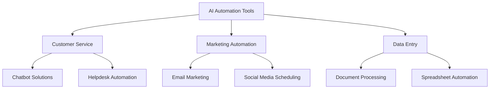

---

## Choosing the Right AI Automation Tools for Your Business

In today's fast-paced business environment, automating repetitive tasks is no longer just a luxury; it's a necessity. AI automation tools have emerged as game-changers for companies looking to streamline operations, optimize workflows, and enhance productivity. But with so many options available, how do you choose the right ones for your specific needs? In this comprehensive guide, we’ll explore the essential factors to consider when selecting AI automation tools and highlight some top options on the market.

### Understanding AI Automation Tools

AI automation tools leverage artificial intelligence to perform tasks that typically require human intervention. These tools can handle everything from customer service inquiries to data analysis, freeing up valuable time for your team to focus on strategic initiatives. 

#### Key Benefits of AI Automation Tools

- **Increased Efficiency**: Automate repetitive tasks to save time and reduce human error.
- **Cost Savings**: Reduce labor costs by minimizing the need for manual task completion.
- **Enhanced Accuracy**: AI tools can analyze data and execute tasks with precision, improving overall quality.
- **Scalability**: Easily adjust operations based on demand without needing to hire additional staff.

### Factors to Consider When Choosing AI Automation Tools

When selecting the right AI automation tools for your business, consider the following factors:

#### 1. Define Your Needs

Before diving into the vast options available, take a moment to assess what tasks you need to automate. Are you looking to improve customer support? Streamline marketing processes? Or perhaps automate data entry? Clearly defining your needs will help you narrow down your choices.

#### 2. Integration Capabilities

Your chosen AI automation tools should seamlessly integrate with your existing software ecosystem. Look for tools that offer APIs or plug-ins for popular platforms like CRM systems, email marketing tools, and project management software.

#### 3. User-Friendly Interface

A tool's user interface can significantly impact adoption rates within your team. Choose tools that are intuitive and easy to navigate, reducing the learning curve and encouraging usage.

#### 4. Scalability

As your business grows, your automation needs will likely evolve. Select tools that can scale with your operations, accommodating increased workload without compromising performance.

### Top AI Automation Tools to Consider

To help you in your decision-making process, let's compare some of the most popular AI automation tools available today.

#### Comparison Table of Top AI Automation Tools

<table>
  <tr>
    <th>Tool</th>
    <th>Primary Use</th>
    <th>Key Features</th>
    <th>Pros</th>
    <th>Cons</th>
  </tr>
  <tr>
    <td>Zapier</td>
    <td>Workflow Automation</td>
    <td>Integrates with 2,000+ apps</td>
    <td>Easy to use, vast integration options</td>
    <td>Can become expensive with multiple tasks</td>
  </tr>
  <tr>
    <td>UiPath</td>
    <td>Robotic Process Automation</td>
    <td>Advanced automation capabilities</td>
    <td>Highly scalable, powerful analytics</td>
    <td>Steep learning curve for new users</td>
  </tr>
  <tr>
    <td>Chatbot.com</td>
    <td>Customer Service</td>
    <td>AI-driven chatbots, analytics</td>
    <td>24/7 customer support, customizable</td>
    <td>Limited support for complex queries</td>
  </tr>
  <tr>
    <td>HubSpot</td>
    <td>Marketing Automation</td>
    <td>Email campaigns, social media tools</td>
    <td>All-in-one platform, easy to use</td>
    <td>Can be costly for advanced features</td>
  </tr>
</table>

### Exploring Use Cases of AI Automation Tools

Understanding how businesses utilize AI automation tools can help you visualize their potential impact.

#### Case Study 1: Streamlining Customer Support

A mid-sized e-commerce company implemented a chatbot solution to handle common customer inquiries. By doing so, they reduced response times by 60% and improved customer satisfaction ratings significantly. The chatbot handled routine questions, allowing human agents to focus on complex issues, ultimately increasing productivity.

#### Case Study 2: Automating Marketing Campaigns

A digital marketing agency adopted HubSpot for its marketing automation capabilities. They automated email campaigns and social media scheduling, resulting in a 40% increase in leads generated. The time saved allowed the team to strategize and create higher-quality content.

### Pros and Cons of AI Automation Tools

#### Pros
- **Time-Saving**: Automating tasks means employees can focus on strategic activities.
- **Cost-Effective**: Reduces the need for additional personnel.
- **Data-Driven Insights**: Many tools provide analytics to guide decision-making.

#### Cons
- **Initial Setup Costs**: Some tools may require a significant investment upfront.
- **Dependence on Technology**: Over-reliance on automation can lead to vulnerabilities if systems fail.
- **Learning Curve**: Some tools may require training to use effectively, which can slow down initial implementation.

### Conclusion: Making the Right Choice

Choosing the right AI automation tools for your business can transform your operations. By understanding your specific needs, evaluating integration capabilities, and considering user experience, you can make an informed decision that will yield significant benefits.

To kickstart your journey towards automation, start by assessing your current processes and identifying areas ripe for improvement. Test out a few tools through free trials to see which one fits best with your workflow.

### Call to Action

Ready to revolutionize your business with AI automation tools? Don’t wait any longer! Explore our top picks, and take the first step towards enhanced productivity and efficiency. Visit our website for more insights and tools to help you succeed in the ever-evolving digital landscape!

## 関連記事

- [AI Agents: The Future of Personal Assistants in 2026](/posts/ai-agents-the-future-of-personal-assistants-in-2026/)
- [AI Tools for Small Businesses: Increase Your ROI](/posts/ai-tools-for-small-businesses-increase-your-roi/)
- [Automating Business Processes with AI in 2026](/posts/automating-business-processes-with-ai-in-2026/)
