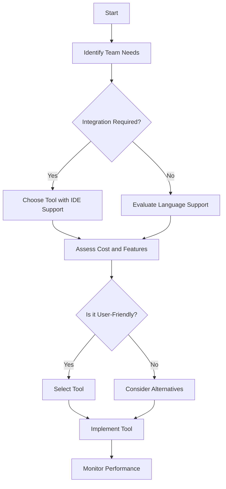

---

# Choosing the Right AI Coding Tool for Your Team

In the digital age, coding has become an integral part of various industries, from tech startups to established corporations. As development teams strive for greater efficiency and innovation, many are turning to AI coding tools to enhance their workflow. But with a multitude of options available, how do you choose the right AI coding tool for your team? In this guide, we'll explore key factors to consider, review popular tools, and provide practical examples to help streamline your decision-making process.

## Why AI Coding Tools Matter

AI coding tools can significantly boost productivity and reduce errors in coding. They assist developers by automating repetitive tasks, providing code suggestions, and even debugging. By leveraging these tools, teams can focus on more complex and creative aspects of their projects. 

### Benefits of AI Coding Tools

1. **Increased Efficiency**: Automate mundane tasks like code formatting and syntax checks.
2. **Enhanced Collaboration**: Facilitate teamwork with shared coding environments and version control.
3. **Reduced Errors**: AI tools can catch bugs before they become costly problems.
4. **Learning Opportunities**: New developers can learn coding best practices through suggestions made by AI tools.

## Factors to Consider When Choosing AI Coding Tools

When selecting an AI coding tool for your team, consider the following factors:

### 1. **Integration with Existing Tools**

Ensure that the AI coding tool integrates seamlessly with your current development environment. Tools that work well with popular IDEs (Integrated Development Environments) like Visual Studio Code or IntelliJ IDEA can save time and streamline processes.

### 2. **Ease of Use**

Consider the learning curve associated with the tool. An intuitive interface can help your team get up and running quickly.

### 3. **Language Support**

Different AI coding tools support different programming languages. Make sure the tool you choose supports the languages your team works with most frequently.

### 4. **Cost and Licensing**

Evaluate the pricing structure of each tool. Some tools offer free versions with limited features, while others may require a subscription for full functionality.

### 5. **Community and Support**

A strong developer community can be invaluable. Look for tools that offer good documentation, tutorials, and forums for troubleshooting.

## Popular AI Coding Tools: A Comparison

To help you make an informed choice, let's take a look at some popular AI coding tools available today:

<table>
  <tr>
    <th>Tool</th>
    <th>Language Support</th>
    <th>Integration</th>
    <th>Pricing</th>
    <th>Pros</th>
    <th>Cons</th>
  </tr>
  <tr>
    <td>[GitHub Copilot](https://github.com/features/copilot?ref=AFFILIATE_ID)</td>
    <td>Python, JavaScript, TypeScript, Ruby, Go</td>
    <td>Visual Studio Code, JetBrains IDEs</td>
    <td>$10/month</td>
    <td>Context-aware code suggestions</td>
    <td>Requires internet connection</td>
  </tr>
  <tr>
    <td>[Tabnine](https://www.tabnine.com/?ref=AFFILIATE_ID)</td>
    <td>Multiple languages</td>
    <td>VS Code, IntelliJ, Sublime Text</td>
    <td>$12/month</td>
    <td>Customizable AI models</td>
    <td>Can be overzealous with suggestions</td>
  </tr>
  <tr>
    <td>DeepCode</td>
    <td>Java, JavaScript, TypeScript, Python</td>
    <td>GitHub, Bitbucket, GitLab</td>
    <td>$19/month</td>
    <td>Advanced error detection</td>
    <td>Limited language support</td>
  </tr>
  <tr>
    <td>[Codeium](https://codeium.com/?ref=AFFILIATE_ID)</td>
    <td>Python, Java, JavaScript, C++</td>
    <td>Multiple IDEs</td>
    <td>Free</td>
    <td>Free to use</td>
    <td>Less robust than paid options</td>
  </tr>
</table>

### Visual Workflow for Choosing AI Coding Tools

To simplify the process of choosing the right AI coding tool, consider the following decision tree:

### Example Use Case: GitHub Copilot

Imagine a startup developing a web application using JavaScript. The team decides to implement GitHub [Copilot](https://github.com/features/copilot?ref=AFFILIATE_ID), which provides context-aware suggestions as they write code. This not only speeds up the development process but also helps junior developers learn best practices. Additionally, the integration with Visual Studio Code makes it a breeze to set up and start using.

### Pros and Cons of Popular AI Coding Tools

#### GitHub Copilot

- **Pros**:
  - Context-aware suggestions enhance productivity.
  - Works well with popular IDEs.
  
- **Cons**:
  - Requires a constant internet connection.
  - Can occasionally suggest outdated practices.

#### Tabnine

- **Pros**:
  - Supports multiple languages and IDEs.
  - Customizable AI models for tailored suggestions.
  
- **Cons**:
  - May overwhelm users with too many suggestions.
  - Some features locked behind a paywall.

#### DeepCode

- **Pros**:
  - Excellent at identifying potential bugs.
  - Integrates with major version control systems.
  
- **Cons**:
  - Limited language support compared to others.
  - May produce false positives.

#### Codeium

- **Pros**:
  - Completely free to use.
  - Supports several popular languages.
  
- **Cons**:
  - Lacks some advanced features of paid tools.
  - Less community support compared to established tools.

## Making the Right Choice

Choosing the right AI coding tool is essential for enhancing productivity in your development team. By considering integration, ease of use, language support, cost, and community support, you can make an informed decision that best suits your team's needs.

### Conclusion

With the right AI coding tool, your team can streamline workflows, reduce errors, and enhance collaboration. Whether you opt for [GitHub Copilot](https://github.com/features/copilot?ref=AFFILIATE_ID), [Tabnine](https://www.tabnine.com/?ref=AFFILIATE_ID), DeepCode, or [Codeium](https://codeium.com/?ref=AFFILIATE_ID), make sure it aligns with your team's coding practices and enhances your overall productivity.

Ready to boost your team's coding efficiency? Explore the options we discussed and take the first step towards implementing an AI coding tool today! Don't hesitate to share your experiences and questions in the comments below. Your feedback could help fellow developers make their choice!

---

By following this guide, you’ll be well on your way to selecting the best AI coding tool for your team, ensuring that you stay at the forefront of productivity and innovation in software development.

## 関連記事

- [AI Agents: The Future of Personal Assistants in 2026](/posts/ai-agents-the-future-of-personal-assistants-in-2026/)
- [AI Automation: A Game Changer for Small Businesses](/posts/ai-automation-a-game-changer-for-small-businesses/)
- [AI Automation: The Key to Enhanced Business Efficiency](/posts/ai-automation-the-key-to-enhanced-business-efficiency/)
