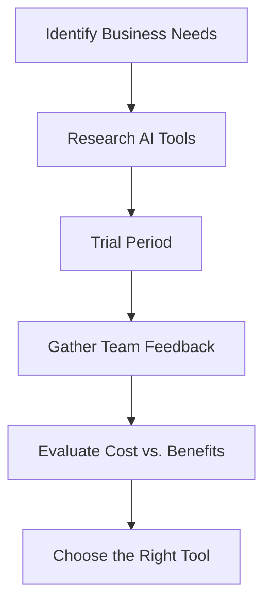

---

### Choosing the Right AI Tool for Your Business Needs

In today’s fast-paced digital landscape, businesses are increasingly turning to AI tools to enhance productivity, streamline operations, and gain a competitive edge. But with a plethora of options available, how do you choose the right AI tools for your business? In this guide, we’ll break down the key factors to consider when selecting AI tools, highlight some popular choices, and provide practical examples and use cases.

### Understanding Your Business Needs

Before diving into the world of AI tools, it’s crucial to identify your specific business needs. Are you looking to automate repetitive tasks, enhance customer service, or analyze data for better decision-making? By understanding your objectives, you can narrow down the vast array of options available.

#### Key Considerations

1. **Functionality**: What specific functions do you need the AI tool to perform?
2. **Integration**: How well does the tool integrate with your existing systems?
3. **Scalability**: Can the tool grow with your business?
4. **User-Friendliness**: Is the tool easy to use for your team?
5. **Cost**: What’s your budget for AI tools?

### Popular AI Tools for Business

Here, we’ll compare some of the leading AI tools that cater to various business needs. 

#### 1. Chatbots for Customer Service

*Examples: Intercom, Drift*

Chatbots have revolutionized customer service by providing instant responses to customer inquiries. For example, a retail business may implement a chatbot on their website to assist customers 24/7. This can significantly reduce response times and improve customer satisfaction.

**Pros:**
- 24/7 availability
- Reduces workload on human agents
- Improves customer engagement

**Cons:**
- May lack the ability to handle complex queries
- Can sometimes frustrate users if not properly programmed

#### 2. AI-Powered Analytics Tools

*Examples: Google Analytics, Tableau*

Data analytics tools utilize AI algorithms to provide insights and predictive analytics. A marketing team, for instance, can use these tools to analyze customer behavior and optimize campaigns. 

**Pros:**
- Provides actionable insights
- Helps in data-driven decision-making
- Predictive capabilities improve future strategies

**Cons:**
- Requires a learning curve
- Potentially high costs for advanced features

#### 3. Project Management Tools

*Examples: Trello, Asana with AI integrations*

Project management tools enhanced with AI capabilities can help teams prioritize tasks and allocate resources efficiently. Imagine a software development team using an AI tool to predict project timelines based on historical data.

**Pros:**
- Improves task management
- Facilitates collaboration
- AI predictions can enhance project planning

**Cons:**
- Over-reliance on AI predictions can lead to issues
- May require regular updates and training

### Comparison of AI Tools for Business

Here’s a quick comparison table to help you visualize the pros and cons of various AI tools:

<table>
    <tr>
        <th>Tool Type</th>
        <th>Examples</th>
        <th>Pros</th>
        <th>Cons</th>
    </tr>
    <tr>
        <td>Chatbots</td>
        <td>Intercom, Drift</td>
        <td>24/7 availability, reduces workload, enhances engagement</td>
        <td>Lack of complexity handling, potential user frustration</td>
    </tr>
    <tr>
        <td>Analytics Tools</td>
        <td>Google Analytics, Tableau</td>
        <td>Actionable insights, data-driven decisions, predictive analytics</td>
        <td>Learning curve, high costs for advanced features</td>
    </tr>
    <tr>
        <td>Project Management</td>
        <td>Trello, Asana</td>
        <td>Improves task management, facilitates collaboration, predictive planning</td>
        <td>Over-reliance on predictions, need for updates</td>
    </tr>
</table>

### How to Select the Right Tool

To effectively choose an AI tool, follow these steps:

1. **Identify Your Goals**: Write down what you need from an AI tool.
2. **Research Options**: Look for tools that align with your goals.
3. **Trial Period**: Utilize free trials to understand the tool’s functionality.
4. **Gather Feedback**: Involve your team in the testing process to gather insights.
5. **Evaluate Cost vs. Benefits**: Compare the potential ROI with the tool’s costs.

### The Future of AI in Business

As AI continues to evolve, businesses that leverage these tools effectively will likely see enhanced productivity and growth. From automating tasks to predictive analytics, the potential applications of AI tools are virtually limitless. 

### Conclusion

Choosing the right AI tools for business is not just about picking the latest technology; it's about aligning tools with your specific business needs and objectives. By following the steps outlined above and considering the pros and cons of each tool, you can make an informed decision that will enhance your operations and lead to greater success.

Are you ready to transform your business with AI tools? Start by identifying your needs today and explore the options that can revolutionize the way you operate. Don’t hesitate—take the first step towards a more efficient, AI-driven future!

--- 

Your business deserves the best tools available. If you found this guide helpful, share it with others who might be considering AI tools for their business needs, and let’s embrace the future together!

## 関連記事

- [AI for Business: Essential Tools Every Company Needs in 2026](/posts/ai-for-business-essential-tools-every-company-needs-in-2026/)
- [Choosing the Right AI Tools for Your Business Growth](/posts/choosing-the-right-ai-tools-for-your-business-growth/)
- [Choosing the Right AI Tools for Your Business Needs](/posts/choosing-the-right-ai-tools-for-your-business-needs/)
