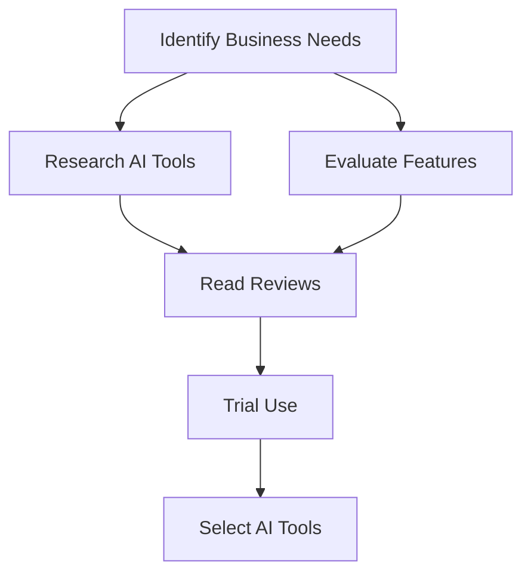

---

# Choosing the Right AI Tools for Small Business Growth

In today's fast-paced digital landscape, small businesses are increasingly turning to AI tools to enhance their operations, improve customer experience, and drive growth. With a plethora of options available, it can be overwhelming to choose the right AI tools that align with your specific business needs. In this comprehensive guide, we’ll explore some of the best AI tools for small businesses, their benefits, and how to effectively incorporate them into your business strategy.

## The Importance of AI Tools for Small Businesses

AI tools can automate mundane tasks, analyze vast amounts of data, and provide valuable insights that help small businesses make informed decisions. These tools can lead to increased efficiency, cost savings, and better customer engagement. Here are a few key benefits of leveraging AI tools:

### 1. Enhanced Productivity
AI tools can automate repetitive tasks such as data entry, scheduling, and email management, freeing up time for employees to focus on strategic initiatives.

### 2. Improved Customer Insights
With AI-driven analytics, small businesses can gain insights into customer behavior, preferences, and purchasing patterns, allowing for personalized marketing strategies.

### 3. Cost Efficiency
By automating tasks that would typically require manual labor, AI tools can significantly reduce operational costs.

### 4. Scalability
As your business grows, AI tools can easily scale to accommodate increased demand, making them a long-term solution for growth.

## Popular AI Tools for Small Business

Let’s take a closer look at some of the most popular AI tools that can help small businesses thrive. We’ll compare their features, pros, and cons to help you make an informed decision.

### 1. Chatbots for Customer Service

**Use Case**: Implementing AI chatbots on your website can provide 24/7 customer support.

**Example Tools**: 
- **Intercom**: A popular platform for chatbots that provides real-time assistance to customers.
- **Drift**: Focuses specifically on sales conversations, qualifying leads, and scheduling meetings.

**Pros**:
- Instant responses to customer inquiries.
- Reduction in customer service workload.
- Increased customer satisfaction.

**Cons**:
- May not handle complex queries effectively.
- Initial setup costs can be high.

### 2. AI-Powered Marketing Tools

**Use Case**: Automating marketing campaigns based on customer behavior.

**Example Tools**:
- **HubSpot**: An all-in-one marketing platform that leverages AI for personalized content delivery.
- **Mailchimp**: Offers AI-driven email marketing solutions that optimize send times and content.

**Pros**:
- Targeted marketing increases conversion rates.
- Saves time on campaign management.

**Cons**:
- Requires a learning curve to fully utilize features.
- Subscription costs can add up for small businesses.

### 3. AI Analytics Tools

**Use Case**: Analyzing business data for better decision-making.

**Example Tools**:
- **Google Analytics**: Provides insights into website traffic and user behavior.
- **Tableau**: Offers advanced data visualization and business intelligence capabilities.

**Pros**:
- Offers in-depth analysis of business performance.
- Helps identify trends and opportunities.

**Cons**:
- Can be overwhelming for beginners.
- Requires data management skills.

### 4. AI for Workflow Automation

**Use Case**: Streamlining internal processes to improve efficiency.

**Example Tools**:
- **Zapier**: Connects various apps to automate workflows.
- **Integromat**: Offers advanced automation features with a visual interface.

**Pros**:
- Saves time on manual tasks.
- Integrates with numerous applications.

**Cons**:
- Can become complex with multiple integrations.
- Potential for errors if not properly configured.

### Comparison Table of Top AI Tools for Small Businesses

<table>
  <tr>
    <th>Tool</th>
    <th>Type</th>
    <th>Key Features</th>
    <th>Pricing</th>
  </tr>
  <tr>
    <td>Intercom</td>
    <td>Chatbot</td>
    <td>Real-time support, lead qualification</td>
    <td>Starting at $39/month</td>
  </tr>
  <tr>
    <td>HubSpot</td>
    <td>Marketing</td>
    <td>Content delivery, analytics</td>
    <td>Free tier available, paid plans start at $50/month</td>
  </tr>
  <tr>
    <td>Google Analytics</td>
    <td>Analytics</td>
    <td>Website traffic analysis, user behavior</td>
    <td>Free</td>
  </tr>
  <tr>
    <td>Zapier</td>
    <td>Automation</td>
    <td>App integrations, workflow automation</td>
    <td>Free tier available, paid plans start at $19.99/month</td>
  </tr>
</table>

## How to Choose the Right AI Tools for Your Small Business

When selecting AI tools for your small business, consider the following factors:

### 1. Identify Your Needs
Start by assessing the specific areas of your business that need improvement. Are you looking for better customer service, data analysis, or workflow automation? Understanding your needs will help narrow down your options.

### 2. Evaluate Features and Integration
Look for tools that offer features tailored to your business model. Additionally, ensure that the tools can integrate with your existing systems for a seamless experience.

### 3. Consider Budget and ROI
While many AI tools offer free trials or basic versions, it’s essential to evaluate the cost versus the potential return on investment. Choose tools that fit within your budget but also offer significant value.

### 4. Read Reviews and Case Studies
Don’t just rely on marketing claims. Research user reviews and case studies to understand how other small businesses have benefited from the tools you’re considering.

### 5. Test Before Committing
Many AI tools offer free trials. Take advantage of these trials to test out the features and see how they fit into your workflow before making a long-term commitment.

## Conclusion: Embrace AI for Small Business Growth

Incorporating AI tools into your small business strategy can be a game-changer. By enhancing productivity, improving customer insights, and automating processes, you can position your business for sustained growth. 

Ready to take the next step? Start exploring the AI tools mentioned in this guide and see how they can transform your business operations. Don’t wait—embrace the future of technology today and watch your small business thrive!

### Call to Action

If you found this guide helpful, share it with fellow entrepreneurs and subscribe to our newsletter for more insights on AI tools and productivity tips for small businesses!

## 関連記事

- [AI Tools for Small Businesses: Increase Your ROI](/posts/ai-tools-for-small-businesses-increase-your-roi/)
- [AI Agents: The Future of Personal Assistants in 2026](/posts/ai-agents-the-future-of-personal-assistants-in-2026/)
- [AI Automation: A Game Changer for Small Businesses](/posts/ai-automation-a-game-changer-for-small-businesses/)
