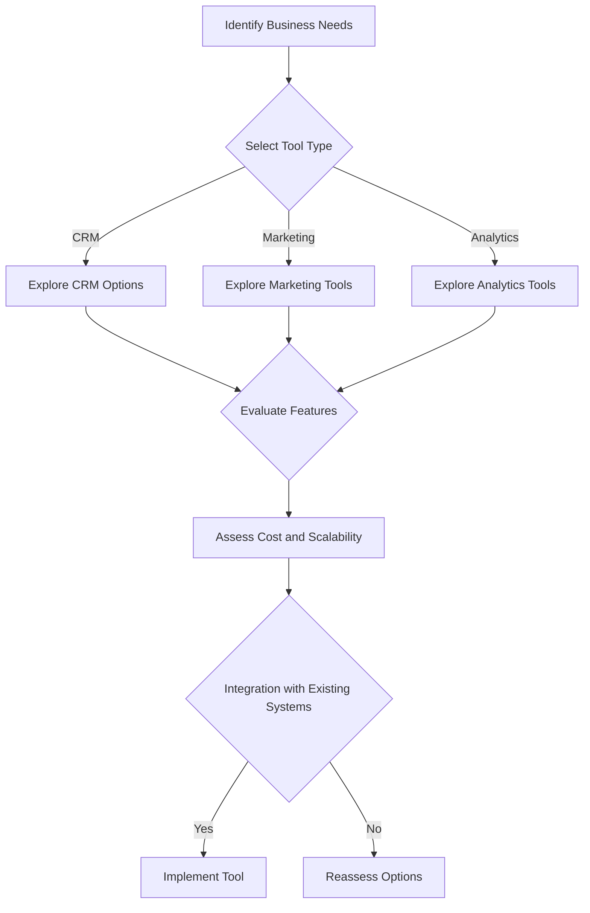

---

# Choosing the Right AI Tools for Your Business Growth

In today’s fast-paced digital landscape, businesses are continually seeking ways to enhance productivity and streamline operations. One of the most powerful ways to achieve this is by leveraging AI tools for business. These innovative solutions can help organizations automate processes, gain insights from data, improve customer experiences, and ultimately drive growth.

But how do you choose the right AI tools for your business needs? In this article, we’ll explore the various types of AI tools available, their benefits, and practical use cases. We will also provide a comparison of some popular tools to help you make an informed decision. Let’s get started!

## Understanding the Types of AI Tools for Business

Before diving into the selection process, it’s essential to understand the different categories of AI tools available. Here are a few common types:

### 1. **Customer Relationship Management (CRM) Tools**
These tools help manage interactions with customers, streamline processes, and improve profitability. AI-powered CRMs can analyze customer data to predict future behavior.

### 2. **Marketing Automation Tools**
These tools enable businesses to automate marketing tasks such as email campaigns, social media posting, and lead generation, allowing for more personalized marketing efforts.

### 3. **Data Analytics Tools**
AI-driven analytics tools help businesses make sense of vast amounts of data, providing insights that can inform strategic decisions.

### 4. **Chatbots and Virtual Assistants**
These AI tools offer automated customer support, answering frequently asked questions and guiding users through processes, which enhances customer satisfaction.

### 5. **Project Management Tools**
AI-enhanced project management tools can optimize task assignments, predict project timelines, and analyze team productivity.

Now that you have a clearer understanding of the types of AI tools available, let's examine how to choose the right ones for your business.

## Criteria for Selecting AI Tools for Business

When selecting AI tools for your business, consider the following criteria:

### 1. **Identify Your Needs**
Start by assessing your business needs. Are you looking to improve customer service, enhance marketing efforts, or analyze data? Knowing your primary objectives will guide your selection.

### 2. **Scalability**
Choose tools that can grow with your business. As your company expands, your AI tools should be able to handle increased workloads and additional features.

### 3. **Integration Capabilities**
Ensure that the AI tools you consider can easily integrate with your existing systems. This will save time and resources during implementation.

### 4. **User-Friendliness**
Select tools that are easy to use. A steep learning curve can hinder adoption among your team, impacting productivity.

### 5. **Cost-effectiveness**
Evaluate the pricing structure of the tools. Consider not just the initial costs but also any ongoing expenses and whether the tool provides good ROI.

### 6. **Vendor Support**
Strong customer support from the vendor can be invaluable, especially when implementing new tools. Look for companies with a reputation for excellent service.

## Popular AI Tools for Business: A Comparison

Here’s a comparison of some popular AI tools that can help drive business growth:

<table>
  <tr>
    <th>Tool</th>
    <th>Type</th>
    <th>Key Features</th>
    <th>Pros</th>
    <th>Cons</th>
  </tr>
  <tr>
    <td>Salesforce Einstein</td>
    <td>CRM</td>
    <td>Predictive analytics, lead scoring, personalized recommendations</td>
    <td>Highly customizable, robust analytics</td>
    <td>Can be expensive for small businesses</td>
  </tr>
  <tr>
    <td>HubSpot</td>
    <td>Marketing Automation</td>
    <td>Email automation, social media management, analytics</td>
    <td>User-friendly interface, free tier available</td>
    <td>Limited features in free version</td>
  </tr>
  <tr>
    <td>Tableau</td>
    <td>Data Analytics</td>
    <td>Data visualization, real-time analytics, integration with various data sources</td>
    <td>Powerful visualization features, great for large datasets</td>
    <td>Steep learning curve for beginners</td>
  </tr>
  <tr>
    <td>Drift</td>
    <td>Chatbot</td>
    <td>Live chat, automated responses, meeting scheduling</td>
    <td>Improves customer engagement, easy to set up</td>
    <td>Limited customization options</td>
  </tr>
  <tr>
    <td>Trello with Butler</td>
    <td>Project Management</td>
    <td>Task automation, deadline reminders, team collaboration</td>
    <td>Intuitive design, integrates well with other tools</td>
    <td>Basic features may not meet complex needs</td>
  </tr>
</table>

## Practical Use Cases of AI Tools in Business

Now, let’s explore some practical examples of how businesses have successfully utilized AI tools to boost productivity and growth.

### 1. **Enhancing Customer Support with Chatbots**
A retail company implemented a chatbot on its website to handle common customer inquiries. The chatbot reduced the workload for human agents by 30%, allowing them to focus on more complex issues. This led to faster response times and improved customer satisfaction.

### 2. **Optimizing Marketing Campaigns with AI**
A digital marketing agency used AI tools to analyze data from previous campaigns. The insights gained helped them create targeted ads, increasing their conversion rates by 25% within a month.

### 3. **Streamlining Workflow with Project Management Tools**
A software development company adopted a project management tool with AI features to optimize task assignments based on team members’ strengths and workloads. This not only improved efficiency but also enhanced team morale as employees felt more aligned with their tasks.

### 4. **Data-Driven Decision Making**
A financial services firm utilized AI analytics tools to sift through data and identify market trends. This enabled them to make informed decisions about investment strategies, increasing their portfolio performance by 15%.

## The Future of AI Tools for Business

As technology continues to evolve, the capabilities of AI tools will only expand. Businesses that embrace these tools will be better positioned to adapt to market changes, improve operational efficiencies, and offer enhanced customer experiences.

### Conclusion

Choosing the right AI tools for business is a critical decision that can significantly impact your growth trajectory. By understanding your needs, evaluating various options, and considering the practical applications of these tools, you can make an informed choice that aligns with your business objectives.

To visualize the decision-making process when selecting AI tools, consider the following flowchart:

### Call to Action

Ready to take your business to the next level with AI tools? Start by defining your business needs and exploring the options mentioned in this article. Whether it’s enhancing customer service or optimizing marketing efforts, the right AI tools can propel your business growth. Don’t wait—get started today and unlock the potential of AI for your business!

## 関連記事

- [AI Agents: The Future of Personal Assistants in 2026](/posts/ai-agents-the-future-of-personal-assistants-in-2026/)
- [AI Tools for Small Businesses: Increase Your ROI](/posts/ai-tools-for-small-businesses-increase-your-roi/)
- [Automating Business Processes with AI in 2026](/posts/automating-business-processes-with-ai-in-2026/)
