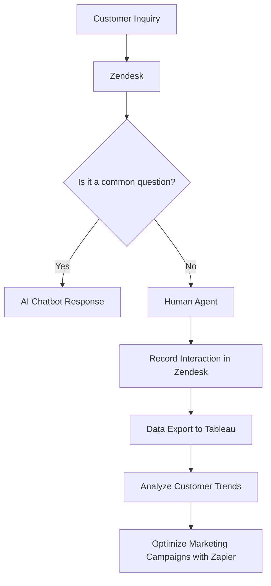

---

# Choosing the Right AI Tools for Your Business Needs

In today's fast-paced digital landscape, integrating the right AI tools for business is no longer a luxury but a necessity. From automating mundane tasks to providing in-depth analytics, AI tools can significantly enhance productivity, streamline operations, and even foster innovation. With so many options available, selecting the appropriate tools for your unique business needs can be overwhelming. In this blog post, we will explore key considerations, practical examples, and some of the top AI tools to help you make informed decisions.

## Understanding Your Business Needs

Before diving headfirst into the world of AI tools, it’s essential to evaluate what your business truly needs. Are you looking to automate repetitive tasks? Do you need enhanced customer insights? Or perhaps you want to optimize your marketing strategies? Here are a few questions to consider:

1. What are the main pain points in your current processes?
2. How much are you willing to invest in AI technologies?
3. What specific outcomes do you want from the implementation of AI tools?

By answering these questions, you'll have a clearer view of which AI tools can best support your objectives.

## Popular Categories of AI Tools for Business

Once you have a grasp on your needs, it’s time to explore the different categories of AI tools available. Here are some popular categories:

### 1. Automation Tools

Automation tools can handle repetitive tasks, freeing up your team to focus on more strategic initiatives. For instance, tools like **Zapier** allow you to connect different software applications and automate workflows. 

### 2. Customer Service Tools

AI-powered customer service tools like **Zendesk** and **Intercom** can enhance customer experience through chatbots and automated responses, which provide 24/7 support and reduce wait times.

### 3. Data Analysis Tools

For businesses looking to make data-driven decisions, tools like **Tableau** and **Google Analytics** leverage AI to analyze vast amounts of data and provide actionable insights.

### 4. Marketing Tools

AI marketing tools, such as **HubSpot** and **Marketo**, help businesses optimize their marketing campaigns through predictive analytics and customer segmentation.

## Key Features to Look for in AI Tools

When evaluating AI tools for your business, consider the following features:

- **User-Friendly Interface**: A tool should be easy to use, minimizing the learning curve for your team.
- **Integration Capabilities**: Ensure the AI tool can seamlessly integrate with your existing software and systems.
- **Scalability**: Choose tools that can grow with your business needs without requiring a complete overhaul.
- **Customer Support**: Reliable customer support is essential for troubleshooting and maximizing the tool's potential.

## Comparing Top AI Tools for Business

To help you make a more informed decision, let’s take a closer look at a few popular AI tools across different categories. Below is a comparison of three leading AI tools: **Zapier**, **Zendesk**, and **Tableau**.

<table>
  <tr>
    <th>Feature</th>
    <th>Zapier</th>
    <th>Zendesk</th>
    <th>Tableau</th>
  </tr>
  <tr>
    <td>Type</td>
    <td>Automation</td>
    <td>Customer Service</td>
    <td>Data Analysis</td>
  </tr>
  <tr>
    <td>Ease of Use</td>
    <td>Very Easy</td>
    <td>Easy</td>
    <td>Moderate</td>
  </tr>
  <tr>
    <td>Integration Capabilities</td>
    <td>Over 3,000 apps</td>
    <td>Multiple CRMs and customer tools</td>
    <td>Excel, SQL, and more</td>
  </tr>
  <tr>
    <td>Scalability</td>
    <td>High</td>
    <td>High</td>
    <td>High</td>
  </tr>
  <tr>
    <td>Price</td>
    <td>Starts at $19/month</td>
    <td>Starts at $5/month per agent</td>
    <td>Starts at $70/month</td>
  </tr>
</table>

### Pros and Cons of Each Tool

#### Zapier
**Pros**:
- Extensive app integration
- User-friendly interface
- Increased productivity through automation

**Cons**:
- Limited functionality in the free version
- May require some initial setup time

#### Zendesk
**Pros**:
- Excellent customer support features
- High customization for ticketing systems
- Useful analytics for customer interactions

**Cons**:
- Can become expensive as teams grow
- Some users find the interface overwhelming

#### Tableau
**Pros**:
- Powerful data visualization
- Integration with various data sources
- Robust analytical capabilities

**Cons**:
- Steeper learning curve
- Higher cost compared to other analytics tools

## Case Studies: Real-World Applications

### Case Study 1: Automating Marketing Campaigns with Zapier

A small e-commerce business leveraged Zapier to automate their email marketing campaigns. By connecting their CRM with an email marketing tool, they were able to send personalized emails based on customer behavior without any manual effort, leading to a 30% increase in open rates.

### Case Study 2: Enhancing Customer Support with Zendesk

A tech startup adopted Zendesk to manage their customer inquiries. Using AI-driven chatbots for initial interactions, they reduced response times significantly and improved customer satisfaction scores by 40% within three months.

### Case Study 3: Data-Driven Decisions with Tableau

A retail chain implemented Tableau to analyze sales data across multiple locations. The insights gained allowed them to optimize inventory management, resulting in a 15% increase in sales over the next quarter.

## Creating an AI Integration Workflow

To visualize how these tools can work in conjunction with one another, here’s a simple workflow that illustrates the integration of Zapier, Zendesk, and Tableau for a streamlined business process:

## Making Your Decision

Choosing the right AI tools for business can be a daunting task, but by clearly understanding your needs, evaluating features, and considering real-world applications, you can make a more informed decision. Remember, the right tools will not only enhance efficiency but also empower your team to focus on high-impact tasks.

### Final Thoughts

As you embark on this journey to integrate AI tools into your business, keep in mind that technology is only as effective as the people who use it. Ensure your team is trained and comfortable with the new tools to maximize their potential.

If you’re ready to take your business to the next level with AI tools, start exploring today! Consider signing up for free trials or demos to see which solutions resonate best with your goals. 

**Call to Action**: Don't wait! Explore our comprehensive reviews of AI tools for business and find the perfect solutions to elevate your productivity. Visit AI Tools Lab and start transforming your business today!

## 関連記事

- [AI for Business: Essential Tools Every Company Needs in 2026](/posts/ai-for-business-essential-tools-every-company-needs-in-2026/)
- [Choosing the Right AI Tools for Your Business Growth](/posts/choosing-the-right-ai-tools-for-your-business-growth/)
- [Enhancing Business Efficiency with AI Tools](/posts/enhancing-business-efficiency-with-ai-tools/)
