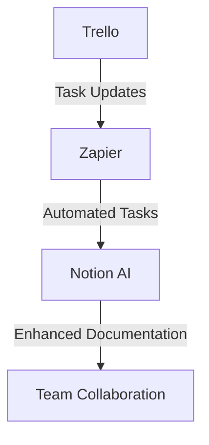

---

# Comparing the Best AI Tools for Enhanced Productivity

In today's fast-paced digital world, productivity is more crucial than ever. Companies and individuals alike are increasingly turning to technology to help streamline their processes and enhance their efficiency. Among these technologies, artificial intelligence (AI) tools have emerged as game-changers, offering innovative solutions to common productivity challenges. In this article, we will explore some of the best AI tools available today, compare their features, and help you determine which tool is right for your needs.

## What Makes an AI Tool “The Best”?

Before diving into specific AI tools, let's discuss what characteristics make an AI tool stand out. The best AI tools typically have the following features:

1. **Ease of Use**: An intuitive interface that requires minimal learning time.
2. **Integration Capabilities**: Compatibility with existing software and workflows.
3. **Customization**: Ability to tailor functionalities to meet specific needs.
4. **Scalability**: Suitable for both small teams and larger enterprises.
5. **Cost-Effectiveness**: Provides good value for the features offered.

With these criteria in mind, let's take a closer look at some of the best AI tools designed to boost productivity.

## Top AI Tools for Enhanced Productivity

### 1. Notion AI

Notion AI is a versatile tool that enhances the popular productivity platform Notion. With a suite of AI features, it can help users streamline note-taking, project management, and collaboration.

#### Pros:
- Seamless integration with Notion's interface
- Offers content generation features for faster documentation
- Provides intelligent suggestions for organizing tasks

#### Cons:
- Requires a subscription plan for full access
- Limited to Notion users

### 2. Grammarly

Grammarly is an AI-powered writing assistant that helps users improve their writing by offering real-time grammar, punctuation, and style suggestions. 

#### Pros:
- Works across various platforms (web, desktop, mobile)
- Offers plagiarism detection
- Tailors suggestions based on writing goals

#### Cons:
- Premium features can be costly
- May not always understand context perfectly

### 3. Trello with Butler

Trello is a popular project management tool, and its AI automation feature, Butler, allows users to automate repetitive tasks, making project tracking smoother.

#### Pros:
- User-friendly interface
- Customizable automation rules
- Integrates well with other tools

#### Cons:
- Limited automation options in the free version
- Can become overwhelming with complex workflows

### 4. Otter.ai

Otter.ai is an AI-driven transcription tool that converts speech into written text, making it ideal for meetings, interviews, and lectures.

#### Pros:
- High accuracy in transcriptions
- Real-time collaboration features
- Easy export to various formats

#### Cons:
- Free version has limited transcription hours
- Requires internet connection for optimal performance

### 5. Zapier

Zapier is an automation tool that connects various apps to automate workflows without requiring any coding knowledge. It can integrate with thousands of applications.

#### Pros:
- Extensive app integration options
- User-friendly setup process
- Saves significant time on repetitive tasks

#### Cons:
- Can become expensive with advanced features
- Some integrations might have limitations

## Comparison Table of the Best AI Tools

Here's a quick comparison of the AI tools mentioned above, highlighting their primary features:

<table>
  <tr>
    <th>Tool</th>
    <th>Primary Function</th>
    <th>Key Features</th>
    <th>Pricing</th>
  </tr>
  <tr>
    <td>Notion AI</td>
    <td>Productivity & Note-taking</td>
    <td>Content generation, task suggestions</td>
    <td>Subscription-based</td>
  </tr>
  <tr>
    <td>Grammarly</td>
    <td>Writing Assistance</td>
    <td>Grammar checks, plagiarism detection</td>
    <td>Free & Premium options</td>
  </tr>
  <tr>
    <td>Trello with Butler</td>
    <td>Project Management</td>
    <td>Task automation, customizable workflows</td>
    <td>Free & Paid plans</td>
  </tr>
  <tr>
    <td>Otter.ai</td>
    <td>Transcription</td>
    <td>Real-time collaboration, high accuracy</td>
    <td>Free & Premium options</td>
  </tr>
  <tr>
    <td>Zapier</td>
    <td>Workflow Automation</td>
    <td>App integrations, automation setup</td>
    <td>Free & Paid plans</td>
  </tr>
</table>

## Visualization of AI Tools Workflow

Understanding how these tools can work together to enhance productivity is essential. For example, you can use Zapier to connect Trello and Notion AI, automating task updates based on project changes. Here’s a simple workflow diagram to illustrate this integration:

## Choosing the Right Tool for You

Selecting the best AI tool for your productivity needs depends on various factors including your specific requirements, the size of your team, and your budget. Here are a few tips to help you make the right choice:

1. **Assess Your Needs**: Determine what aspects of your workflow require enhancement. Are you looking for better writing, project management, or automation?
  
2. **Trial Versions**: Take advantage of free trials or versions to test the tools before committing to a subscription.

3. **Gather Feedback**: If you’re part of a team, get input from your colleagues on what tools they find useful.

4. **Consider Future Growth**: Choose a tool that not only meets your current needs but can also scale with your business as it grows.

## Conclusion

The right AI tools can significantly enhance your productivity and streamline your workflow, allowing you to focus on what really matters—growing your business or completing your projects efficiently. Whether you choose Notion AI for organization, Grammarly for writing, or Zapier for automation, each tool has unique features that cater to different needs.

Don't let inefficiencies hold you back any longer. Explore these best AI tools today and experience the transformation in your productivity!

### Call to Action

Ready to enhance your productivity with AI? Try out the tools mentioned in this article and see which one best fits your workflow. Share your experiences in the comments below, and let us know how AI has transformed your productivity!