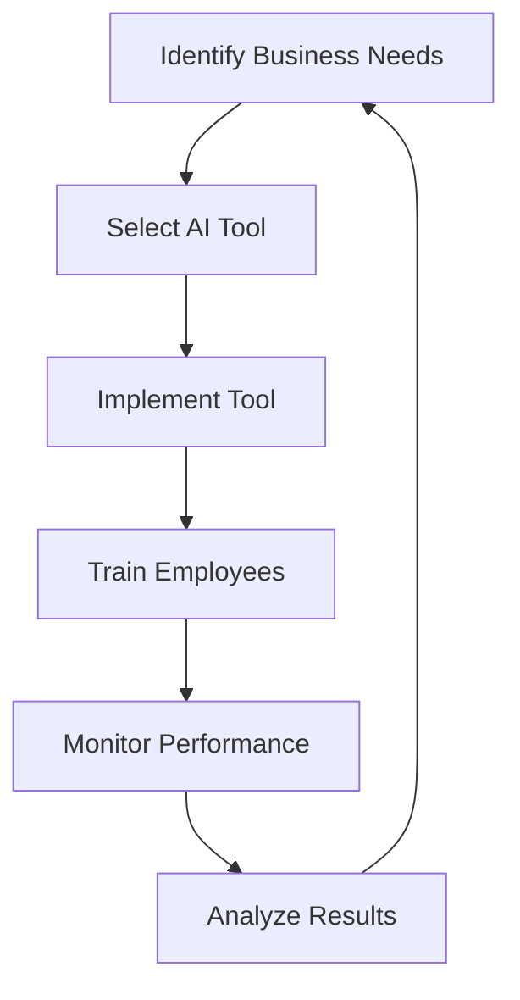

---

# Enhancing Business Efficiency with AI Tools in 2026

In the fast-paced world of business, efficiency is key to staying competitive. As we step into 2026, the integration of AI tools for business has transformed how organizations operate, manage resources, and engage with customers. From automating repetitive tasks to providing data-driven insights, AI tools are not just a trend—they're becoming essential to modern business strategy. In this post, we'll explore how these tools can enhance your business efficiency, including practical examples, pros and cons, and a comparison of notable AI solutions.

## What Are AI Tools for Business?

AI tools for business refer to software and applications that utilize artificial intelligence technologies to automate processes, analyze data, and improve decision-making. These tools can range from chatbots that enhance customer service to advanced analytics platforms that drive strategic planning. 

### Why Use AI Tools?

1. **Increased Productivity**: AI can handle mundane tasks, allowing employees to focus on higher-value activities.
2. **Data-Driven Insights**: AI analyzes vast amounts of data quickly, helping businesses make informed decisions.
3. **Cost Reduction**: Automating tasks can lead to significant cost savings over time.
4. **Enhanced Customer Experience**: AI tools can personalize interactions, improving customer satisfaction and loyalty.

## Key AI Tools Transforming Business Efficiency

### 1. Chatbots for Customer Service

**Example**: Many organizations are deploying chatbots to handle customer inquiries. For instance, a retail company may use a chatbot to answer frequently asked questions, process orders, or provide product recommendations.

**Pros**:
- 24/7 availability for customer support
- Reduced response times
- Cost-effective compared to human agents

**Cons**:
- Limited ability to handle complex inquiries
- Potential frustration if the bot cannot understand user requests

### 2. Project Management Tools with AI

**Example**: Tools like Monday.com and Asana are integrating AI features to help teams manage projects efficiently. For instance, AI can predict project completion times based on historical data, allowing for better resource allocation.

**Pros**:
- Improved team collaboration
- Enhanced transparency and accountability
- Predictive analytics for better planning

**Cons**:
- Learning curve for team members
- Dependence on accurate data for predictions

### 3. AI-Powered Analytics Platforms

**Example**: Platforms like Tableau and Power BI are using AI to transform raw data into actionable insights. For example, a marketing team can analyze customer behavior patterns and adjust campaigns accordingly.

**Pros**:
- Real-time data visualization
- Ability to uncover hidden trends
- Supports strategic decision-making

**Cons**:
- May require training to fully utilize features
- Can be expensive for small businesses

### 4. AI in Human Resources

**Example**: AI recruitment tools like HireVue can streamline the hiring process by analyzing resumes and predicting candidate success. For instance, they can assess video interviews for best-fit candidates.

**Pros**:
- Reduces time-to-hire
- Improves quality of hire
- Minimizes bias in recruitment processes

**Cons**:
- Potential ethical concerns regarding data use
- Risk of overlooking candidates without traditional qualifications

## A Comparative Look at Leading AI Tools for Business

To help you choose the right AI tools for your business, here’s a comparison of some leading options.

<table>
  <tr>
    <th>Tool</th>
    <th>Type</th>
    <th>Key Features</th>
    <th>Pricing</th>
  </tr>
  <tr>
    <td>Zendesk Chatbot</td>
    <td>Customer Service</td>
    <td>24/7 Support, Integration with CRM</td>
    <td>Starting at $19/month</td>
  </tr>
  <tr>
    <td>Monday.com</td>
    <td>Project Management</td>
    <td>AI Predictions, Custom Workflows</td>
    <td>Starting at $8/user/month</td>
  </tr>
  <tr>
    <td>Tableau</td>
    <td>Analytics</td>
    <td>Data Visualization, Predictive Analytics</td>
    <td>Starting at $70/user/month</td>
  </tr>
  <tr>
    <td>HireVue</td>
    <td>HR Recruitment</td>
    <td>Video Interviews, AI Assessment</td>
    <td>Contact for pricing</td>
  </tr>
</table>

## Workflow of AI Tools in Business Operations

Understanding how AI tools fit into your business operations can be visualized as follows:

This cycle illustrates that the implementation of AI tools is not a one-time event but an ongoing process that requires continuous evaluation and adaptation.

## Conclusion: Embrace AI Tools for Future Success

As we navigate through 2026, the importance of AI tools for business cannot be overstated. They not only streamline operations but also empower employees to focus on strategic initiatives that drive growth. By investing in the right AI solutions tailored to your organizational needs, you can significantly enhance efficiency, reduce costs, and improve customer engagement.

Are you ready to take your business to the next level with AI tools? Explore the options that best fit your needs and start leveraging the power of AI today. Don’t wait! Contact us for expert guidance on selecting and implementing AI tools that will transform your business efficiency. 

Let’s embrace the future together!

## 関連記事

- [AI Tools for Team Efficiency: What Actually Works in 2026](/posts/boosting-team-efficiency-ai-tools-for-businesses-in-2026/)
- [Measuring AI Automation ROI: Metrics and Frameworks That Matter](/posts/maximizing-roi-with-ai-automation-solutions-for-businesses/)
- [5 Must-Have AI Tools to Streamline Your Workflow in 2026](/posts/5-must-have-ai-tools-to-streamline-your-workflow-in-2026/)
