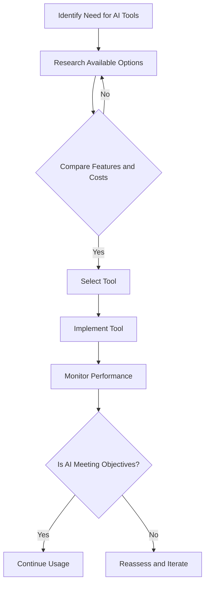

---

# Enhancing Business Efficiency with AI Tools

In today's fast-paced business environment, organizations are constantly seeking ways to improve efficiency and productivity. Enter AI tools for business—technologies that leverage artificial intelligence to automate processes, enhance decision-making, and provide actionable insights. From chatbots to data analytics, these tools are shaping the future of work and enabling companies to thrive in a competitive landscape.

## Understanding AI Tools for Business

AI tools encompass a wide range of applications that can assist businesses in various sectors. These tools utilize machine learning, natural language processing, and data analytics to help organizations automate mundane tasks, analyze large datasets, and improve customer experiences. By integrating AI into their operations, businesses can save time, reduce human error, and make informed decisions faster.

### Why Use AI Tools in Business?

1. **Increased Efficiency**: Automating repetitive tasks frees up valuable time for employees to focus on more strategic activities.
2. **Data-Driven Decision Making**: AI tools can analyze vast amounts of data rapidly, providing insights that empower better business decisions.
3. **Enhanced Customer Experience**: Chatbots and recommendation systems can provide personalized experiences for customers, boosting satisfaction and loyalty.
4. **Cost Savings**: Automating tasks reduces labor costs and minimizes errors, ultimately leading to significant savings.

## Popular AI Tools for Business

With a plethora of AI tools available, it can be challenging to determine which ones are the best fit for your organization. Below are some of the most popular AI tools currently being used in the business landscape, along with their pros and cons.

### 1. ChatGPT by OpenAI

**Overview**: [ChatGPT](https://chat.openai.com/?ref=AFFILIATE_ID) is a conversational AI tool that can assist with customer support, content creation, and more.

**Pros**:
- Natural language understanding allows for human-like interactions.
- Versatile use cases, from chatbots to content generation.
  
**Cons**:
- May generate incorrect or nonsensical answers.
- Requires ongoing training and fine-tuning for specific applications.

### 2. Salesforce Einstein

**Overview**: Salesforce Einstein is an AI feature integrated into the Salesforce platform, providing predictive analytics and automation.

**Pros**:
- Seamlessly integrates with Salesforce CRM.
- Offers personalized customer insights and forecasting.

**Cons**:
- Requires a Salesforce subscription, which can be costly.
- The complexity of setup for new users.

### 3. Tableau

**Overview**: Tableau is a data visualization tool that uses AI to help businesses analyze and visualize their data.

**Pros**:
- Intuitive interface for creating interactive dashboards.
- Strong data integration capabilities.

**Cons**:
- Can be expensive for smaller businesses.
- Steep learning curve for advanced features.

### 4. HubSpot

**Overview**: HubSpot uses AI for marketing automation, customer relationship management, and analytics.

**Pros**:
- Comprehensive platform for managing marketing and sales activities.
- User-friendly interface.

**Cons**:
- Advanced features may require higher-tier subscriptions.
- May not be as customizable as other CRM tools.

### Comparison Table of AI Tools for Business

<table>
  <tr>
    <th>Tool</th>
    <th>Best For</th>
    <th>Pros</th>
    <th>Cons</th>
  </tr>
  <tr>
    <td>[ChatGPT](https://chat.openai.com/?ref=AFFILIATE_ID)</td>
    <td>Customer Support & Content Creation</td>
    <td>Natural language interaction, versatile</td>
    <td>Potential inaccuracies, needs training</td>
  </tr>
  <tr>
    <td>Salesforce Einstein</td>
    <td>Predictive Analytics</td>
    <td>Seamless integration, personalized insights</td>
    <td>Costly subscription, complex setup</td>
  </tr>
  <tr>
    <td>Tableau</td>
    <td>Data Visualization</td>
    <td>Intuitive dashboards, strong integration</td>
    <td>High cost, learning curve</td>
  </tr>
  <tr>
    <td>HubSpot</td>
    <td>Marketing Automation & CRM</td>
    <td>Comprehensive platform, user-friendly</td>
    <td>Expensive advanced features, limited customization</td>
  </tr>
</table>

## Use Cases of AI Tools in Business

### Streamlining Customer Support

AI tools like [ChatGPT](https://chat.openai.com/?ref=AFFILIATE_ID) can significantly enhance customer support by providing instant responses to common inquiries. For example, a retail company can implement a chatbot on their website to handle FAQs, allowing human agents to focus on more complex customer issues.

### Data Analysis and Reporting

Businesses can use Tableau to visualize sales data, track KPIs, and generate reports. By using AI-driven analytics, a marketing team can analyze customer behaviors and preferences, leading to more targeted campaigns.

### Personalized Marketing

With tools like HubSpot, businesses can segment their audience and deliver personalized marketing messages based on user behavior. For instance, an e-commerce company can send tailored recommendations to customers based on their past purchases, driving higher conversion rates.

### Predictive Maintenance

Manufacturing companies are leveraging AI tools to predict equipment failures before they occur. By analyzing historical data, these businesses can schedule maintenance proactively, reducing downtime and saving costs.

## The Future of AI in Business

As AI technology continues to evolve, we can expect to see even more innovative applications in the business world. Companies that adopt AI tools early will have a competitive advantage, as they will be better positioned to innovate, streamline operations, and enhance customer experiences.

## Conclusion

AI tools for business are not merely a trend; they are essential for organizations looking to enhance efficiency, improve customer experiences, and gain a competitive edge. By carefully evaluating available options and implementing the right tools, businesses can unlock the full potential of AI technology.

Are you ready to transform your business operations with AI tools? Start exploring the possibilities today and see how they can make a difference for your organization!

**Call to Action**: Don't wait any longer—embrace the future of business efficiency today! Explore our comprehensive guides on the best AI tools for your business needs and start streamlining your operations now.

## 関連記事

- [AI for Business: Essential Tools Every Company Needs in 2026](/posts/ai-for-business-essential-tools-every-company-needs-in-2026/)
- [Choosing the Right AI Tools for Your Business Growth](/posts/choosing-the-right-ai-tools-for-your-business-growth/)
- [AI Agents: The Future of Personal Assistants in 2026](/posts/ai-agents-the-future-of-personal-assistants-in-2026/)
