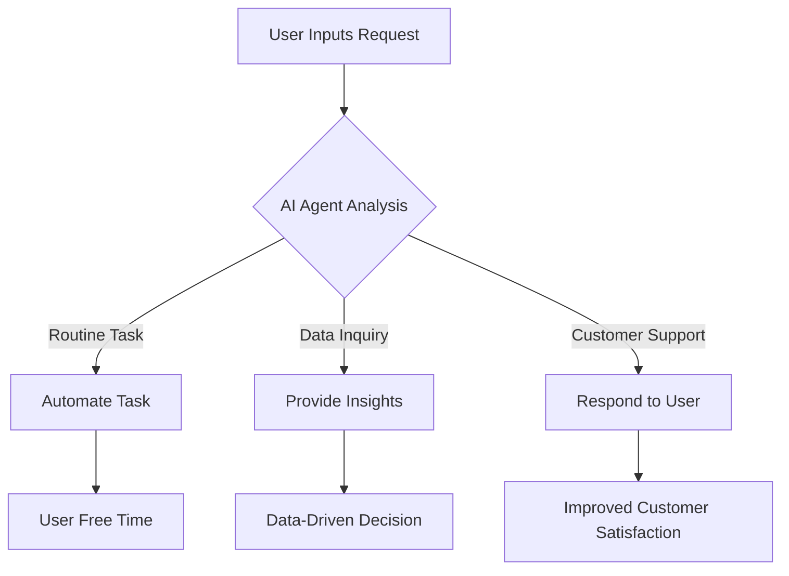

---

# Enhancing Productivity with AI Agents in 2026

As we look ahead to 2026, the landscape of productivity is poised for a transformation driven by the rise of AI agents. These intelligent assistants are not just tools; they are game-changers that promise to streamline workflows, enhance decision-making, and redefine how we approach our daily tasks. In this article, we'll explore the evolution of AI agents, their impact on productivity, and practical applications that can help you stay ahead in your professional and personal life.

## What Are AI Agents?

AI agents are sophisticated software programs designed to perform specific tasks autonomously or semi-autonomously. They leverage artificial intelligence, machine learning, and natural language processing to understand user needs, predict outcomes, and execute actions. From personal assistants like Siri and Alexa to complex business solutions like customer service bots, AI agents are becoming integral to various sectors.

## The Productivity Revolution: Why AI Agents Matter

### 1. Automating Routine Tasks

One of the primary benefits of AI agents is their ability to automate mundane tasks. This includes scheduling meetings, managing emails, or even handling customer inquiries. For example, AI agents like x.ai can manage your calendar by scheduling appointments based on your availability and preferences, freeing up your time for more critical activities.

### 2. Enhancing Decision-Making

AI agents can analyze vast amounts of data in real-time, providing insights that would take humans hours or even days to gather. Tools like Tableau, enhanced with AI capabilities, can help businesses make data-driven decisions quickly. By visualizing trends and patterns, these AI agents enable teams to pivot strategies based on actionable insights.

### 3. Improving Collaboration

With the rise of remote work, collaboration tools have become essential. AI agents, integrated into platforms like Slack or Microsoft Teams, can summarize conversations, remind users of deadlines, and even suggest project management strategies based on past performance. This helps keep teams aligned and focused on common goals.

### 4. Personalizing User Experiences

AI agents can tailor experiences based on user behavior and preferences. For instance, e-commerce platforms like Shopify utilize AI agents to recommend products, leading to increased customer satisfaction and sales. A personalized experience not only enhances productivity but also fosters customer loyalty.

## Practical Use Cases of AI Agents in 2026

### AI-Powered Virtual Assistants

Imagine having an AI assistant that not only manages your calendar but also learns your work habits over time. Tools like [Notion AI](https://www.notion.so/product/ai?ref=AFFILIATE_ID) can assist in drafting reports or creating presentations tailored to your style, making the process faster and more efficient.

### Intelligent Customer Support

Companies are increasingly relying on AI agents for customer service. Chatbots like Drift can handle inquiries 24/7, providing instant responses to customers. This not only enhances customer satisfaction but also allows human agents to focus on more complex issues that require human empathy and understanding.

### Data Analysis and Reporting

AI agents like Google Analytics with AI features can automatically generate reports, highlighting key performance indicators and trends. This automation saves analysts countless hours of work and ensures that decision-makers have access to the most relevant information quickly.

### Workflow Automation

Tools like Zapier use AI to connect various applications and automate workflows. For example, you can set up a workflow where every time a new lead is added to your CRM, an email is sent to your sales team instantly. This seamless integration boosts productivity by ensuring that no task falls through the cracks.

## Pros and Cons of AI Agents for Productivity

### Pros

- **Time-Saving**: AI agents automate repetitive tasks, allowing users to focus on high-value activities.
- **Data-Driven Insights**: They analyze data quickly, providing actionable insights that drive better decision-making.
- **Scalability**: AI agents can handle increased workloads without the need for additional personnel.
- **Enhanced Collaboration**: They facilitate communication and project management in remote teams.

### Cons

- **Dependence on Technology**: Over-reliance on AI agents can lead to a decline in critical thinking and problem-solving skills.
- **Privacy Concerns**: The use of AI agents often involves collecting personal data, raising privacy issues.
- **Initial Costs**: Implementing AI solutions can require significant upfront investment, which may be a barrier for smaller businesses.
- **Limited Understanding**: AI agents may not fully grasp complex human emotions or nuanced tasks, leading to potential misunderstandings.

## The Future of AI Agents in Productivity: A Workflow Diagram

To better understand how AI agents can enhance productivity, consider the following workflow diagram that illustrates the integration of AI agents into daily operations:

## Conclusion: Embrace AI Agents for Enhanced Productivity

As we transition into 2026, the capabilities of AI agents will only continue to expand. By automating routine tasks, enhancing decision-making, and improving collaboration, these intelligent tools can significantly boost productivity across various sectors. However, it's essential to strike a balance between leveraging AI and maintaining human skills.

Are you ready to harness the power of AI agents for your productivity? Explore the available tools and start integrating them into your workflow today. Whether you’re a business owner, a team leader, or an individual looking to optimize your time, the future is bright with AI agents paving the way for enhanced efficiency.

### Ready to Transform Your Productivity?

Don’t wait for the future to catch up! Start exploring AI agents today and see how they can revolutionize your approach to work and life. Check out our top recommendations for AI tools that can help you become more productive and efficient. Visit AI Tools Lab and take your first step towards a smarter, more productive future!

## 関連記事

- [Maximizing Productivity with AI Agents in 2026](/posts/maximizing-productivity-with-ai-agents-in-2026/)
- [AI Agents: The Future of Personal Assistants in 2026](/posts/ai-agents-the-future-of-personal-assistants-in-2026/)
- [AI Tools for Small Businesses: Increase Your ROI](/posts/ai-tools-for-small-businesses-increase-your-roi/)
