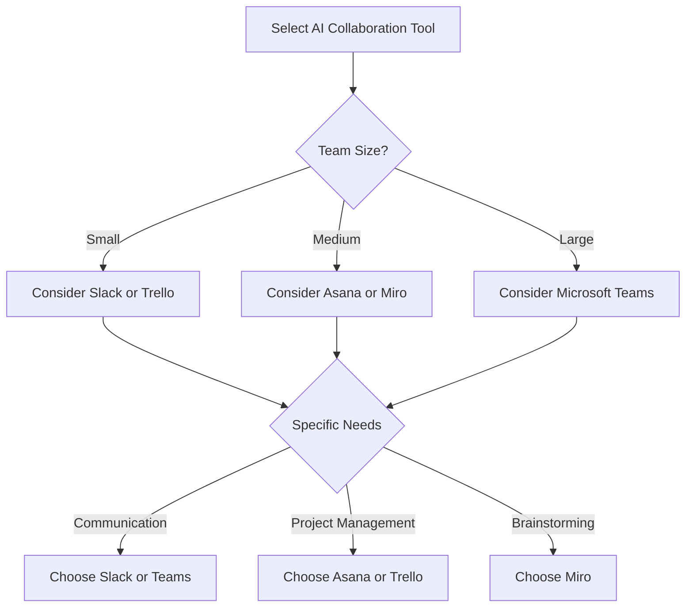

---

# Enhancing Team Collaboration with AI Tools

In today’s fast-paced work environment, effective collaboration is more important than ever. With teams often spread across different locations and time zones, finding ways to communicate and work together seamlessly can be challenging. Fortunately, AI tools for collaboration are here to save the day. These innovative solutions not only streamline communication but also enhance productivity and foster a more cohesive team dynamic.

## The Rise of AI in Team Collaboration

Artificial Intelligence has revolutionized many aspects of business operations, and team collaboration is no exception. AI tools can automate routine tasks, facilitate communication, and provide insights that help teams make informed decisions. Whether it’s scheduling meetings, managing projects, or brainstorming ideas, AI tools have become indispensable in modern workplaces.

### Key Benefits of AI Tools for Collaboration

1. **Enhanced Communication**: AI tools can break down language barriers and provide real-time translation services, making it easier for global teams to work together.
2. **Increased Productivity**: Automating repetitive tasks allows team members to focus on more strategic initiatives, boosting overall productivity.
3. **Data-Driven Insights**: AI can analyze team performance and collaboration patterns, providing insights that help teams improve their workflows.
4. **Flexible Collaboration**: With cloud-based AI tools, team members can collaborate from anywhere, at any time, using any device.

## Popular AI Tools for Collaboration

Let’s take a closer look at some of the most effective AI tools that can enhance team collaboration:

### 1. Slack

**Overview**: Slack is a communication platform that integrates various tools and services to streamline team communication.

**Pros**:
- Real-time messaging with channels for different projects.
- Extensive app integrations.
- Searchable message history.

**Cons**:
- Can become overwhelming with too many channels.
- Limited functionality in the free version.

### 2. Microsoft Teams

**Overview**: Microsoft Teams is part of the Microsoft 365 suite and offers chat, video conferencing, and file collaboration features.

**Pros**:
- Deep integration with Microsoft 365 applications.
- Excellent video conferencing capabilities.
- Robust security features.

**Cons**:
- Can be complex for new users.
- Requires a Microsoft 365 subscription for full features.

### 3. Trello

**Overview**: Trello is a project management tool that uses boards, lists, and cards to organize tasks and projects.

**Pros**:
- Visual task management.
- Easy to use and highly customizable.
- Collaboration features such as comments and attachments.

**Cons**:
- Limited reporting and analytics tools.
- Can be less effective for larger teams.

### 4. Asana

**Overview**: Asana is a project tracking tool that helps teams organize and manage their work.

**Pros**:
- Comprehensive task management features.
- Timeline view for project planning.
- Integrates with various third-party applications.

**Cons**:
- Can be overwhelming with too many features.
- The free version has limited functionality.

### 5. Miro

**Overview**: Miro is an online whiteboard platform designed for brainstorming and collaboration.

**Pros**:
- Supports real-time collaboration.
- A variety of templates for different use cases.
- Integrations with other tools like Slack and Trello.

**Cons**:
- Might require a learning curve for new users.
- Advanced features are locked behind a paywall.

### Comparison of AI Tools for Collaboration

To help you choose the right AI tool for your team, here’s a comparison table of the tools mentioned above:

<table>
  <tr>
    <th>Tool</th>
    <th>Best For</th>
    <th>Key Features</th>
    <th>Pricing</th>
  </tr>
  <tr>
    <td>Slack</td>
    <td>Team Communication</td>
    <td>Real-time messaging, app integrations</td>
    <td>Free; Paid plans start at $6.67/user/month</td>
  </tr>
  <tr>
    <td>Microsoft Teams</td>
    <td>Video Conferencing</td>
    <td>Chat, video calls, Microsoft 365 integration</td>
    <td>Free; Microsoft 365 plans start at $5/user/month</td>
  </tr>
  <tr>
    <td>Trello</td>
    <td>Project Management</td>
    <td>Visual task boards, collaboration features</td>
    <td>Free; Paid plans start at $10/user/month</td>
  </tr>
  <tr>
    <td>Asana</td>
    <td>Task Management</td>
    <td>Task assignments, timelines</td>
    <td>Free; Paid plans start at $10.99/user/month</td>
  </tr>
  <tr>
    <td>Miro</td>
    <td>Brainstorming</td>
    <td>Collaborative whiteboard, templates</td>
    <td>Free; Paid plans start at $8/user/month</td>
  </tr>
</table>

### Choosing the Right AI Tool for Your Team

When selecting an AI tool for collaboration, consider the following factors:

- **Team Size**: Some tools are better suited for small teams, while others can handle larger groups effectively.
- **Specific Needs**: Identify your team's specific collaboration needs, whether it’s project management, communication, or brainstorming.
- **Budget**: Consider how much your team is willing to spend on collaboration tools.

Here’s a simple decision tree to help guide your choice:

## Conclusion

AI tools for collaboration are not just trends; they are essential components of modern teamwork that can enhance productivity and communication. By leveraging these tools, teams can work more effectively, regardless of their physical location. Whether you choose Slack for messaging, Microsoft Teams for video conferencing, or Trello for project management, the right AI tool can make a significant difference in how your team collaborates.

### Call to Action

Ready to enhance your team collaboration with AI tools? Explore the options discussed in this article, and don’t hesitate to start trial versions to find the perfect fit for your team. Your journey towards improved collaboration starts today!

## 関連記事

- [AI Agents: The Future of Personal Assistants in 2026](/posts/ai-agents-the-future-of-personal-assistants-in-2026/)
- [AI Automation: A Game Changer for Small Businesses](/posts/ai-automation-a-game-changer-for-small-businesses/)
- [AI Automation: The Key to Enhanced Business Efficiency](/posts/ai-automation-the-key-to-enhanced-business-efficiency/)
